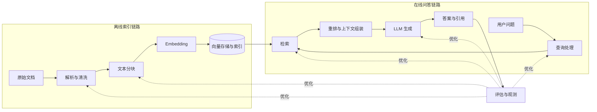

# 前言与全书概览

> [返回总目录](README.md) · 上一卷：无 · [下一卷：第 1 章 数据导入](01-数据导入.md)

## 本书讲什么

《大模型应用开发：RAG 实战课》（黄佳著）围绕 RAG 系统的完整生命周期展开，目标是帮助读者理解并实现一个可检索、可生成、可评估、可持续优化的知识库问答系统。

本书不只介绍某个框架，而是拆解 RAG 的核心组件、数据流和工程取舍。框架和模型会持续变化，但以下问题长期有效：

- 数据如何导入、清洗和分块？
- 如何把文本转换为可检索的表示？
- 如何选择向量存储、索引和检索策略？
- 如何让模型基于检索结果回答，而不是脱离资料自由发挥？
- 如何判断问题出在检索还是生成，并通过评估持续改进？

## 架构白板：RAG 的两条链路

RAG 不是单次模型调用，而是由**离线索引**和**在线问答**组成的系统。



离线链路把原始知识转换为可检索的索引；在线链路先查资料，再把问题和相关资料交给大模型生成答案。评估与观测贯穿两条链路，用于定位瓶颈，而不是只给最终答案打一个总分。

## RAG 三问

### 一问：什么是 RAG？

RAG（Retrieval-Augmented Generation，检索增强生成）把信息检索和大模型生成结合起来。模型回答前先从外部知识库获取相关内容，再基于这些内容生成结果。

它主要解决三类问题：

1. **知识时效性**：模型训练数据存在截止时间，外部知识库可以持续更新。
2. **领域知识不足**：企业制度、产品文档和内部资料通常不在模型训练数据中。
3. **答案缺少依据**：返回来源和引用，有助于核验答案并降低幻觉风险。

一个最小 RAG 闭环包含四步：

1. 文档分块并生成向量，写入向量存储。
2. 将用户问题转换为查询向量。
3. 检索最相关的文本块。
4. 把问题和文本块一起交给大模型，生成带依据的回答。

> RAG 不能保证答案一定正确。解析错误、分块不合理、召回失败、上下文污染或生成不忠实，都可能导致错误结果。

### 二问：如何快速搭建 RAG 系统？

常见实现路径如下：

| 路径 | 优点 | 局限 | 适用场景 |
|---|---|---|---|
| 手工实现最小链路 | 数据流透明，便于理解和调试 | 初期代码较多 | 学习原理、强定制、核心链路可控 |
| LlamaIndex | 文档索引与检索能力封装较完整 | 默认行为较多，排障时需理解内部机制 | 文档问答原型、索引策略实验 |
| LangChain | 组件接口丰富，便于组合模型与工具 | 抽象层较多，版本演进较快 | 需要灵活编排的 LLM 应用 |
| LangGraph | 状态、分支、循环和可观测性较清晰 | 简单线性 RAG 使用它可能过重 | Agentic RAG、复杂工作流 |
| Dify、RAGFlow、FastGPT 等 | 可视化、上手快、便于业务验证 | 算法级定制和底层排障能力有限 | PoC、低代码交付、流程验证 |

选型原则：

- 学习阶段先手工实现 `加载 → 分块 → 嵌入 → 检索 → 生成`，看清数据流。
- 原型阶段选择能减少非核心工作的框架或平台。
- 生产阶段根据数据规模、团队能力、可观测性、权限、成本和定制需求选型。
- 不要为了使用框架而设计业务；框架应服务于明确的问题。

### 三问：从哪里开始优化？

先建立小规模评测集，把问题分成**检索问题**和**生成问题**，再调整组件。没有基线和评测数据的“调参”很难证明有效。

| 环节 | 常见问题 | 优先检查 |
|---|---|---|
| 数据导入 | 文本缺失、乱码、表格结构丢失 | 解析结果、清洗规则、元数据 |
| 文本分块 | 语义被切断或块内噪声过多 | 块大小、重叠、标题与段落边界 |
| 信息嵌入 | 领域语义区分能力不足 | 模型、向量归一化、领域适配 |
| 向量存储与索引 | 延迟高、召回下降或成本过高 | 距离度量、索引类型、参数与规模 |
| 查询处理 | 用户问题含糊或表达与文档差异大 | 改写、分解、扩展、路由 |
| 检索 | 没召回正确内容或噪声太多 | Top-K、阈值、混合检索、过滤条件 |
| 检索后处理 | 最相关内容没有排在前面 | 重排、去重、压缩、上下文预算 |
| 响应生成 | 忽略资料、错误引用或过度发挥 | Prompt、模型选择、输出约束、引用校验 |
| 系统评估 | 只看主观案例，无法比较版本 | 检索指标、忠实度、相关性、人工评审 |

推荐排障顺序：

```text
原始文档是否正确
  ↓
正确答案所在文本块是否存在
  ↓
该文本块是否被检索到
  ↓
是否进入最终上下文
  ↓
模型是否忠实使用上下文
  ↓
答案与引用是否一致
```

这个顺序能区分“知识库里没有”“检索没找到”和“模型没有正确使用”三类问题，避免一开始就盲目更换大模型。

## 全书知识地图

本书将 RAG 拆成十个可独立优化的环节：

| 阶段 | 核心问题 | 对应章节 |
|---:|---|---|
| 1 | 如何读取多源、异构文档并保留有效结构？ | [第 1 章 数据导入](01-数据导入.md) |
| 2 | 如何在检索粒度和语义完整性之间平衡？ | [第 2 章 文本分块](02-文本分块.md) |
| 3 | 如何选择和评估 Embedding 模型？ | [第 3 章 信息嵌入](03-信息嵌入.md) |
| 4 | 如何选择向量库、距离度量和索引？ | [第 4 章 向量存储](04-向量存储.md) |
| 5 | 如何改写、分解和路由用户查询？ | [第 5 章 检索前处理](05-检索前处理.md) |
| 6 | 如何通过索引结构提升召回与效率？ | [第 6 章 索引优化](06-索引优化.md) |
| 7 | 如何重排、过滤和压缩检索结果？ | [第 7 章 检索后处理](07-检索后处理.md) |
| 8 | 如何约束模型基于证据生成并正确引用？ | [第 8 章 响应生成](08-响应生成.md) |
| 9 | 如何评估检索、生成和端到端效果？ | [第 9 章 系统评估](09-系统评估.md) |
| 10 | 何时使用 GraphRAG、Agentic RAG 或多模态 RAG？ | [第 10 章 复杂 RAG 范式](10-复杂RAG范式.md) |

## 建议学习路线

### 第一次阅读：建立完整链路

按章节顺序阅读，重点掌握每一步的输入、输出以及它对下一步的影响。此时不要陷入框架 API 或参数细节。

### 第二次阅读：围绕故障排查

准备一组带标准答案和来源的测试问题，记录以下中间结果：

- 原始解析文本
- 分块内容与元数据
- 检索结果及分数
- 重排后的上下文
- 最终 Prompt
- 模型答案与引用

### 第三次阅读：面向生产取舍

重点关注：

- 质量：召回率、相关性、忠实度、引用准确性
- 性能：索引时间、检索延迟、首 Token 延迟、吞吐量
- 成本：Embedding、存储、重排和生成成本
- 安全：权限过滤、提示注入、敏感信息和租户隔离
- 运维：数据更新、版本管理、链路追踪、回归评测

## 开篇结论

1. RAG 的本质是“先检索证据，再基于证据生成”，不是单纯接入向量数据库。
2. 高质量 RAG 依赖整条链路，任何一个组件都可能成为瓶颈。
3. 框架能提高开发效率，但不能替代对数据流、评估方法和工程边界的理解。
4. 优化必须从可复现的评测集和中间链路观测开始。
5. 先完成透明、可调试的最小闭环，再根据实际瓶颈增加复杂度。

---

> [返回总目录](README.md) · [下一卷：第 1 章 数据导入](01-数据导入.md)
