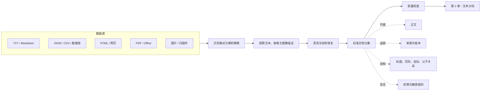

# 第 1 章 数据导入

> [返回总目录](README.md) · [上一卷：前言与全书概览](00-前言与全书概览.md) · [下一卷：第 2 章 文本分块](02-文本分块.md)

## 本章目标

数据导入是 RAG 离线索引链路的入口。它的任务不是“把文件读成字符串”，而是把多源、异构、质量不一的数据转换成**可追踪、可解析、可分块、可更新**的标准文档。

完成本章后，你应该能够：

- 说明为什么解析质量决定后续检索与生成的上限。
- 为 TXT、Markdown、JSON、CSV、网页、图片和 PDF 选择解析策略。
- 设计统一的文档内容与元数据模型。
- 保留标题层级、页码、表格归属和父子关系等结构信息。
- 建立导入质量检查，而不是等到问答错误时才排查源数据。

## 1.1 架构白板：数据如何进入 RAG



导入链路的输出是第 2 章的输入。如果这里丢失标题、表格语义或来源信息，后续即使更换更强的 Embedding 模型或大模型，也无法恢复原始信息。

## 1.2 统一文档模型

不同工具可能使用 `Document`、`Node` 或 `Element` 等名称，但工程上可以统一理解为“正文 + 元数据”。

### 1.2.1 正文

正文是后续分块、嵌入和生成使用的内容，应满足：

- 使用统一编码，避免乱码和不可见字符。
- 删除无意义的页眉、页脚、菜单和广告。
- 尽量保留标题、列表、表格和代码块的语义。
- 不把完全无关的内容拼成一个大字符串。

### 1.2.2 元数据

推荐至少保留以下字段：

| 字段 | 作用 | 示例 |
|---|---|---|
| `document_id` | 文档稳定标识，用于更新和删除 | `policy-2026-001` |
| `source` | 原始文件、URL 或数据表 | `docs/refund-policy.pdf` |
| `source_type` | 区分文件、网页、数据库等来源 | `pdf`、`web`、`mysql` |
| `title` | 文档或章节标题 | `退款规则` |
| `page_number` | 页码与引用定位 | `12` |
| `section_path` | 标题层级路径 | `售后政策/退款/时限` |
| `element_type` | 内容类型 | `title`、`text`、`table` |
| `parent_id` | 关联所属标题、表格或父级元素 | `section-42` |
| `updated_at` | 增量同步和版本判断 | `2026-09-04T10:00:00Z` |
| `content_hash` | 去重和变更检测 | 内容摘要值 |
| `tenant_id` / `acl` | 检索阶段的权限过滤 | `team-a` / `internal` |

元数据不是附属信息。它直接支持来源引用、权限过滤、增量更新、去重、结构化分块和故障排查。

### 1.2.3 设计约束

- `document_id` 应稳定，不能每次导入都随机变化。
- `source` 必须能追溯到原始数据。
- 权限信息应在导入时写入，不能只依赖生成阶段的 Prompt。
- 不需要参与语义检索的内部字段，不应拼入正文或发送给模型。
- 原始文件、解析结果和最终文档对象应保留版本关系。

## 1.3 标准导入流程

### 第一步：发现数据

记录数据源、文件类型、大小、更新时间、所属租户和访问权限。不要仅根据扩展名判断类型，必要时检查 MIME 类型或文件头。

### 第二步：选择解析策略

优先使用结构明确的专用解析器；通用解析器适合兜底，但不一定能为每种格式提供最佳结果。

### 第三步：提取内容

根据格式提取正文、标题、列表、表格、图片文字和必要的视觉描述。解析失败应显式记录，不能静默丢弃。

### 第四步：清洗与标准化

统一编码、空白和换行，删除重复页眉页脚，恢复阅读顺序，并将常见内容转换为稳定的中间表示。

### 第五步：补充元数据

生成稳定 ID、来源、版本、结构层级、权限和内容摘要。表格、图片说明与正文之间的关系也应在此阶段建立。

### 第六步：质量验收

检查覆盖率、解析错误、结构完整性和抽样结果。通过验收后，文档才能进入分块和嵌入流程。

## 1.4 常见数据源的处理策略

### 1.4.1 TXT 与 Markdown

纯文本适合直接读取，但仍需处理编码、换行和空文件。Markdown 还应保留标题、列表、表格与代码块。

Markdown 常被用作中间格式，因为它：

- 比 HTML 和 PDF 更容易解析。
- 能保留基础层级和格式。
- 便于按标题进行结构化分块。
- 适合进入 Prompt，也方便前端展示。

不要为了“纯文本化”而删掉所有 Markdown 标记。标题层级本身就是有价值的语义和元数据。

### 1.4.2 JSON、JSONL 与 CSV

结构化数据不应默认整体读成一个长字符串。

| 数据类型 | 推荐处理单位 | 应保留的信息 |
|---|---|---|
| JSON 对象 | 业务实体或目标字段 | 字段路径、实体 ID、来源 |
| JSON 数组 | 每个数组元素 | 序号、主键、对象类型 |
| JSONL | 每一行对象 | 行号、事件时间、记录 ID |
| CSV | 每一行或业务分组 | 列名、行号、业务主键 |
| 数据库 | 查询结果中的业务实体 | 表名、主键、更新时间 |

需要先明确“用户会按什么粒度提问”。例如，产品表通常按产品生成文档，而不是把整个 CSV 作为一个文档。字段名也应保留，否则单独的数字和短文本缺少语义。

数据库导入还应注意：

- 使用只读账户和最小权限。
- 避免无边界的全表扫描。
- 记录同步游标或更新时间，支持增量导入。
- 将内部主键映射为稳定的 `document_id`。

### 1.4.3 网页

直接提取网页全部文字，通常会混入导航、页脚、推荐内容和脚本生成的噪声。推荐流程是：

1. 遵守站点使用规则并限制抓取频率。
2. 获取页面最终内容，识别是否依赖 JavaScript 渲染。
3. 提取正文区域，去除导航和模板噪声。
4. 保留标题、URL、发布时间、作者和标题层级。
5. 对内容正文计算摘要值，避免重复索引。

单页正文可使用 HTML 解析器；整站导入可从 Sitemap 或受控 URL 列表开始；动态页面需要浏览器渲染或专门的抓取服务。递归抓取必须设置域名白名单、深度和页面数量上限。

### 1.4.4 图片、扫描件与演示文稿

需要区分两个任务：

- **OCR**：识别图片里的文字。
- **视觉理解**：描述图表、流程、场景和文字之间的关系。

只有文字识别需求时，OCR 通常成本更低、结果更稳定。图片本身承载业务语义时，可以调用多模态模型生成结构化描述，但要保留页码、图片位置和原图引用。

多模态解析存在额外风险：

- 模型可能遗漏小字、图例或数值。
- 同一图片的描述可能不稳定。
- 每页转图片后调用模型，成本和延迟较高。
- 视觉描述是模型生成内容，不能视为原始事实。

因此，重要数值和表格应优先使用确定性解析或人工抽样校验。

## 1.5 PDF：最需要单独设计的格式

PDF 描述的是页面如何呈现，不等同于结构化文档。多栏排版、扫描页、表格、公式、页眉页脚和阅读顺序都会影响解析。

### 1.5.1 三类解析方案

| 方案 | 优点 | 局限 | 适用场景 |
|---|---|---|---|
| 规则/文本层提取 | 快、成本低、容易本地部署 | 不适合扫描件和复杂布局 | 文本型、排版简单的 PDF |
| OCR/布局模型 | 能识别扫描件、表格和版面元素 | 资源消耗较高，仍可能分类错误 | 扫描件、多栏、复杂图文 PDF |
| 多模态模型 | 能理解图表和视觉语义 | 成本高、结果可能不稳定 | 图像语义关键、规则难以覆盖的页面 |

生产系统通常采用分层策略，而不是所有 PDF 都走最昂贵的方案：

```text
检测到可用文本层？
├─ 是 → 先做快速文本与结构提取
│       └─ 质量不达标 → 升级到布局模型
└─ 否 → OCR / 布局模型
        └─ 图表语义仍缺失 → 对目标页面调用多模态模型
```

### 1.5.2 PDF 解析时应保留什么

- 页码和原始文件位置
- 标题、段落、列表、表格和图片类型
- 页面阅读顺序
- 标题与正文、表格与表题的父子关系
- 必要时保留元素坐标和页面尺寸
- 解析器名称、版本和策略，便于结果复现

### 1.5.3 坐标的价值

坐标不是所有项目的必选项，但在以下场景很有价值：

- 恢复多栏页面的阅读顺序。
- 判断表格、标题和说明文字的归属。
- 在答案引用中高亮原文位置。
- 对解析结果做可视化抽样验收。
- 重新组织同一区域内的图文内容。

坐标系可能来自 PDF 单位、布局模型尺寸或渲染后的像素。进行可视化时必须按页面宽高缩放，不能直接混用。

### 1.5.4 表格不能脱离上下文

只提取表格单元格，往往会丢失年份、单位和统计口径。应把表格与以下信息关联：

- 表格标题
- 所属章节
- 列名与单位
- 页码和来源
- 必要的前后说明文字

例如，两张数值相同但年份不同的 GDP 表，如果丢失标题，检索结果将无法判断数据属于哪一年。

## 1.6 保留文档结构

### 1.6.1 父子关系

复杂文档可以把标题、正文、列表和表格解析为独立元素，再通过稳定标识建立关系：

```text
Title(element_id=section-1)
├─ Paragraph(parent_id=section-1)
├─ ListItem(parent_id=section-1)
└─ Table(parent_id=section-1)
```

这种结构支持两种重要能力：

1. 检索命中较小元素时，可以补回父标题或父级上下文。
2. 分块时可以避免把标题与其正文、表格与其说明割裂。

### 1.6.2 结构恢复优先级

建议按以下顺序处理：

1. 使用解析器直接给出的父子关系。
2. 根据标题层级和阅读顺序恢复。
3. 根据页码与坐标推断邻近关系。
4. 无法可靠判断时保留原始元素，并标记低置信度。

不要用未经验证的邻近规则强行关联所有元素，否则错误结构会在后续检索中被放大。

## 1.7 工具选型原则

工具名称和 API 会变化，选型应围绕能力而不是框架热度。

| 维度 | 需要回答的问题 |
|---|---|
| 格式覆盖 | 是否支持真实业务中的文件类型？ |
| 解析质量 | 标题、表格、公式、图片和阅读顺序能否保留？ |
| 部署方式 | 本地、云 API 还是混合部署？ |
| 性能 | 单文档耗时、并发能力和资源消耗如何？ |
| 成本 | OCR、多模态调用和商业 API 的费用如何？ |
| 可观测性 | 能否记录失败原因、解析版本和中间结果？ |
| 数据安全 | 敏感文件是否允许发送到外部服务？ |
| 可替换性 | 输出能否转换为内部统一文档模型？ |

建议先准备一组有代表性的“黄金文档”，包含简单文本、扫描 PDF、复杂表格、多栏页面和图片。用同一套验收标准比较工具，而不是只看官方演示。

## 1.8 生产化与质量验收

### 1.8.1 导入任务需要可重复执行

- 使用 `document_id + content_hash` 判断新增、更新和未变化。
- 更新文档时删除或废弃旧版本的文本块和向量。
- 同一任务重试不能产生重复数据。
- 记录任务批次、解析器版本、开始时间、耗时和状态。
- 对失败文档进入重试或人工处理队列。

### 1.8.2 推荐观测指标

| 指标 | 说明 |
|---|---|
| 发现文档数 | 数据源中识别到的文档数量 |
| 成功/失败/跳过数 | 导入结果分布 |
| 文本提取率 | 有效文本页或元素占比 |
| 空文档率 | 没有提取到正文的比例 |
| 重复率 | 内容摘要重复的比例 |
| 结构保留率 | 标题、表格、页码等关键字段完整度 |
| 单文档延迟 | 发现性能异常和超大文件 |
| 人工抽检通过率 | 真实解析质量基线 |

### 1.8.3 最小验收清单

导入完成后至少抽样确认：

- [ ] 文件没有乱码，正文没有大面积缺失。
- [ ] 页眉、页脚、菜单等噪声已清理。
- [ ] 标题与正文顺序正确。
- [ ] 表格保留列名、单位和所属标题。
- [ ] 图片文字和视觉描述能区分来源。
- [ ] `source`、页码和章节路径可以定位原文。
- [ ] 权限字段完整且能在检索前过滤。
- [ ] 重复导入不会产生重复文档。
- [ ] 失败文档有原因和处理状态。

### 1.8.4 安全边界

外部文档是不可信输入。导入阶段应考虑：

- 文件大小、页数、压缩包层级和处理超时限制。
- MIME 类型校验与恶意文件扫描。
- HTML 脚本、宏和嵌入对象的隔离。
- 敏感信息识别、脱敏和访问控制。
- 文档中的提示注入文本不能获得系统权限。
- 外部解析服务的数据保留与合规策略。

## 1.9 常见故障定位

| 现象 | 优先排查 |
|---|---|
| 回答缺少某段知识 | 原始文件是否发现、目标页是否解析成功 |
| 检索到大量导航文字 | 网页正文选择器和模板噪声清理 |
| 表格答案缺少年份或单位 | 表题、列名和父子关系是否保留 |
| PDF 段落顺序混乱 | 多栏布局、坐标和阅读顺序恢复 |
| 扫描 PDF 没有内容 | 是否误用只支持文本层的解析器 |
| 相同内容出现多次 | URL 规范化、内容摘要和幂等策略 |
| 用户检索到无权查看的内容 | `tenant_id` / `acl` 是否在导入和检索阶段生效 |
| 更新后仍回答旧内容 | 文档版本与旧向量是否正确清理 |

故障排查应先查看解析后的标准文档，再查看分块结果。不要一开始就调整 Top-K、Embedding 模型或生成 Prompt。

## 本章面试表达

可以用下面这段话概括数据导入层的设计：

> RAG 的质量上限首先由数据层决定。我的导入链路会根据数据类型选择解析策略，将文本、结构和来源统一转换成内部文档模型，并保留页码、标题路径、父子关系、版本和权限元数据。对于 PDF，我采用文本提取、布局/OCR、多模态理解逐级升级的方案，避免所有文档都走高成本模型。导入完成后通过内容摘要保证幂等更新，并对空文档率、结构完整度和抽样准确率做质量门禁。这样后续分块、检索、引用和权限过滤都有稳定基础。

## 本章小结

1. 数据导入的目标是生成可追踪、可更新的标准文档，而不只是提取字符串。
2. 专用解析器通常比通用解析器更能保留特定格式的结构。
3. Markdown 是实用的中间表示，但不能替代页码、坐标和权限等元数据。
4. PDF 应根据文本层、版面复杂度和视觉语义逐级选择解析方案。
5. 标题、表格、正文之间的父子关系会直接影响分块和检索质量。
6. 生产系统必须支持幂等、增量更新、失败重试、权限控制和质量观测。

下一章将在标准文档的基础上讨论如何分块，并平衡语义完整性、检索粒度和上下文成本。

---

> [返回总目录](README.md) · [上一卷：前言与全书概览](00-前言与全书概览.md) · [下一卷：第 2 章 文本分块](02-文本分块.md)
