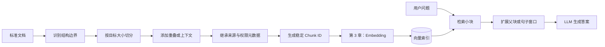
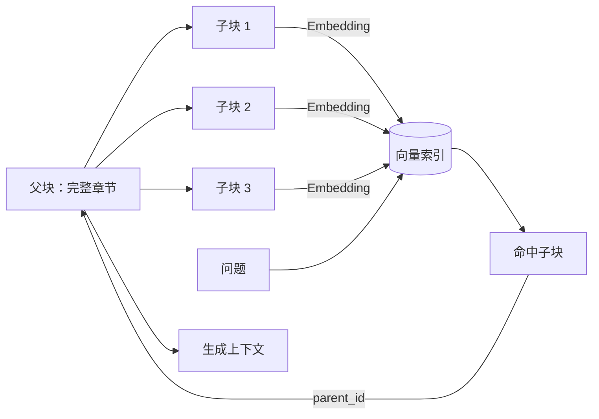

# 第 2 章 文本分块

> [返回总目录](README.md) · [上一卷：第 1 章 数据导入](01-数据导入.md) · [下一卷：第 3 章 信息嵌入](03-信息嵌入.md)

## 本章目标

文本分块（Chunking）把第 1 章生成的标准文档拆成适合嵌入、索引、检索和生成的语义单元。

分块不是简单地限制字符串长度，而是在三个目标之间寻找平衡：

- **检索精度**：块应足够聚焦，避免多个主题被压进同一个向量。
- **上下文完整性**：块应保留回答问题所需的事实、标题和上下文。
- **成本与性能**：控制向量数量、检索噪声和传给大模型的 Token 数。

完成本章后，你应该能够：

- 解释块过大和过小分别会造成什么问题。
- 根据文档结构和查询粒度选择分块策略。
- 正确理解 `chunk_size`、`chunk_overlap` 和 Token 预算。
- 设计父子块、句子窗口和元数据继承。
- 用评测集验证分块效果，而不是凭感觉调参。

## 2.1 架构白板：分块在 RAG 中的位置



分块阶段应输出两类信息：

1. 可用于嵌入和检索的块内容。
2. 可追踪来源、恢复上下文和执行权限过滤的元数据。

## 2.2 为什么必须分块

### 2.2.1 模型输入有边界

每个块需要进入 Embedding 模型，因此不能超过该模型的最大输入长度。检索到的多个块还会与系统指令、对话历史、用户问题一起进入生成模型，也必须服从整体上下文预算。

上下文窗口变大并不意味着可以取消分块：

- 输入越长，调用成本和延迟通常越高。
- 大量无关内容会稀释有效证据。
- 关键信息位于长上下文中间时，模型可能利用不足。
- 权限、引用和增量更新仍需要细粒度内容单元。

### 2.2.2 一个向量难以准确表示多个主题

Embedding 会把一段任意长度的文本压缩为固定维度向量。块中包含的主题越多，向量越可能只表达整体语义，具体事实会被弱化。

例如，把“景点历史、开放时间、门票和交通”放在同一个大块里，用户查询“几点开门”时，开放时间这一局部语义可能不够突出。

### 2.2.3 块也不能过小

如果把“太原游乐场”和“每天 09:00 开门”切成两个互不关联的块，第二个块缺少主体，检索后可能无法判断开放时间属于哪个景点。

因此，最小块至少应表达一个可独立理解的事实或语义单元，并保留必要的标题路径。

## 2.3 分块的核心参数

### 2.3.1 `chunk_size`

`chunk_size` 是目标块大小，不一定是绝对大小。具体单位可以是字符、词、Token、句子或结构元素。

| 单位 | 优点 | 局限 |
|---|---|---|
| 字符 | 实现简单、速度快 | 中英文与不同内容密度差异较大 |
| Token | 更贴近模型限制和成本 | 需要与模型匹配的分词器 |
| 句子 | 语义边界自然 | 长句和短句差异较大 |
| 段落/标题 | 保留文档结构 | 单个结构单元可能过长 |

如果能获得目标模型的分词器，可以在嵌入前准确计算 Token；不能笼统地认为“分块阶段无法知道 Token 数”。字符数只是缺少对应分词器时的近似方案。

可将 **300～800 Token** 作为普通知识文档的初始实验区间，而不是固定最佳值。FAQ 可能更小，法律条款和技术说明可能需要更大上下文。

### 2.3.2 `chunk_overlap`

重叠用于缓解信息恰好落在边界上的问题。常见起点是块大小的 **10%～20%**，但并非越大越好。

重叠过大将导致：

- 向量数量和存储成本增加。
- 检索结果出现大量重复内容。
- 上下文预算被相似文本占用。
- 评测时看似召回很多，实际信息增益很低。

结构化分块已经保留完整语义时，可以减少甚至不使用固定重叠。

### 2.3.3 生成上下文预算

在线生成时可使用以下预算思路：

```text
可用检索上下文
= 模型上下文上限
- 系统指令
- 对话历史
- 用户问题
- 预留输出
- 安全余量
```

分块大小和 Top-K 必须一起考虑。块很大时，即使 Top-K 较小也可能超出预算；块很小时，Top-K 太小又可能缺少完整答案。

## 2.4 常见分块策略

| 策略 | 核心方式 | 优点 | 主要风险 | 适用场景 |
|---|---|---|---|---|
| 固定长度 | 达到长度即切分 | 简单、快速、可预测 | 容易切断语义 | 基线实验、结构弱的文本 |
| 递归分块 | 按段落、句子、词逐级切分 | 成本低，较好保留自然边界 | 不理解真正主题变化 | 通用文本的默认选择 |
| 结构分块 | 按标题、章节、表格或代码结构切分 | 可解释，结构完整 | 依赖高质量解析 | Markdown、HTML、PDF、代码 |
| 语义分块 | 根据相邻句子的向量差异寻找断点 | 能识别主题变化 | 慢、贵、参数敏感 | 结构弱但主题变化明显的长文 |
| 命题分块 | 将内容转成独立事实或命题 | 检索粒度细 | 依赖模型，可能改写或遗漏事实 | 高精度事实问答 |

推荐演进顺序：

```text
递归分块基线
  ↓
加入标题和文档结构
  ↓
针对边界问题调整 overlap
  ↓
仍无法满足评测时，再考虑语义或命题分块
```

复杂方法只有在评测指标或业务结果改善时才值得保留。

## 2.5 递归分块

递归分块按优先级尝试多个边界，例如：

```text
章节标题 → 空行 → 换行 → 句号 → 逗号 → 空格 → 字符
```

执行逻辑：

1. 先使用最高优先级边界切分。
2. 小片段在不超过目标大小时合并。
3. 过大的片段继续使用下一级边界切分。
4. 最后按需要添加少量重叠。

它比单一分隔符更稳健。例如，某段落超过目标长度时，单一“空行分块”可能直接产生超大块；递归分块会继续尝试句子或更细边界。

### 中文文本注意事项

中文分块应把 `。！？；` 等标点纳入句子边界，并处理全角、半角符号。不要只使用英文句点和空格，否则可能退化为生硬的字符切分。

## 2.6 基于文档结构分块

结构化分块优先服从文档天然边界，再用长度限制处理超大元素。

### 2.6.1 Markdown 与 HTML

推荐按标题层级组织内容，并把标题路径写入每个块：

```text
section_path: 产品文档 / 售后政策 / 退款时限
content: 用户提交退款申请后，平台将在 3 个工作日内审核……
```

短小的同级段落可以合并；新的主标题通常应开启新块。HTML 还需要先删除导航、页脚和模板噪声。

### 2.6.2 PDF 与演示文稿

使用第 1 章保留的页码、元素类型、坐标和父子关系：

- 标题应与其正文关联。
- 表格应与表题、列名和单位关联。
- 图片描述应保留原图和页码引用。
- 多栏页面应先恢复阅读顺序，再进行分块。

不能只按照 PDF 页切分。一个主题可能跨页，同一页也可能包含多个无关主题。

### 2.6.3 代码

代码知识库应优先按语法结构切分，例如包、类型、函数和方法，而不是机械地按字符切分。

每个代码块建议保留：

- 仓库、分支、文件路径和语言
- 包名或模块名
- 类型、函数或方法签名
- 必要的注释和依赖上下文
- 起止行号与提交版本

大型函数仍可继续按逻辑段落切分，但签名和所属类型应作为上下文保留。

### 2.6.4 表格

表格分块应确保每个块包含列名、单位和表题。大表可以按行分组，但每组都要重复必要的表头，而不是只保留孤立数据行。

## 2.7 语义分块

语义分块的一般过程是：

1. 先按句子或短段落切分。
2. 为相邻单元生成向量。
3. 计算相邻单元的语义差异。
4. 在差异超过阈值的位置建立断点。
5. 合并过短块，并限制最大长度。

它适合没有可靠标题、但主题变化明显的访谈、会议纪要和长篇叙述。

需要注意：

- 分块阶段额外调用 Embedding，离线成本更高。
- 阈值变化可能导致块数量剧烈波动。
- 相似度不等于逻辑从属关系。
- 必须与简单基线做同一评测集对比。

多数项目应先采用递归或结构分块，只有确认边界质量是主要瓶颈后再引入语义分块。

## 2.8 小块检索与大上下文生成

检索偏好小而聚焦的块，生成偏好完整上下文。以下策略用于协调这组矛盾。

### 2.8.1 父子块



- 子块用于向量检索，提高匹配精度。
- 父块单独存储，通过 `parent_id` 关联。
- 检索命中子块后，根据预算返回父块或父块中的邻近内容。

父块不能无限扩大，否则只是把噪声重新放回生成上下文。

### 2.8.2 句子窗口

将单句或短段落用于检索，同时在元数据中保存其前后若干句。命中后再扩展窗口。

这种方式适合事实分散在相邻句子中的文本，但要对多个命中窗口去重和合并，避免重复上下文。

### 2.8.3 摘要到原文

可以先检索章节或文档摘要，再展开到对应原文。它适合超长、多层级文档，但摘要由模型生成时可能遗漏细节，不能替代原文和来源关系。

## 2.9 Chunk 数据模型

每个 Chunk 至少应包含：

| 字段 | 用途 |
|---|---|
| `chunk_id` | 稳定标识与向量更新 |
| `document_id` | 追踪所属文档 |
| `content` | 用于嵌入和生成的正文 |
| `chunk_index` | 文档内顺序 |
| `start_offset` / `end_offset` | 定位原文 |
| `section_path` | 保留标题上下文 |
| `page_number` | 引用与定位 |
| `parent_id` | 扩展父级上下文 |
| `content_hash` | 去重和增量更新 |
| `tenant_id` / `acl` | 检索前权限过滤 |
| `chunker_version` | 复现与回滚分块结果 |

设计要求：

- 分块后必须继承文档级来源、版本和权限。
- 相同文档与相同分块配置应生成稳定结果。
- 修改分块策略时更新 `chunker_version`，并重建对应向量。
- 不要把所有元数据拼入 Embedding 文本；只加入有助于语义区分的字段。

## 2.10 如何评测分块效果

### 2.10.1 建立评测集

准备一组包含以下信息的问题：

- 用户问题
- 标准答案
- 答案所在文档和原文位置
- 需要单块回答还是跨块组合
- 问题类型和难度

评测集应覆盖短事实、长解释、表格、跨段落和边界案例。

### 2.10.2 对比实验

一次只改变一个主要变量，例如：

| 实验组 | 块大小 | 重叠 | 策略 |
|---|---:|---:|---|
| A | 300 Token | 30 Token | 递归 |
| B | 500 Token | 50 Token | 递归 |
| C | 800 Token | 80 Token | 递归 |
| D | 结构自适应 | 0 | 按标题 |

记录配置、分块器版本和数据集版本，保证结果可复现。

### 2.10.3 关键指标

| 指标 | 说明 |
|---|---|
| Recall@K | 正确证据是否出现在前 K 个结果中 |
| MRR / nDCG | 正确证据的排序质量 |
| Context Precision | 返回上下文中有效信息的比例 |
| 答案正确率 | 最终答案是否正确 |
| 忠实度 | 答案是否得到上下文支持 |
| 平均上下文 Token | 生成成本与噪声水平 |
| 索引规模 | Chunk 数、向量数和存储成本 |
| 端到端延迟 | 检索、扩展与生成的总耗时 |

分块优化不能只看最终答案。若正确块根本没有召回，应优化分块或检索；若已召回但回答错误，应继续检查上下文组装和生成阶段。

## 2.11 常见问题与排查

| 现象 | 可能原因 | 优先调整 |
|---|---|---|
| 检索结果主题太宽泛 | 块过大、混入多个主题 | 减小块或按标题切分 |
| 命中内容缺少主体 | 块过小、标题丢失 | 补充标题路径或使用父子块 |
| 答案需要的信息分散在相邻块 | 边界切断、Top-K 太小 | 适量重叠或句子窗口 |
| 返回结果高度重复 | 重叠过大 | 减少重叠并做结果去重 |
| 表格数字没有含义 | 表头、单位或表题丢失 | 结构化处理表格 |
| 中文句子被生硬切断 | 分隔符不适合中文 | 增加中文标点边界 |
| 向量数量和成本过高 | 块太小或重复内容多 | 合并短块、去重、调大块 |
| 更新后仍检索到旧块 | 缺少稳定 ID 或版本清理 | 按文档版本重建并删除旧向量 |
| 语义分块结果不稳定 | 阈值敏感或模型变化 | 固定版本并回到简单基线对比 |

## 本章面试表达

可以用下面这段话概括分块设计：

> 文本分块本质上是在检索精度、上下文完整性和成本之间做权衡。我会先用递归加结构化分块建立基线，根据文档类型保留标题、页码、表格和代码结构，并把来源、版本和权限继承到 Chunk。参数不会凭经验直接定死，而是通过带标准证据的评测集，对比不同块大小和重叠下的 Recall@K、上下文精度、答案忠实度及 Token 成本。对于“小块容易检索但上下文不足”的场景，我会用父子块或句子窗口在命中后扩展上下文，而不是简单增大所有块。

## 本章小结

1. 分块不仅为了适配上下文窗口，更重要的是提高检索粒度并控制噪声。
2. 块过大会稀释主题，块过小会割裂事实与上下文。
3. 递归分块适合作为通用基线，结构分块通常比纯长度切分更可解释。
4. Token 可以在分块阶段通过对应分词器计算，字符只是近似单位。
5. 重叠用于缓解边界问题，但会增加重复、存储和上下文成本。
6. 父子块与句子窗口可以实现“小块检索、大上下文生成”。
7. 分块参数必须通过检索和端到端评测共同验证。

下一章将为这些 Chunk 生成 Embedding，并讨论模型选型、向量维度、相似度和归一化。

---

> [返回总目录](README.md) · [上一卷：第 1 章 数据导入](01-数据导入.md) · [下一卷：第 3 章 信息嵌入](03-信息嵌入.md)
