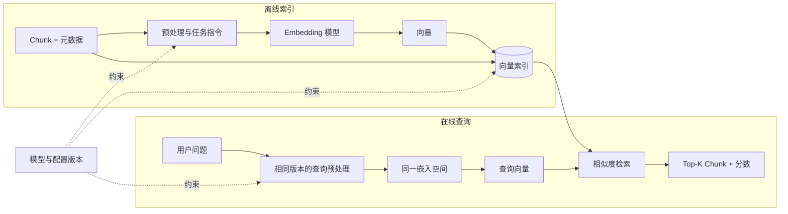
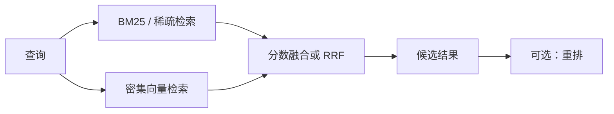

# 第 3 章 信息嵌入

> [返回总目录](README.md) · [上一卷：第 2 章 文本分块](02-文本分块.md) · [下一卷：第 4 章 向量存储](04-向量存储.md)

## 本章目标

信息嵌入（Embedding）把第 2 章生成的 Chunk 编码为固定维度向量，使系统能够用数学方法比较查询与文档的语义相关性。

本章重点不是记住某个模型或框架 API，而是建立稳定的工程认知：

- Embedding 表示什么，又不表示什么。
- 余弦相似度、点积和欧氏距离如何选择。
- 模型、维度、归一化和预处理为什么必须版本一致。
- 稀疏检索与密集检索如何互补。
- 如何批量生成、缓存、评测和更新向量。
- 什么情况下值得微调嵌入模型。

## 3.1 架构白板：从 Chunk 到向量检索



离线文档向量与在线查询向量必须处于**同一嵌入空间**。更换模型、模型版本、输出维度或关键预处理后，旧向量通常不能继续混用，需要重新生成并重建索引。

## 3.2 Embedding 的本质

Embedding 是一个编码函数：

```text
文本、图片或音频 → 固定维度浮点向量
```

训练目标使语义相关的输入在向量空间中更接近，不相关的输入更远。向量的单个维度通常没有可直接解释的业务含义，价值来自整体空间中的相对位置。

在 RAG 中，最常见的过程是：

1. 为每个文档 Chunk 生成文档向量。
2. 为用户问题生成查询向量。
3. 在向量索引中计算相似度或距离。
4. 返回分数最高的文档 Chunk。

### Embedding 不等于知识库

Embedding 只提供语义表示。一个完整检索系统还需要：

- 原始 Chunk 与来源元数据
- 向量存储和索引
- 距离度量
- 元数据过滤
- Top-K、阈值、混合检索和重排
- 评测与版本治理

## 3.3 相似度与距离

### 3.3.1 余弦相似度

余弦相似度只比较两个向量的方向：

$$
\operatorname{cos}(a,b)=\frac{a\cdot b}{\lVert a\rVert\lVert b\rVert}
$$

- 值越大通常表示越相似。
- 它弱化了向量模长的影响。
- 零向量无法计算余弦相似度，应在写入前检查。

### 3.3.2 点积

点积同时受方向和模长影响：

$$
a\cdot b=\sum_i a_i b_i
$$

- 值越大通常表示匹配越强。
- 未归一化时，点积与余弦相似度不等价。
- 某些模型明确使用点积训练，应遵循模型说明。

### 3.3.3 欧氏距离

欧氏距离衡量两个向量之间的直线距离：

$$
\lVert a-b\rVert_2=\sqrt{\sum_i(a_i-b_i)^2}
$$

- 值越小表示越接近。
- 它对向量模长敏感。
- 向量数据库可能返回距离，也可能转换成相似度分数，不能假设所有分数方向一致。

### 3.3.4 归一化后的等价关系

如果向量都经过 L2 归一化，即 `||a|| = ||b|| = 1`：

```text
cosine(a, b) = dot(a, b)
||a - b||² = 2 - 2 × dot(a, b)
```

此时三者会产生相同的排序，只是分数形式不同。未归一化时不存在这一保证。

### 3.3.5 工程选择原则

1. 优先遵循嵌入模型推荐的度量方式。
2. 确认模型输出是否已归一化，不要依赖框架默认值猜测。
3. 建库与查询必须采用一致的归一化策略。
4. 距离度量必须与向量索引配置一致。
5. 阈值不能从其他模型直接复制，应基于当前模型和数据标定。

## 3.4 向量维度不是越高越好

维度由模型架构和输出配置决定。更高维度可能保留更多表示能力，但也会增加：

- 向量存储空间
- 网络传输量
- 索引内存
- 距离计算成本
- 重建和备份时间

高维不自动等于高质量。不同训练方法、语料和目标函数的影响通常比单纯维度更重要。

粗略估算未压缩 `float32` 向量的原始空间：

```text
向量数据量 ≈ Chunk 数 × 维度 × 4 Byte
```

例如，100 万个 768 维向量仅原始向量约占 2.86 GiB；实际系统还需要索引结构、ID、元数据和副本空间。

如果模型支持可变维度或 Matryoshka 表示，可以测试较低维度；如果模型不支持，不能随意截断向量。任何降维方案都必须重新评测，并在第 4 章使用匹配的向量字段维度。

## 3.5 嵌入模型的演进：只需理解主线

| 阶段 | 代表思路 | 局限与价值 |
|---|---|---|
| 静态词向量 | Word2Vec、GloVe、FastText | 同一词只有一个表示，适合理解历史基础 |
| 上下文词向量 | ELMo、BERT 等 | 同一词可随上下文变化，但原始模型未必适合句子检索 |
| 句子/段落嵌入 | 双塔、对比学习、Sentence Transformers | 可预计算文档向量，适合大规模语义检索 |
| 指令化嵌入 | 根据查询、文档或任务使用不同指令 | 同一模型适配多种检索任务，但必须正确传递任务信息 |
| 多模态嵌入 | 图文或音视频对齐 | 支持跨模态检索，模型和数据处理更复杂 |

RAG 最关心的是能够高效比较查询与 Chunk 的句子或段落级嵌入，而不是逐个词的静态向量。

## 3.6 模型选型

### 3.6.1 先明确约束

| 维度 | 需要回答的问题 |
|---|---|
| 任务 | 用于检索、聚类、分类还是多模态搜索？ |
| 语言 | 是否覆盖中文、多语言和跨语言检索？ |
| 领域 | 通用语料能否理解业务术语、缩写和实体？ |
| 输入长度 | 是否覆盖当前 Chunk 长度，超长时如何截断？ |
| 部署 | 使用商业 API、本地 CPU/GPU 还是专用推理服务？ |
| 隐私 | 原始文本是否允许发送到外部服务？ |
| 性能 | 批量吞吐、在线延迟和并发要求是什么？ |
| 成本 | API、GPU、存储和重建成本如何？ |
| 维度 | 向量库空间与精度如何平衡？ |
| 许可 | 开源模型许可证是否允许当前用途？ |

### 3.6.2 商业 API 与本地模型

| 方案 | 优点 | 局限 |
|---|---|---|
| 商业 API | 接入快、运维少、扩缩容方便 | 数据外传、持续费用、限流和供应商依赖 |
| 本地开源模型 | 数据可控、可离线、可定制 | 需要推理资源、部署优化和版本维护 |
| 混合方案 | 可按敏感度、语言或业务路由 | 架构与评测更复杂，多个空间不能直接混检 |

如果不同业务使用不同嵌入模型，应使用独立向量字段、独立集合或明确的检索路由，不能把不同模型生成的向量放进同一空间直接比较。

### 3.6.3 公共榜单只能用于初筛

MTEB 等公共基准可以快速了解模型在检索、分类、聚类和多语言任务上的相对表现，但不能代替业务评测：

- 公共数据可能与训练数据重叠。
- 榜单平均分可能掩盖目标语言或任务的短板。
- 精度没有体现延迟、吞吐、成本和隐私约束。
- 模型版本与服务实现可能持续变化。

正确做法是先用公共基准筛出候选模型，再用业务问题和真实文档做离线评测。

## 3.7 查询与文档编码必须一致

### 3.7.1 同一空间不一定意味着相同文本模板

有些模型是对称编码：查询与文档采用相同方法。有些检索模型是非对称编码，需要分别使用查询指令与文档指令，例如：

```text
query: 为这个问题检索相关资料：退款审核需要多久？
document: 用户提交退款申请后，平台将在 3 个工作日内审核。
```

是否添加前缀、使用什么前缀，应遵循模型说明并保持版本化。遗漏任务指令可能显著降低召回率。

### 3.7.2 需要固定的 Embedding Contract

建议记录以下配置：

| 字段 | 示例含义 |
|---|---|
| `model_provider` | 模型来源或服务商 |
| `model_name` | 模型名称 |
| `model_revision` | 精确版本或提交版本 |
| `dimensions` | 输出维度 |
| `distance_metric` | cosine、dot 或 L2 |
| `normalize` | 是否在应用侧归一化 |
| `query_prefix` | 查询任务指令 |
| `document_prefix` | 文档任务指令 |
| `max_input_tokens` | 最大输入长度 |
| `preprocess_version` | 清洗和拼接规则版本 |

这份契约应同时约束离线索引服务、在线查询服务和向量库 Schema。

## 3.8 稀疏、密集与混合检索

### 3.8.1 稀疏表示

BM25、TF-IDF 等方法基于词项匹配。向量维度对应词表，绝大多数值为零。

优点：

- 对产品编号、人名、错误码和专有名词等精确词项敏感。
- 可解释，成熟且高效。
- 不需要神经网络推理。

局限：

- 难以匹配不同措辞表达的同一语义。
- 分词、同义词和跨语言能力有限。

BM25 不是简单词频统计。它综合词频、逆文档频率和文档长度归一化：

$$
\operatorname{score}(q,d)=\sum_{t\in q}\operatorname{IDF}(t)\cdot
\frac{f(t,d)(k_1+1)}{f(t,d)+k_1\left(1-b+b\frac{|d|}{\operatorname{avgdl}}\right)}
$$

无需在应用层手工构造一个包含全部词表维度的数组，搜索引擎通常通过倒排索引高效实现。

### 3.8.2 密集表示

神经网络将文本编码为几百到几千维的密集向量，各维度通常不可直接解释。

优点：

- 能匹配语义相近但字面不同的表达。
- 对自然语言问题和跨语言检索更友好。

局限：

- 可能忽略罕见关键词、编号和精确实体。
- 需要模型推理和向量索引。
- 效果受领域与训练数据影响。

“密集”和“稀疏”描述的是表示与检索机制，不能简单理解为向量中是否碰巧出现接近零的数值。

### 3.8.3 混合检索

混合检索同时执行关键词检索和密集向量检索，再融合结果：



它适合同时包含自然语言语义和精确标识符的企业知识库。两路分数的数值范围通常不同，不能直接相加而不做校准；可使用归一化加权、RRF 或学习排序。

## 3.9 多语言与多模态嵌入

### 3.9.1 多语言

多语言模型尝试把不同语言的相同语义映射到相近位置，从而支持跨语言检索。

评测时应分别覆盖：

- 中文查询 → 中文文档
- 英文查询 → 英文文档
- 中文查询 → 英文文档
- 业务术语、缩写和中英混写

“支持多语言”不等于每种语言效果相同，仍需按目标语言测试。

### 3.9.2 多模态

多模态模型通过对比学习等方式，把相关图像和文本映射到同一空间，可实现文搜图、图搜文和相似图片检索。

需要明确：

- 文本模型与多模态模型通常不是同一个向量空间。
- 图片、OCR 文本和视觉描述可以分别建立索引，再融合结果。
- 重要数值和图表事实不能只依赖视觉向量。
- 多模态向量的维度、预处理和距离度量也必须版本化。

## 3.10 批处理、缓存与幂等更新

### 3.10.1 批量生成

离线索引应按批次生成文档向量，以提高 API 或本地推理吞吐。批大小受以下因素约束：

- 服务端单请求文本数量和 Token 上限
- GPU 显存或进程内存
- 网络超时和请求体大小
- 限流与并发配额

批次失败时应能定位到具体 Chunk，并支持缩小批次重试，不能因为一条异常文本丢弃整个任务。

### 3.10.2 缓存键

缓存不能只使用原始文本。推荐至少包含：

```text
cache_key = hash(
  model_provider,
  model_name,
  model_revision,
  dimensions,
  normalize,
  task_prefix,
  preprocess_version,
  content
)
```

否则更换模型或预处理后可能错误复用旧向量。

### 3.10.3 增量更新

- Chunk 内容和 Embedding Contract 都未变化：复用向量。
- Chunk 内容变化：重新生成该 Chunk 的向量。
- 模型、维度或关键预处理变化：创建新索引并全量重建。
- 上线新索引前进行评测，切换完成后再回收旧索引。

推荐采用版本化索引或蓝绿切换，避免重建期间在线查询混用新旧空间。

## 3.11 如何评测嵌入模型

### 3.11.1 评测数据

每条样本至少包含：

- 查询
- 正相关 Chunk
- 可选的相关等级
- 困难负样本
- 语言、领域和问题类型标签

困难负样本是“看起来很像但不能回答问题”的内容，最能暴露模型区分能力。

### 3.11.2 指标

| 指标 | 说明 |
|---|---|
| Recall@K | 正确证据是否出现在前 K 个结果中 |
| MRR | 第一个正确结果是否靠前 |
| nDCG@K | 多级相关性下的排序质量 |
| Precision@K | 返回结果中的相关内容比例 |
| QPS / 吞吐 | 单位时间处理的文本数量 |
| P50 / P95 延迟 | 在线查询或离线批处理速度 |
| 单位成本 | 每百万 Token、每千请求或本地算力成本 |
| 索引体积 | 维度对内存和磁盘的影响 |

同一评测中应固定 Chunk、向量库索引和检索参数，先单独比较嵌入模型；否则无法判断提升来自哪个组件。

## 3.12 何时微调嵌入模型

先确认以下手段是否已经不足：

1. 改善数据清洗和分块。
2. 正确使用查询/文档任务指令。
3. 更换适合目标语言和领域的现成模型。
4. 加入 BM25 混合检索和重排。
5. 调整 Top-K、过滤条件和索引参数。

在以下条件同时较充分时，再考虑微调：

- 领域术语或业务相关性与通用语义差异明显。
- 有足够的真实查询、正样本和高质量负样本。
- 基线评测能稳定复现问题。
- 团队能够承担训练、部署、回归和版本维护成本。

常见训练数据形式是 `query → positive document → negative documents`。相比只拟合人工相似度分数，对比学习和困难负样本通常更贴近检索任务。

微调后必须与基线比较：

- 目标业务召回是否提高。
- 通用查询能力是否退化。
- 不同语言、长短查询和新数据分布是否稳定。
- 推理延迟、模型体积和维护成本是否可接受。

## 3.13 数据模型与向量存储衔接

第 2 章的 Chunk 与本章的向量应形成一一对应且可版本化的记录：

| 字段 | 来源 | 作用 |
|---|---|---|
| `chunk_id` | 分块阶段 | 主键与向量更新 |
| `document_id` | 数据导入阶段 | 文档追踪和批量删除 |
| `content` | 分块阶段 | 生成与结果展示 |
| `embedding` | 本章 | 相似度检索 |
| `embedding_version` | 本章 | 标识 Embedding Contract |
| `section_path` / `page_number` | 导入与分块阶段 | 引用和上下文恢复 |
| `tenant_id` / `acl` | 数据导入阶段 | 检索前权限过滤 |
| `content_hash` | 分块阶段 | 缓存与增量更新 |

下一章将决定这些字段如何存储、采用哪种索引，以及如何在召回率、延迟和内存之间取舍。

## 3.14 常见问题与排查

| 现象 | 可能原因 | 优先排查 |
|---|---|---|
| 所有相似度都很接近 | 模型不适合领域、块主题过多 | 业务评测、分块和模型选型 |
| 明确关键词无法召回 | 密集模型忽略精确词项 | BM25、混合检索、实体字段 |
| 离线效果好，线上效果差 | 查询编码路径或任务前缀不一致 | Embedding Contract |
| 更换模型后结果异常 | 新查询向量检索了旧文档向量 | 索引版本与全量重建 |
| 写入向量库时报维度错误 | 模型输出与 Schema 不一致 | `dimensions` 配置 |
| 余弦和点积结果不一致 | 向量未归一化 | 模长、归一化和度量配置 |
| 相似度阈值迁移后失效 | 模型或分数分布变化 | 用当前数据重新标定 |
| 嵌入成本突然增加 | 重复计算、缓存失效或块数量增加 | 缓存键、Chunk 版本和批处理日志 |
| 长文本召回变差 | 输入被截断或关键信息被稀释 | Token 日志与分块策略 |
| 跨语言效果不稳定 | 目标语言能力不足 | 分语言评测与模型替换 |

## 本章面试表达

可以用下面这段话概括 Embedding 层设计：

> Embedding 层的职责是把查询和文档 Chunk 映射到同一个可检索空间。我不会只按公共榜单选模型，而是结合中文和领域数据评测 Recall@K、排序质量、延迟、成本与隐私。工程上会把模型版本、维度、归一化、距离度量、任务前缀和预处理固化成 Embedding Contract，确保离线建库与在线查询一致。对于编号和专有名词较多的场景，会将 BM25 与密集向量做混合检索。模型或维度变化时使用版本化索引全量重建，并通过内容摘要和完整配置作为缓存键，避免错误复用旧向量。

## 本章小结

1. Embedding 把 Chunk 编码为向量，相似内容在训练得到的空间中通常更接近。
2. 未归一化时，余弦相似度、点积和欧氏距离不能混为一谈。
3. 向量维度越高不代表质量一定越好，必须同时评估精度、延迟和存储成本。
4. 查询与文档必须使用兼容的模型、版本、任务指令和预处理。
5. 稀疏检索擅长精确词项，密集检索擅长语义匹配，混合检索可以互补。
6. 公共榜单只适合初筛，最终选择应由业务评测集决定。
7. 缓存键和索引版本必须包含完整的 Embedding Contract。
8. 微调之前，应先验证分块、任务指令、混合检索和现成模型是否已经足够。

---

> [返回总目录](README.md) · [上一卷：第 2 章 文本分块](02-文本分块.md) · [下一卷：第 4 章 向量存储](04-向量存储.md)
