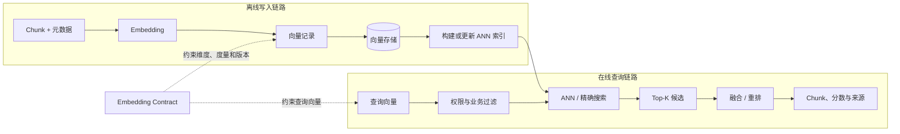
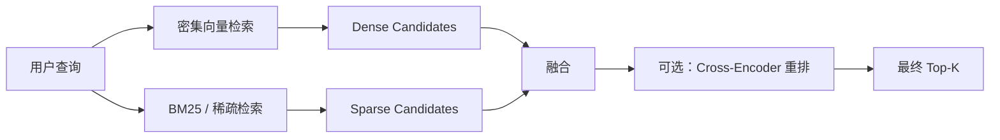
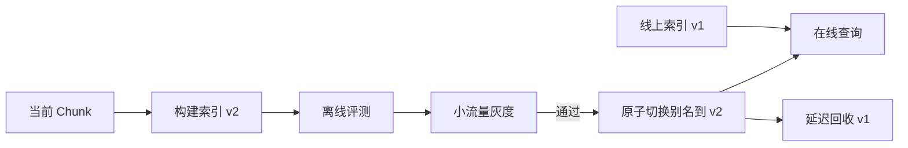

# 第 4 章 向量存储

> [返回总目录](README.md) · [上一卷：第 3 章 信息嵌入](03-信息嵌入.md) · [下一卷：第 5 章 检索前处理](05-检索前处理.md)

## 本章目标

向量存储负责保存 Chunk、Embedding 和元数据，并在大量候选中快速找到与查询向量最接近的记录。

本章不绑定某个数据库产品，重点回答以下工程问题：

- 向量存储与向量索引有什么区别？
- Schema 如何绑定第 3 章的 Embedding Contract？
- FLAT、HNSW、IVF 和 PQ 分别适合什么场景？
- 距离、相似度和返回分数的方向如何判断？
- 元数据过滤应在向量检索之前还是之后执行？
- 如何实现混合检索、增量更新、多租户和版本迁移？
- 如何估算容量并评测召回率、延迟和成本？

## 4.1 架构白板：写入与查询链路



写入与查询必须使用兼容的模型、维度、归一化、任务指令和距离度量。向量库能快速查找“近邻”，但不会自动修复错误的 Chunk、Embedding 或权限设计。

## 4.2 先区分三个概念

### 4.2.1 向量记录

一条向量记录通常包含：

- 主键与 `chunk_id`
- 固定维度的密集向量，或稀疏向量
- Chunk 正文或正文存储引用
- 文档、页码、章节等来源元数据
- 租户和访问控制字段
- 内容与 Embedding 版本

### 4.2.2 向量存储

向量存储负责持久化、更新、删除、过滤和读取记录。它可能是：

| 形态 | 特点 | 适用场景 |
|---|---|---|
| 进程内索引库 | 接入简单、延迟低，不一定提供完整持久化和分布式能力 | Demo、小规模离线实验 |
| 关系库扩展 | 与业务数据和事务体系整合方便 | 已有关系数据库、规模适中 |
| 搜索引擎 | 关键词、过滤和全文检索能力成熟 | 混合搜索与日志检索 |
| 专用向量数据库 | ANN、扩缩容和向量生命周期能力完整 | 独立的大规模检索服务 |
| 托管向量服务 | 运维工作少、扩容方便 | 快速上线、接受外部服务依赖 |

### 4.2.3 向量索引

向量索引是数据库用于加速近邻搜索的数据结构。它不等同于业务层的“索引流程”，也不等同于向量存储本身。

- 精确索引会比较全部候选，结果准确但成本随数据量增长。
- ANN（Approximate Nearest Neighbor，近似最近邻）牺牲部分召回率换取更低延迟和更高吞吐。

## 4.3 Schema 设计

### 4.3.1 推荐字段

| 字段 | 类型示意 | 作用 |
|---|---|---|
| `id` | string / int64 | 数据库主键 |
| `chunk_id` | string | 对应分块结果的稳定标识 |
| `document_id` | string | 按文档更新和删除 |
| `content` | text | 生成、引用和调试使用 |
| `embedding` | vector(dim) | 密集向量字段 |
| `embedding_version` | string | 绑定 Embedding Contract |
| `content_hash` | string | 缓存、去重和增量更新 |
| `section_path` | string | 标题上下文和过滤 |
| `page_number` | integer | 来源定位 |
| `tenant_id` | string | 租户隔离 |
| `acl` | string / array | 权限过滤 |
| `updated_at` | timestamp | 增量同步和审计 |
| `status` | enum | active、deleted、pending 等状态 |

正文是否与向量放在同一数据库，应根据返回延迟、正文大小、成本和一致性要求决定。若正文单独存储，向量记录必须保留稳定引用，并处理两边写入的一致性。

### 4.3.2 Schema 不变量

- 一个密集向量字段的维度通常固定，写入维度不一致应直接失败。
- 向量字段的度量方式必须与模型和查询端一致。
- `embedding_version` 应能唯一定位模型、版本、维度、归一化和预处理。
- `tenant_id`、`acl` 等过滤字段应使用适合过滤和索引的数据类型。
- 主键必须支持幂等写入，不能依赖每次导入随机生成的新 ID。
- 不同嵌入空间应使用独立字段、集合或索引版本，不能直接混合比较。

## 4.4 距离度量与分数方向

第 3 章已经介绍余弦相似度、点积和欧氏距离。本章只强调数据库接口中的工程约束。

| 度量 | 更优方向 | 是否受模长影响 | 常见用途 |
|---|---|---|---|
| Cosine Similarity | 越大越相似 | 否，比较方向 | 通用语义检索 |
| Inner Product / Dot Product | 越大越相似 | 是 | 模型明确按点积训练的场景 |
| L2 / Euclidean Distance | 越小越接近 | 是 | 欧氏空间距离 |
| Hamming Distance | 越小越接近 | 针对二进制位 | 二进制向量 |
| Jaccard Similarity/Distance | 取决于 API 定义 | 针对集合 | 二进制集合或标签相似性 |

需要特别注意：

1. 有些数据库返回 similarity，有些返回 distance，还有些返回经过转换的 score。
2. 同名分数在不同产品间不一定有相同范围或方向。
3. IP 在未归一化时没有固定的 `[-1, 1]` 范围。
4. 建索引与搜索时的 metric 必须一致或满足数据库明确支持的转换规则。
5. 更换模型后，旧阈值不能直接复用，应重新标定分数分布。

应用层应把数据库原始分数、度量类型和排序方向一起记录，避免统一命名为含糊的 `score` 后误用。

## 4.5 索引算法

### 4.5.1 FLAT：精确搜索

FLAT 将查询向量与过滤范围内的所有候选逐一比较。

优点：

- 返回精确近邻，可作为召回率评测基线。
- 无近似索引训练和调参。
- 数据更新简单。

局限：

- 计算量近似随候选数量和维度线性增长。
- 数据量或查询并发增大后，延迟和成本显著上升。

不要使用固定的“多少条向量以下必须用 FLAT”作为通用规则。硬件、维度、过滤选择性、并发和延迟目标都会改变分界点。

### 4.5.2 HNSW：图索引

HNSW 构建多层近邻图，查询时从稀疏高层逐步导航到稠密底层。

常见参数：

| 参数 | 影响 |
|---|---|
| `M` | 每个节点的连接规模；增大通常提高召回，也增加内存和构建成本 |
| `efConstruction` | 建索引时的候选范围；增大通常提高索引质量和构建耗时 |
| `efSearch` / `ef` | 查询时的候选范围；增大通常提高召回和延迟 |

优点是低延迟和较高召回，适合内存充足、读请求较多的场景。主要代价是索引内存和构建成本较高。更新、删除和压缩行为取决于具体数据库实现，需要实测。

### 4.5.3 IVF：聚类倒排

IVF 先把向量聚类到多个桶，查询时只搜索与查询最接近的部分桶。

常见参数：

| 参数 | 影响 |
|---|---|
| `nlist` | 聚类桶数量；过少会扩大桶内扫描，过多会增加训练和路由成本 |
| `nprobe` | 每次查询探测的桶数量；增大通常提高召回和延迟 |

IVF 需要代表性训练数据来学习聚类中心。数据分布发生明显变化时，原索引质量可能下降，应重新评测或训练。

### 4.5.4 PQ 与标量量化

量化通过降低每个向量的存储精度来节省内存并加速计算。

- Scalar Quantization 将每个维度压缩到更低精度表示。
- Product Quantization 把向量分段，并用码本近似表示每一段。

优点是显著降低存储和内存；代价是有损近似，可能降低召回。常见做法是先用量化索引召回更多候选，再使用原始向量或重排模型精排。

PQ 的分段数量通常需要与向量维度满足数据库约束，具体参数不能脱离实现文档照搬。

### 4.5.5 稀疏与二进制索引

- BM25 等稀疏检索通常使用倒排索引。
- 二进制向量可使用二进制 FLAT、哈希或其他专用索引。
- 稀疏向量、密集向量和二进制向量的数据类型与可用度量不同，Schema 必须匹配。

### 4.5.6 索引选型总结

| 目标 | 优先建立的候选方案 |
|---|---|
| 精确基线或小候选集 | FLAT |
| 低延迟、高召回、内存可接受 | HNSW |
| 希望通过探测桶数调节召回与延迟 | IVF_FLAT |
| 超大规模且内存受限 | IVF_PQ、量化或磁盘型 ANN |
| 关键词和编号检索 | 倒排/稀疏索引 |

最终选择必须在真实数据、硬件、过滤条件和并发下测试，不能只根据向量数量决定。

## 4.6 召回率、延迟和吞吐的调参方法

### 4.6.1 先建立精确基线

从业务评测集中抽取代表性查询，使用 FLAT 或离线精确搜索得到 Ground Truth，再比较 ANN 返回结果。

常用 ANN 召回率：

$$
\operatorname{Recall@K}=\frac{|\operatorname{ANN@K}\cap\operatorname{Exact@K}|}{K}
$$

ANN Recall 衡量索引逼近精确近邻的能力，不等同于“是否找到了业务正确答案”。业务 Recall@K 还需要标准证据标注。

### 4.6.2 一次只调整一组参数

例如：

- HNSW：固定 `M` 和索引版本，对比不同 `efSearch`。
- IVF：固定 `nlist`，对比不同 `nprobe`。
- 量化索引：对比压缩率、ANN Recall 和重排后质量。

同时记录 P50/P95/P99 延迟、QPS、CPU、内存和过滤后候选数量。

### 4.6.3 不要只测空载延迟

测试应覆盖：

- 真实向量规模与维度
- 真实过滤条件及其选择性
- 单查询和目标并发
- 冷缓存与热缓存
- 数据持续写入时的查询
- 节点故障、扩容或索引重建期间的查询

## 4.7 元数据过滤

向量相似度只能表达语义接近，不能替代租户、权限、时间和业务状态过滤。

典型查询条件：

```text
tenant_id = 当前租户
AND acl 包含当前用户角色
AND status = active
AND updated_at >= 指定时间
```

### 4.7.1 三种过滤执行方式

| 方式 | 过程 | 风险与特点 |
|---|---|---|
| Pre-filter | 先确定符合条件的候选，再做向量搜索 | 权限语义清晰；候选过少或索引不适配时可能影响 ANN 性能 |
| Integrated filter | ANN 遍历过程中应用过滤 | 通常兼顾性能与正确性，依赖数据库实现 |
| Post-filter | 先取近邻，再丢弃不符合条件的结果 | 可能返回不足 K 条，不能作为唯一权限边界 |

访问控制应在候选进入结果之前生效。不能先取跨租户 Top-K，再在应用层过滤，否则既可能泄露数据，也会因为合法结果被挤出候选集而降低召回。

### 4.7.2 过滤字段设计

- 高频过滤字段应使用原生类型，并按数据库能力建立标量索引。
- 避免把所有字段塞进一个不可索引的 JSON 后再做复杂过滤。
- 记录过滤前后候选数量和耗时。
- 高选择性过滤可能改变最佳 ANN 索引和参数，应纳入基准测试。

## 4.8 Search、Query 与混合条件

不同产品命名不完全一致，可以按语义区分：

- **Vector Search**：输入查询向量，按距离或相似度返回近邻。
- **Scalar Query**：按主键或元数据条件精确查询，不需要查询向量。
- **Filtered Vector Search**：先应用业务条件，再在有效范围内做向量检索。

一个完整的向量检索请求通常包含：

| 参数 | 作用 |
|---|---|
| 查询向量 | 必须满足维度和版本约束 |
| `top_k` | 返回候选数量 |
| filter | 租户、权限和业务范围 |
| index / collection version | 避免查询到错误空间 |
| output fields | 控制返回正文和元数据 |
| consistency / read timestamp | 控制新写入数据何时可见 |
| search params | `efSearch`、`nprobe` 等运行时参数 |

## 4.9 混合检索

企业知识库通常既需要语义检索，也需要匹配产品编号、错误码和专有名词，因此可并行执行稀疏与密集检索。



### 4.9.1 融合方式

| 方法 | 特点 |
|---|---|
| 加权分数 | 直观，但两路分数必须先校准到可比较范围 |
| RRF | 基于排名而非原始分数，对分数尺度差异更稳健 |
| 学习排序 | 可利用更多特征，但需要标注数据和训练维护 |

混合权重不存在通用最佳值。应在业务评测集上同时调整两路候选数、权重和最终 Top-K。

### 4.9.2 多向量与多模态

同一记录可以包含正文向量、标题向量、图片向量或其他表示，但要注意：

- 不同模型生成的向量不能直接计算相似度。
- 每个向量字段需要独立维度、度量和索引配置。
- 多路结果应在候选层融合，而不是把不兼容向量强行放进同一字段。
- 多模态检索仍应保留原始图片、OCR 文本和来源引用。

## 4.10 数据组织：集合、分区、分片与副本

这些术语在不同数据库中的定义略有差异，通常可以这样理解：

| 概念 | 主要作用 |
|---|---|
| Collection / Index | 一组共享 Schema 和向量空间的记录 |
| Namespace / Partition | 逻辑隔离、路由或减少搜索范围 |
| Shard | 把数据分布到多个节点，提高容量和写入吞吐 |
| Replica | 保存数据或索引副本，提高可用性和读取能力 |

### 多租户策略

| 策略 | 优点 | 局限 |
|---|---|---|
| 共享集合 + `tenant_id` 过滤 | 资源利用率高、管理简单 | 必须保证过滤不可绕过，邻居噪声和热点需评测 |
| 每租户 Namespace/Partition | 隔离和路由更明确 | 大量小分区可能增加管理开销 |
| 每租户独立集合 | 隔离最强、迁移方便 | 集合数量和资源碎片化成本高 |

高敏感场景应优先选择更强隔离，并把租户过滤下沉到数据访问层，而不是依赖调用方自觉传参。

## 4.11 数据生命周期

### 4.11.1 Insert 与 Upsert

- Insert 适合确定主键不存在的新记录。
- Upsert 根据主键插入或替换，适合幂等同步。
- 不同数据库对部分字段更新、向量更新和事务范围的语义不同，需要明确验证。

写入成功不一定代表新记录立刻能被所有查询看到。应根据业务要求选择一致性级别，并监控写入到可检索的延迟。

### 4.11.2 删除

删除可能先写入墓碑标记，再由后台压缩回收空间。需要关注：

- 何时不再被查询返回
- 索引和磁盘空间何时真正回收
- 备份和副本是否同步删除
- 合规删除是否需要额外流程

按 `document_id` 删除旧 Chunk，再写入新版本，是文档更新时常见的清理方式。

### 4.11.3 Embedding 版本迁移

模型、维度、归一化或关键预处理变化时，推荐使用蓝绿索引：



不要在同一集合中逐条覆盖模型版本，导致重建期间新旧向量混查。

### 4.11.4 失败恢复与对账

建议维护导入任务表或事件日志，记录：

- `document_id`、`chunk_id` 与版本
- 预期 Chunk 数和实际向量数
- 写入批次与状态
- 失败原因和重试次数
- 删除、重建和切换时间

定期对账原始文档、Chunk 存储与向量库，发现孤儿向量、缺失向量和版本不一致。

## 4.12 容量规划

### 4.12.1 原始向量空间

```text
原始向量字节数
≈ 向量数量 × 维度 × 每维字节数
```

`float32` 每维 4 Byte，`float16` 每维 2 Byte。除此之外还要计算：

- ANN 索引结构
- 主键和标量元数据
- 正文或正文引用
- WAL、临时文件和压缩空间
- 分片与副本
- 备份
- 重建期间新旧索引并存

不能只用原始向量大小估算机器内存。HNSW 图连接、数据库执行开销和副本可能使实际占用显著增加。

### 4.12.2 规划输入

- 文档数量与平均 Chunk 数
- 重叠造成的额外 Chunk
- 向量维度和数据类型
- 每日新增、更新和删除量
- 保存的索引版本数量
- 副本数与容灾要求
- 峰值 QPS、Top-K 和过滤选择性
- 延迟与业务 Recall 目标

容量规划应保留重建和故障转移余量，并通过真实数据压测校准。

## 4.13 一致性、可用性与备份

### 4.13.1 一致性

RAG 通常能接受短暂的最终一致，但权限撤销、合规删除和高时效内容可能要求更强保证。应分别定义：

- 写入成功到可搜索的最大延迟
- 删除成功到不可搜索的最大延迟
- 副本或跨区域读取的新鲜度
- 失败重试是否会产生重复记录

### 4.13.2 备份与恢复

备份策略应覆盖：

- 向量与标量数据
- Collection Schema
- 索引和搜索配置
- Embedding Contract
- 别名、租户映射和权限配置
- 恢复后的对账与抽样检索测试

如果向量可以由 Chunk 重新生成，可在恢复时间和备份成本之间权衡，但必须保留原始内容、模型版本和可复现的处理配置。

## 4.14 可观测性

### 写入指标

- 每秒写入向量数
- 成功、失败和重试数量
- Embedding 到可检索的延迟
- 索引构建与压缩进度
- 数据版本不一致数量

### 查询指标

- P50/P95/P99 延迟和 QPS
- 超时与错误率
- Top-K、过滤选择性和空结果率
- 不同索引版本的流量与质量
- ANN Recall 与业务 Recall@K
- CPU、内存、磁盘、缓存命中率和网络

日志和 Trace 至少应包含查询 ID、租户、索引版本、过滤条件摘要、Top-K、搜索参数、耗时和结果 ID。敏感正文与完整向量通常不应直接写入日志。

## 4.15 安全边界

- 权限过滤必须在结果候选产生前生效。
- 服务端根据认证信息注入 `tenant_id` 和 ACL，不能完全信任客户端参数。
- 限制 Top-K、过滤复杂度、批量写入大小和查询超时。
- 对管理操作、删除和索引切换进行鉴权与审计。
- 敏感正文、向量和备份应按要求加密。
- 向量不应被视为完全匿名数据；必要时评估反推和成员推断风险。
- 外部托管服务需要评估数据驻留、保留和删除策略。

## 4.16 常见问题与排查

| 现象 | 可能原因 | 优先排查 |
|---|---|---|
| 写入报维度错误 | Schema 与模型输出不一致 | Embedding Contract 和字段维度 |
| 搜索结果顺序相反 | 把 distance 当 similarity | 度量类型、分数方向和排序代码 |
| 更换模型后召回异常 | 新旧向量混查 | `embedding_version` 与索引别名 |
| ANN 比精确搜索漏召回 | 搜索参数过小或索引质量不足 | `efSearch`、`nprobe`、构建参数 |
| 延迟低但业务结果差 | 只优化 ANN Recall，Embedding 或 Chunk 不适合 | 业务评测集与上游链路 |
| 过滤后不足 K 条 | 使用 Post-filter 或候选数太小 | 过滤执行计划与候选池 |
| 某租户查到其他租户数据 | 过滤未下沉或可被绕过 | 服务端 ACL 和隔离策略 |
| 内存远超向量公式 | 忽略图索引、元数据和副本 | 索引统计与容量模型 |
| 更新后仍返回旧内容 | 删除可见性、缓存或版本切换问题 | 一致性、墓碑、别名和缓存 |
| 重建期间查询波动 | 原集合内混合更新或资源争抢 | 蓝绿索引与资源隔离 |
| 混合检索一侧完全主导 | 分数尺度不同 | 分数校准、RRF 和候选数 |
| 数据量增长后召回下降 | 数据分布变化或索引参数未重估 | 重建基准和参数压测 |

## 本章面试表达

可以用下面这段话概括向量存储层设计：

> 向量存储层不仅是把浮点数组写进数据库，还要把 Chunk、Embedding Contract、权限和版本组成可治理的数据模型。我会先用精确搜索建立 Ground Truth，再在真实数据与过滤条件下评测 HNSW、IVF 或量化索引的 Recall、P99 延迟、内存和成本。建库与查询固定相同的维度、归一化和距离度量，ACL 在 ANN 候选产生前生效。模型升级时通过蓝绿索引全量重建和灰度切换，避免新旧空间混查；同时监控写入可见性、空结果率、过滤选择性和版本对账。对于编号与语义并存的知识库，再通过 BM25 和密集向量的 RRF 或校准加权实现混合检索。

## 本章小结

1. 向量存储负责数据生命周期，向量索引负责加速近邻搜索，两者不能混为一谈。
2. Schema 必须绑定 Embedding Contract，尤其是模型版本、维度、归一化和度量方式。
3. FLAT 提供精确基线；HNSW、IVF 和量化索引用不同资源换取 ANN 性能。
4. 索引没有通用规模阈值，必须在真实数据、过滤和并发下评测。
5. L2 等距离通常越小越好，Cosine 和 IP 相似度通常越大越好，但最终以数据库 API 定义为准。
6. 权限过滤不能只在向量检索后执行。
7. 混合检索需要处理两路分数尺度和候选融合。
8. 模型或维度变化时应构建版本化新索引，而不是混合覆盖旧向量。
9. 容量规划必须计入索引、元数据、副本、备份和重建双份空间。
10. 生产系统需要对一致性、备份、租户隔离、可观测性和数据对账负责。

下一章将讨论如何在生成查询向量之前改写、分解和路由用户问题，使检索请求更容易命中正确的数据源和证据。

---

> [返回总目录](README.md) · [上一卷：第 3 章 信息嵌入](03-信息嵌入.md) · [下一卷：第 5 章 检索前处理](05-检索前处理.md)
