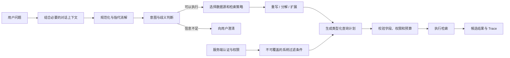
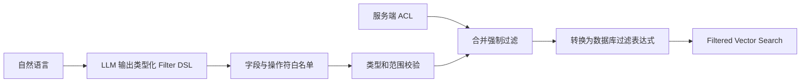

# 第 5 章 检索前处理

> [返回总目录](README.md) · [上一卷：第 4 章 向量存储](04-向量存储.md) · [下一卷：第 6 章 索引优化](06-索引优化.md)

## 本章目标

检索前处理发生在用户提出问题之后、真正访问索引之前。它把自然语言问题转换成更容易检索、更安全且可执行的查询计划。

本章重点解决：

- 多轮对话中的指代如何还原成独立问题？
- 什么时候应该重写、分解、扩展或澄清查询？
- 如何从自然语言生成类型安全的元数据过滤条件？
- Text-to-SQL、Text-to-Cypher 怎样避免注入和越权？
- 如何在向量库、全文搜索、关系库和图数据库之间路由？
- 查询转换失败时如何回退，并验证转换没有改变用户意图？

## 5.1 架构白板：从问题到查询计划



检索前处理的输出不应只是一个新字符串，而应是一个可验证的查询计划。原始问题必须保留，以便回退、审计和判断转换是否偏离意图。

## 5.2 Query Plan 数据模型

建议使用内部统一结构表达查询意图：

| 字段 | 作用 |
|---|---|
| `original_query` | 用户原始输入，不可覆盖 |
| `standalone_query` | 结合对话历史后的独立问题 |
| `intent` | 问答、统计、导航、操作等意图 |
| `routes` | 目标数据源或检索器列表 |
| `sub_queries` | 分解后的子查询 |
| `expansions` | 同义词或多角度查询 |
| `filters` | LLM 可建议、服务端必须校验的业务过滤 |
| `mandatory_filters` | 认证系统注入的租户和权限过滤 |
| `structured_call` | 预定义数据函数及其类型化参数 |
| `top_k` / `budget` | 候选数、Token、延迟和调用预算 |
| `embedding_version` | 指向第 3、4 章的兼容向量空间 |
| `confidence` | 路由或解析置信度，仅作决策参考 |
| `trace_id` | 关联改写、路由和检索 Trace |

`mandatory_filters` 与模型输出必须分开保存。模型不能删除、放宽或重写系统权限条件。

## 5.3 多轮对话与独立问题

用户经常提出依赖历史的问题：

```text
用户：退款审核通常需要多久？
助手：通常需要 3 个工作日。
用户：那被拒绝后怎么办？
```

第二个问题需要还原为类似“退款申请被拒绝后应该怎么办？”，才能独立检索。

### 5.3.1 改写原则

- 只补全对话中已经明确的实体和条件。
- 保留时间、否定、比较对象和约束词。
- 不把助手之前生成但未经证据确认的内容当成事实写入查询。
- 同时保留原始问题和独立问题。
- 对历史过长的对话，只选择与当前问题相关的轮次。

### 5.3.2 何时不应自动改写

当指代存在多个可能对象或缺少关键条件时，自动补全容易改变意图，应直接澄清。例如：“它支持吗？”在对话里出现多个产品时，没有可靠依据选择其中一个。

## 5.4 查询规范化与重写

查询重写用于消除表达噪声，使问题更接近知识库中的语言，但不能替用户创造新的需求。

常见操作：

- 拼写、空白、全角半角和大小写规范化
- 统一产品别名、缩写和实体名称
- 删除不影响含义的口语填充词
- 补全对话指代
- 将复杂表达转换为清晰、完整的问题

### 5.4.1 原意保护

重写后应检查以下信息是否保持一致：

| 信息 | 典型错误 |
|---|---|
| 实体 | 把 A 产品改成 B 产品 |
| 时间 | 丢失“2025 年以后” |
| 范围 | 把“华东区域”扩展到全国 |
| 否定 | 把“不支持退款”改成“支持退款” |
| 比较 | 丢失 A 与 B 的对比关系 |
| 用户目标 | 把排障问题改成产品介绍 |

高风险领域可以使用规则校验关键实体，或让轻量判别步骤检查重写前后是否语义等价。低置信度时回退到原查询。

## 5.5 查询分解

查询分解把一个需要多份证据的问题拆成若干可独立检索的子问题。

示例：

```text
原问题：比较 A 和 B 的退款时限与手续费。

子查询：
1. A 的退款时限是多少？
2. A 的退款手续费是多少？
3. B 的退款时限是多少？
4. B 的退款手续费是多少？
```

### 5.5.1 适用场景

- 多实体比较
- 多条件问题
- 多跳关系查询
- 一个答案需要跨文档证据
- 原查询过长且包含多个明确任务

### 5.5.2 工程约束

- 子查询必须能映射回原问题的目标。
- 记录 AND、OR、顺序或依赖关系，不能只保存字符串列表。
- 限制子查询数量、并发和总候选预算。
- 合并结果时去重，并保留每条证据对应的子查询。
- 子查询全部失败时，回退到原查询或请求澄清。

分解会提高召回覆盖，也会增加延迟、成本和噪声，不应对所有问题默认开启。

## 5.6 查询扩展与多查询

查询扩展通过同义词、别名或不同表达增加召回覆盖。例如：

```text
原查询：账号被封怎么申诉？
扩展：账号冻结申诉、账户封禁解除、账号限制复核
```

### 5.6.1 扩展来源

- 受控词典：产品别名、组织简称、领域术语
- 拼写和实体规范化服务
- LLM 生成的多角度问题
- 用户行为或查询日志中的常见表达

### 5.6.2 合并结果

多查询检索后需要：

- 按 `chunk_id` 去重
- 保留命中的查询来源
- 使用最大分数、校准加权或 RRF 融合
- 限制每个扩展查询的候选数
- 防止大量同义改写挤占上下文

受控词典通常比自由生成更稳定。LLM 扩展应设置数量限制，并通过评测证明收益。

## 5.7 HyDE：用假设文档辅助检索

HyDE（Hypothetical Document Embeddings）先让模型生成一段“可能回答问题的文档”，再嵌入该假设文档进行检索。它尝试缩小短查询与长文档之间的表达差异。


### 关键边界

- 假设文档是检索探针，不是真实证据。
- 最终回答只能引用知识库检索到的真实内容。
- 假设内容偏离用户意图时，可能把检索带向错误主题。
- 它增加一次生成调用和 Embedding 成本。
- 对关键词、编号和精确实体查询，BM25 或实体过滤可能更合适。

应把原查询检索与 HyDE 检索作为可比较或可融合的两路召回，并在业务评测集上验证收益。

## 5.8 查询澄清

当信息不足、歧义明显或执行风险较高时，应向用户提问，而不是继续猜测。

### 5.8.1 需要澄清的情况

- 指代对象不唯一
- 缺少时间、地区、产品版本等关键条件
- 用户要求比较，但没有明确比较对象
- 查询可能触发高成本或敏感数据操作
- 多个数据源都合理，且不同选择会产生明显不同答案

### 5.8.2 澄清问题设计

- 一次只询问影响最大的缺失条件。
- 尽量给出少量明确选项。
- 说明为什么需要该信息。
- 保留用户原始目标，避免把澄清变成新的任务。
- 设置最大交互轮数，用户不补充时采用安全默认或明确无法执行。

澄清可以提高正确率，但增加交互延迟。对于低风险信息问答，可以并行检索多个解释并在答案中说明假设；对于数据操作和权限敏感请求，应优先澄清。

## 5.9 自查询：从自然语言生成元数据过滤

Self-query 从用户问题中提取语义查询和结构化条件：

```text
输入：查找 2026 年发布、适用于企业版的退款文档

语义查询：退款文档
业务过滤：year = 2026 AND edition = enterprise
系统过滤：tenant_id = 当前租户 AND acl 包含当前角色
```

### 5.9.1 安全执行流程



模型只负责提出业务过滤建议。服务端负责：

- 只允许 Schema 中公开的字段
- 校验值类型、枚举和范围
- 限制表达式深度与条件数量
- 拒绝未知操作符和原始表达式片段
- 注入不可覆盖的租户、权限和状态过滤
- 转换成目标数据库的参数化表达式

不能让模型直接生成并透传数据库 filter 字符串。

## 5.10 Text-to-SQL 与预定义数据函数

自然语言统计、聚合和精确业务查询通常更适合关系数据库，而不是向量搜索。

### 5.10.1 推荐架构


优先让模型选择受控函数并填写参数，例如：

```text
function: query_sales_summary
arguments:
  region: 华东
  start_date: 2026-01-01
  end_date: 2026-06-30
```

应用层再将其转换为预定义、参数化 SQL。这通常比允许模型自由生成任意 SQL 更可控。

### 5.10.2 必要防护

- 使用只读、最小权限数据库账户
- 表、列、函数和操作符白名单
- 所有用户值参数化，禁止字符串拼接
- 限制 JOIN、子查询、返回行数和扫描范围
- 设置查询超时、并发和资源预算
- 执行前做 AST 或查询计划检查
- 行级权限由数据库或服务端注入
- 隐藏无关 Schema 和敏感字段
- 记录审计日志，但避免记录敏感结果全文

如果必须支持自由 SQL，应在隔离的只读副本或受限执行环境运行，并采用比普通工具调用更严格的审核。

## 5.11 Text-to-Cypher 与图查询

图数据库适合实体关系、多跳路径和网络分析。处理原则与 Text-to-SQL 相同：

- 优先使用预定义图查询函数。
- 限制标签、关系、属性和遍历深度。
- 参数化实体值。
- 限制结果数量和执行时间。
- 权限过滤不能由模型决定。

只有问题确实依赖关系网络时才路由到图数据库；普通文档问答继续使用文本检索。

## 5.12 查询路由

查询路由决定使用哪个数据源或检索器。

### 5.12.1 常见路由目标

| 查询类型 | 适合的数据源或策略 |
|---|---|
| 文档解释、制度问答 | 密集向量或混合检索 |
| 产品编号、错误码 | BM25、关键词或混合检索 |
| 精确统计、聚合 | 关系数据库 / 数据函数 |
| 多跳实体关系 | 图数据库 / 图查询函数 |
| 图片语义 | 多模态向量索引 |
| 实时公开信息 | 受控搜索或实时数据 API |
| 闲聊或无需知识的问题 | 不检索或直接模型回答 |

### 5.12.2 路由方法

| 方法 | 优点 | 局限 |
|---|---|---|
| 规则路由 | 快、可解释、稳定 | 覆盖复杂表达困难 |
| 语义路由 | 对不同措辞更鲁棒 | 依赖路由样本和阈值 |
| LLM 路由 | 能理解复杂意图 | 成本、延迟和输出不稳定 |
| 级联路由 | 先规则，再语义或 LLM | 工程复杂度更高，但更可控 |

### 5.12.3 路由失败与回退

- 低置信度时可选择多个安全数据源并行召回。
- 某一路超时不能阻塞全部结果，应使用独立超时和部分降级。
- 结构化查询失败时，不应伪造结果；可回退文档检索或明确失败。
- 无结果时区分“路由错误”和“目标数据源确实没有答案”。
- 记录候选路由、最终路由和回退原因。

“查询所有数据源”不是无条件的最终回退。它可能越权、增加成本并制造大量噪声，必须受到权限和预算约束。

## 5.13 查询处理顺序

不是所有查询都需要走完全部步骤。推荐按风险和必要性执行：

```text
1. 注入认证与不可覆盖的系统约束
2. 规范化输入并还原必要的对话指代
3. 判断是否需要拒绝或澄清
4. 识别意图并选择数据源
5. 根据路由决定是否重写、分解或扩展
6. 生成类型化查询计划
7. 校验字段、权限、复杂度和预算
8. 执行检索并保留 Trace
```

例如，错误码查询通常不需要 HyDE；简单 FAQ 不需要查询分解；精确统计问题不应先做向量扩展。

## 5.14 评测方法

### 5.14.1 评测集

评测样本应包含：

- 原始查询和必要的对话历史
- 期望的独立问题
- 意图与目标数据源
- 正确过滤条件
- 是否需要澄清
- 期望子查询或覆盖点
- 标准证据与答案

需要覆盖否定、时间条件、指代、省略、多意图、越权请求和路由模糊等边界案例。

### 5.14.2 指标

| 指标 | 说明 |
|---|---|
| 意图保持率 | 重写前后是否保持同一目标和约束 |
| 独立问题正确率 | 指代消解是否正确 |
| 路由准确率 | 是否选择正确数据源 |
| Filter Exact/Execution Match | 过滤结构或执行结果是否正确 |
| 子查询覆盖率 | 分解后是否覆盖原问题全部要点 |
| Recall@K | 转换后是否召回标准证据 |
| 无效计划率 | 未通过 Schema 或安全校验的比例 |
| 澄清准确率 | 应澄清和不应澄清的判断质量 |
| 回退率 | 主路径失败后使用降级策略的比例 |
| P50/P95 延迟 | 查询处理增加的时延 |
| 单查询成本 | LLM、Embedding 和多路检索总成本 |

对比实验必须保留“原查询直接检索”作为基线。如果复杂转换没有稳定提升证据召回或答案质量，就不应默认开启。

## 5.15 可观测性

一次 Query Trace 建议记录：

```text
trace_id
original_query_hash
standalone_query
intent
candidate_routes / selected_routes
sub_queries / expansions
business_filters
mandatory_filter_summary
embedding_version
retrieval_strategy
budgets
validation_result
fallback_reason
per_stage_latency
candidate_count
```

隐私敏感时对原始查询和过滤值脱敏或只记录摘要。不要在日志中暴露完整 ACL、数据库结果或敏感用户输入。

## 5.16 安全边界

检索前处理面对用户输入和 LLM 输出，二者都不可信：

- 模型不能授予权限、选择用户角色或移除 ACL。
- 文档中的提示注入不能改变查询服务的系统规则。
- SQL、Cypher 和过滤表达式必须经过结构化校验。
- 限制子查询数、路由扇出、Top-K、Token 和总执行时间。
- 工具与数据源使用最小权限身份。
- 高风险操作需要显式确认或人工审批。
- 查询计划与执行结果应可审计。

## 5.17 常见问题与排查

| 现象 | 可能原因 | 优先排查 |
|---|---|---|
| 改写后召回变差 | 实体、时间或否定条件丢失 | 对比原查询与独立问题 |
| 多轮问题查不到 | 指代没有正确还原 | 对话选择与 standalone query |
| 子查询很多但噪声增加 | 过度分解或结果未去重 | 子查询预算和融合策略 |
| HyDE 召回错误主题 | 假设文档偏离用户意图 | 原查询并行召回和消融评测 |
| Filter 被数据库拒绝 | 字段、类型或操作符不合法 | Filter DSL 与 Schema 校验 |
| 用户看到越权内容 | ACL 由模型生成或检索后过滤 | 服务端强制过滤与第 4 章执行计划 |
| Text-to-SQL 扫描大量数据 | 查询范围和资源预算缺失 | 函数白名单、计划检查和超时 |
| 路由到错误数据源 | 路由样本不足或阈值不合理 | 路由混淆矩阵与低置信度回退 |
| 查询延迟显著增加 | 串行调用过多 | 按需启用、并行执行和预算 |
| 无结果时直接回答“不存在” | 路由或转换失败没有区分 | 回退状态与数据源诊断 |
| 新向量索引上线后查询失败 | `embedding_version` 未同步 | Query Plan 与索引别名 |

## 本章面试表达

可以用下面这段话概括检索前处理层：

> 检索前处理的目标是把用户自然语言转换成可验证的 Query Plan，而不是无条件让 LLM 改写问题。我会先结合必要历史生成 standalone query，保留原始查询用于回退；再按意图选择向量库、BM25、关系库或图数据库，并按需执行重写、分解、扩展或澄清。Self-query 只允许模型输出类型化过滤建议，租户和 ACL 始终由服务端注入。Text-to-SQL 优先映射到预定义数据函数和参数化查询，并增加只读权限、Schema 白名单、计划检查和超时。所有转换都通过业务评测集比较 Recall、路由准确率、意图保持率、延迟和成本，没有稳定收益的复杂策略不会默认开启。

## 本章小结

1. 检索前处理应输出可验证、可回退和可审计的 Query Plan。
2. 查询改写必须保留实体、时间、否定、范围和用户目标。
3. 查询分解与扩展可以提高召回，但也会增加延迟、成本和噪声。
4. HyDE 生成的是检索探针，不能作为最终回答的证据。
5. 信息不足或风险较高时，澄清优于猜测。
6. Self-query 的业务过滤需要 Schema 校验，ACL 必须由服务端强制注入。
7. Text-to-SQL/Cypher 应优先使用预定义函数、参数化查询和最小权限账户。
8. 路由需要置信度、超时、回退和预算，不能无约束查询所有数据源。
9. 所有复杂查询策略都必须与原查询直接检索基线比较。

下一章将讨论如何组织父子索引、层次索引和多表示索引，使不同粒度的查询能够更高效地命中正确内容。

---

> [返回总目录](README.md) · [上一卷：第 4 章 向量存储](04-向量存储.md) · [下一卷：第 6 章 索引优化](06-索引优化.md)
