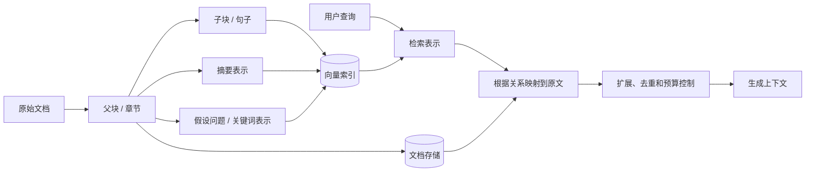
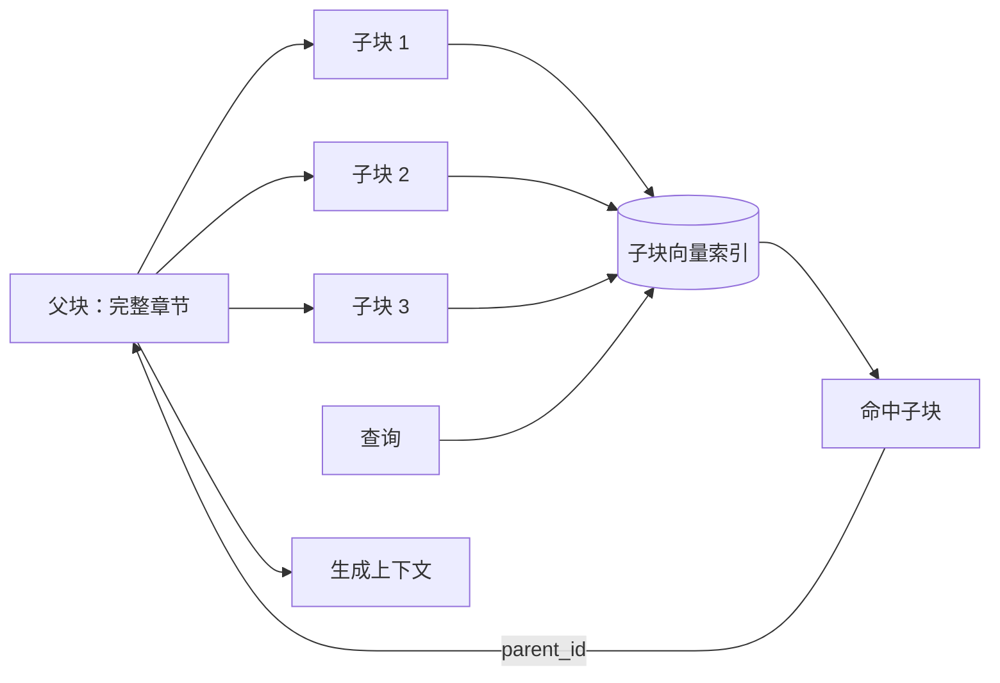
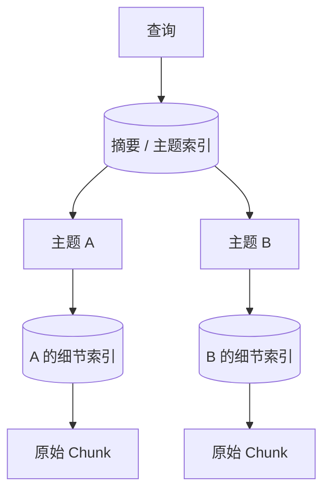
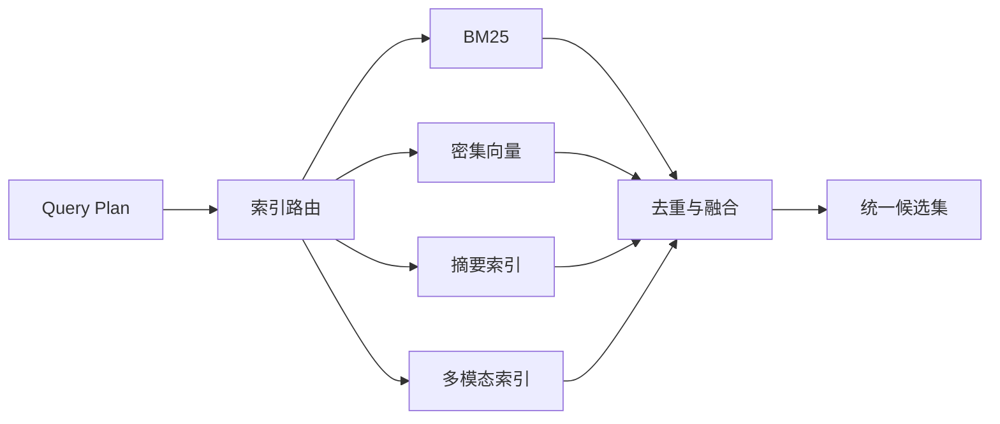

# 第 6 章 索引优化

> [返回总目录](README.md) · [上一卷：第 5 章 检索前处理](05-检索前处理.md) · [下一卷：第 7 章 检索后处理](07-检索后处理.md)

## 本章目标

本章的“索引优化”是指优化内容的组织方式和检索表示，不是第 4 章中的 HNSW、IVF 等数据库 ANN 索引算法。

它要解决的核心矛盾是：

- 用小块检索，语义更聚焦，但生成上下文可能不足。
- 用大块检索，上下文更完整，但相似度容易被无关内容稀释。
- 只索引原文，对概括性、跨段落和多模态问题覆盖有限。
- 同时维护多种表示，会增加存储、更新和检索复杂度。

完成本章后，你应该能够：

- 解释为什么检索 Chunk 与生成 Chunk 可以不同。
- 设计句子窗口、父子块和层次索引。
- 理解摘要索引、多表示索引和 RAPTOR 的适用边界。
- 正确处理邻接关系、权限继承和版本更新。
- 用评测数据判断复杂索引是否真的优于简单基线。

## 6.1 架构白板：检索表示与生成上下文解耦



核心设计是把两件事分开：

1. **用什么表示匹配查询**：子块、摘要、标题、假设问题等。
2. **最终给模型什么内容**：原始 Chunk、父块、邻近段落或完整对象。

索引中的合成表示只用于提升召回，最终答案仍应以可追踪的原始内容为证据。

## 6.2 索引关系模型

复杂索引依赖稳定关系，而不是框架对象名称。推荐在 Chunk 模型上增加：

| 字段 | 作用 |
|---|---|
| `node_id` | 当前节点稳定标识 |
| `document_id` | 所属原始文档 |
| `parent_id` | 父节点 |
| `children_ids` | 子节点列表或关系表 |
| `prev_id` / `next_id` | 同一序列中的相邻节点 |
| `level` | 文档、章节、段落、句子等层级 |
| `representation_type` | raw、summary、title、question、image 等 |
| `source_node_id` | 合成表示对应的原始节点 |
| `embedding_version` | 兼容的向量空间 |
| `index_version` | 内容组织与构建规则版本 |
| `tenant_id` / `acl` | 租户和权限 |

### 关系约束

- 所有合成表示必须能追踪到原始节点。
- 子节点不能比父节点拥有更宽松的权限。
- 邻接关系只能在同一文档和同一有效序列内建立。
- 删除父节点时必须处理子节点、摘要和向量的级联清理。
- 关系遍历必须设置深度、节点数和 Token 预算。

## 6.3 Small-to-Big：小块检索，大块生成

Small-to-Big 将检索粒度和生成粒度解耦：先使用聚焦的小块提高召回精度，命中后再扩展到更完整的上下文。

### 6.3.1 句子窗口

```text
前一句 ← 目标句 → 后一句
           ↑
       用于向量检索

前后窗口整体 → 用于生成
```

构建时：

1. 将文档切为句子或短段落。
2. 为目标节点生成 Embedding。
3. 保存其前后节点 ID 或窗口文本。
4. 查询命中目标节点后，按预算扩展邻居。

适合：

- 答案通常在一句话附近。
- 文档顺序有意义。
- 单句缺少主体、原因或限定条件。

风险：

- 固定窗口可能引入无关句子。
- 多个命中窗口会重叠，需要合并和去重。
- OCR 阅读顺序错误会让窗口内容失真。

### 6.3.2 父子块



子块用于检索，父块保存在文档存储中。命中子块后，通过 `parent_id` 获取父级上下文。

父块不一定是完整文件，更常见的是一个章节或较大的语义块。把整本手册作为父块通常会重新引入大量噪声。

### 6.3.3 两种方式如何选择

| 场景 | 更适合的方式 |
|---|---|
| 上下文主要来自前后几句 | 句子窗口 |
| 文档具有明确标题和章节 | 父子块 |
| 需要同时利用顺序与层级 | 两者组合，但要限制扩展预算 |

## 6.4 Summary-to-Detail：先定位主题，再进入细节

摘要到细节索引先用高层描述定位文档或章节，再路由到关联的细粒度索引。



适合：

- 知识库天然按产品、年份、部门或主题分层。
- 全局索引过大，先路由能缩小搜索范围。
- 用户既会提概括性问题，也会查询具体细节。

### 风险与控制

- 摘要遗漏关键词，可能导致整个子树无法被检索。
- 顶层路由错误会造成系统性漏召回。
- 层级过深会增加延迟和故障点。
- 同一内容可能属于多个主题，需要多父关系或多路召回。

建议保留全局原文检索作为对照或受预算约束的回退路径。

## 6.5 分层索引与自动合并

分层索引把同一内容组织为文档、章节、段落、句子等多个层级。通常只为叶子或部分层级建立向量索引，命中多个同父节点的叶子后，再决定是否合并为父节点。

### 6.5.1 自动合并逻辑

一种可解释的合并规则是：

```text
如果同一父节点的命中子节点覆盖率达到阈值
并且父节点未超过上下文预算
则使用父节点替换这些子节点
否则保留命中的子节点
```

合并决策不能只看子节点数量，还应考虑：

- 子节点的相关分数
- 子节点是否连续
- 父节点中的无关内容比例
- 合并后的 Token 成本
- 多个父节点之间是否重复

### 6.5.2 与父子块的区别

父子块通常是“命中任一子块就返回父块”；自动合并则根据多个命中和预算动态判断是否提升到父级，控制更细但实现和调参更复杂。

## 6.6 相邻节点扩展

前向/后向扩展根据查询和文档顺序，补充命中节点之前或之后的内容。

适合：

- “之前发生了什么”“下一步是什么”等顺序问题
- 操作手册的连续步骤
- 时间线、会议记录和事件因果链

它与固定句子窗口的区别是：

- 固定窗口在构建时预设范围。
- 动态扩展在检索后根据查询意图决定方向和大小。

必要约束：

- 只能在同一文档、同一版本和同一权限范围内扩展。
- 检查 `prev_id` / `next_id` 是否形成循环或断链。
- 限制最大扩展节点数和 Token 数。
- 扩展结果需要去重并保持原始顺序。

动态方向可由规则、分类器或 LLM 判断，但最终遍历边界必须由应用层控制。

## 6.7 多表示索引

同一原始节点可以生成多种用于检索的表示：

| 表示 | 主要解决的问题 | 风险 |
|---|---|---|
| 原文 | 保留完整事实 | 长文本主题可能稀释 |
| 标题与章节路径 | 用户按主题或栏目查询 | 标题过短、重名 |
| 摘要 | 概括性问题和长文档路由 | 摘要遗漏或生成错误 |
| 假设问题 | 用户问题与文档措辞差异 | 生成问题覆盖不全 |
| 关键词与实体 | 编号、术语和专有名词 | 依赖提取质量 |
| 图片描述 | 跨模态语义检索 | 视觉描述可能不忠实 |

检索命中任何表示后，都通过 `source_node_id` 返回原始内容，而不是把模型生成的摘要或假设问题直接作为最终证据。

### 6.7.1 存储方式

- 每种表示使用独立记录，通过 `source_node_id` 关联。
- 不同 Embedding 模型使用独立向量字段或集合。
- `representation_type` 应参与过滤、评测和 Trace。
- 相同原文的多种命中在候选阶段合并，避免重复占用 Top-K。

### 6.7.2 成本

如果每个 Chunk 生成原文、摘要和三个假设问题，向量数量可能增长到原来的五倍。还需要计算生成成本、更新成本和索引内存，因此必须通过召回提升证明价值。

## 6.8 RAPTOR：递归摘要树

RAPTOR（Recursive Abstractive Processing for Tree-Organized Retrieval）通过递归聚类和摘要构建多层表示：

```text
原始 Chunk
  ↓ Embedding + 聚类
局部摘要
  ↓ 再次 Embedding + 聚类
更高层摘要
  ↓
多层节点共同进入检索
```

它尝试同时支持局部事实和跨文档、全局性问题。

### 适用场景

- 长文档或文档集合具有明显主题层次。
- 用户频繁提出概括、比较和跨段落问题。
- 简单父子块与摘要路由仍无法覆盖全局问题。

### 主要代价

- 多轮 Embedding、聚类和摘要成本高。
- 摘要错误可能向上层传播。
- 数据更新后需要局部或整棵树重算。
- 聚类和摘要版本使复现、回滚更复杂。
- 层次越多，调试“为什么命中该节点”越困难。

RAPTOR 不应作为默认起点。先建立普通 Chunk 检索基线，并确认全局问题确实是主要失败类型。

## 6.9 混合召回与索引路由

第 4 章已经介绍 BM25 与密集向量的混合检索，本章关注多索引之间的组织方式。



索引路由可以选择单路、并行多路或级联检索：

| 模式 | 优点 | 局限 |
|---|---|---|
| 单路 | 延迟和成本低 | 路由错误会漏召回 |
| 并行多路 | 覆盖高、便于融合 | 成本和噪声增加 |
| 级联 | 先低成本召回，必要时升级 | 控制逻辑更复杂 |

融合前应统一候选标识并按 `source_node_id` 去重。原始分数来自不同索引时通常不能直接相加，可使用分数校准、RRF 或后续重排。

## 6.10 索引构建流程

```text
1. 读取标准 Chunk 与结构关系
2. 构建父子、邻接和层级节点
3. 按需生成摘要、标题增强或假设问题
4. 校验合成表示能追踪到原文
5. 继承租户、ACL、版本和来源
6. 根据表示类型生成 Embedding
7. 写入对应向量字段或集合
8. 执行关系完整性和数量对账
9. 用评测集验证后切换线上索引版本
```

### 构建不变量

- 相同输入、配置和模型版本应产生可复现的节点关系。
- 摘要或问题生成失败不能阻塞原文基础索引。
- 合成表示不得扩大原文权限范围。
- 每个向量必须有 `source_node_id` 和 `index_version`。
- 索引切换应采用新版本构建、验证后原子切换。

## 6.11 增量更新与版本治理

### 6.11.1 更新影响范围

| 变化 | 需要更新的内容 |
|---|---|
| 一个子块正文变化 | 子块向量、父级摘要、关联假设问题 |
| 标题变化 | 标题表示、章节路径和相关子节点元数据 |
| 文档顺序变化 | `prev_id` / `next_id` 与窗口 |
| ACL 变化 | 原文及全部合成表示的权限 |
| Embedding Contract 变化 | 该空间下全部向量和数据库索引 |
| 摘要 Prompt/模型变化 | 全部受影响摘要和上层递归摘要 |

复杂层次越多，增量更新的影响传播越难。需要维护依赖关系或接受批量重建，不能只更新叶子向量后留下过期父摘要。

### 6.11.2 版本字段

建议记录：

- `chunker_version`
- `embedding_version`
- `summary_version`
- `relationship_version`
- `index_version`

查询端应固定读取一个完整版本，避免父节点、子节点和摘要来自不同构建批次。

## 6.12 评测方法

### 6.12.1 先定义失败类型

| 失败类型 | 适合验证的优化 |
|---|---|
| 命中句子但上下文不足 | 句子窗口、父子块 |
| 多个相关片段属于同一章节 | 自动合并 |
| 概括性问题找不到整章 | 摘要索引、层次路由 |
| 顺序和因果问题缺少前后文 | 相邻节点扩展 |
| 用户措辞与原文差异大 | 假设问题、多表示索引 |
| 精确词项和语义都重要 | BM25 + 密集向量 |
| 跨文档全局问题失败 | RAPTOR 或其他层次摘要 |

### 6.12.2 指标

| 指标 | 说明 |
|---|---|
| Evidence Recall@K | 标准证据是否进入候选集 |
| Parent/Window Hit Rate | 命中后是否扩展到正确上下文 |
| Context Precision | 扩展内容中有效信息的比例 |
| Context Completeness | 回答所需证据是否完整 |
| Redundancy Rate | 候选和扩展内容的重复比例 |
| Answer Correctness / Faithfulness | 答案正确且得到原文支持 |
| Index Expansion Ratio | 向量数相对原始 Chunk 数的增长 |
| Build Time / Update Time | 全量构建和增量更新成本 |
| P50/P95 Latency | 多路召回、关系读取和扩展延迟 |
| Token / Storage Cost | 生成上下文和多表示索引成本 |

对比时固定 Embedding、数据库 ANN 参数和检索后处理，避免把其他变量的变化误认为索引结构收益。

### 6.12.3 消融实验

推荐依次比较：

```text
基础 Chunk 检索
+ 标题路径
+ 父子块或句子窗口
+ 多表示
+ 多路融合
+ 高成本层次摘要
```

每次只增加一种机制，记录质量、延迟和成本变化。收益不稳定的复杂结构应移除。

## 6.13 可观测性

一次检索 Trace 建议记录：

```text
trace_id
query_plan_id
index_version
selected_indexes
matched_representation_type
matched_node_id / source_node_id
parent_expansion
neighbor_expansion
merge_decision
retrieval_scores
fusion_scores
candidate_count_before_after_dedup
context_tokens
per_stage_latency
fallback_reason
```

索引构建侧还应监控：

- 各表示类型的节点与向量数量
- 无父节点、断裂邻接和循环关系数量
- 摘要与假设问题生成失败率
- 原文与合成表示 ACL 不一致数量
- 构建耗时、重试和版本对账结果

## 6.14 安全边界

- 父子、邻接和递归扩展不能跨越租户或 ACL。
- 合成摘要、关键词和假设问题必须继承原文权限。
- 模型生成的摘要与问题是不可信派生数据，不能代替原文证据。
- 限制关系遍历深度、路由扇出、候选数和 Token 数。
- 索引路由不能选择当前用户无权访问的数据源。
- 删除或权限撤销必须级联到全部派生表示。
- Trace 不应记录完整敏感正文或向量。

## 6.15 常见问题与排查

| 现象 | 可能原因 | 优先排查 |
|---|---|---|
| 小块命中但答案不完整 | 没有正确扩展父块或窗口 | `parent_id`、邻接关系和预算 |
| 返回父块后噪声很多 | 父块过大或无条件提升 | 父块粒度与合并阈值 |
| 概括性问题无结果 | 只索引原始小块 | 摘要或标题表示 |
| 摘要命中但原文无依据 | 摘要生成错误或映射断裂 | `source_node_id` 与原文校验 |
| 多表示导致重复结果 | 未按原始节点去重 | 候选合并键 |
| 相邻扩展出现其他章节 | 邻接关系跨边界 | 文档、章节和版本约束 |
| 层次路由漏掉正确子树 | 顶层摘要遗漏或路由错误 | 全局原文回退与路由评测 |
| 更新后仍返回旧摘要 | 依赖传播不完整 | 摘要版本和受影响节点重建 |
| 权限撤销后仍能命中摘要 | 派生表示 ACL 未更新 | 权限级联和版本对账 |
| 索引体积快速增长 | 假设问题或多表示数量过多 | Index Expansion Ratio |
| 延迟增加但质量不变 | 多路检索或递归层次无收益 | 消融实验与各阶段耗时 |
| 自动合并结果不稳定 | 阈值、排序或父块结构变化 | 固定版本和合并 Trace |

## 本章面试表达

可以用下面这段话概括索引优化设计：

> 这里的索引优化不是调 HNSW，而是优化内容如何被检索和展开。我会先用普通 Chunk 检索建立基线，再针对明确失败类型选方案：单句命中但上下文不足时使用父子块或句子窗口；概括性问题使用摘要到原文；顺序问题按邻接关系扩展；措辞差异大时增加标题、关键词或假设问题表示。所有派生表示都通过 source_node_id 回到原文，并继承相同 ACL 和版本。评测不仅看 Recall，还看上下文完整度、重复率、索引膨胀、更新成本和 P95 延迟。复杂的 RAPTOR 或多路索引只有在消融实验中稳定提升业务指标时才会上线。

## 本章小结

1. 检索表示与生成上下文可以解耦，小块用于匹配，大块用于补充证据。
2. 句子窗口适合邻近上下文，父子块适合明确章节层级。
3. 自动合并根据多个子块命中和预算决定是否提升到父节点。
4. 摘要和多表示能提高概括性或措辞差异查询的召回，但必须回到原文作为证据。
5. 相邻扩展需要稳定顺序、同文档边界和遍历预算。
6. RAPTOR 适合跨文档全局问题，但构建、更新和调试成本高。
7. 多索引分数通常不能直接相加，需要校准、RRF 或后续重排。
8. 所有派生表示必须继承权限，并随原文更新和删除。
9. 索引优化必须针对明确失败类型，通过逐层消融实验验证。

下一章将处理已经召回的候选结果，包括重排、去重、压缩和上下文选择。

---

> [返回总目录](README.md) · [上一卷：第 5 章 检索前处理](05-检索前处理.md) · [下一卷：第 7 章 检索后处理](07-检索后处理.md)
