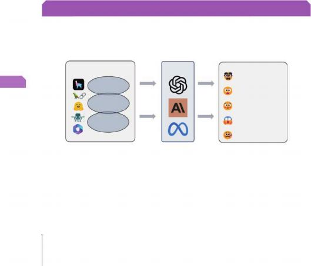

# 第 7 章 检索后处理

> [返回总目录](README.md) · [第 6 章 索引优化](06-索引优化.md) · [第 8 章 响应生成](08-响应生成.md)

---

> 第 7 章 检索后处理
>
> 学习了检索前处理、 索引优化技术后 ， 小冰与咖哥一起讨论了检索后处理技术（见图7-1），但是小冰还是有一些疑问。
>
> 小冰： 能否说说检索前处理 、索引优化和检索后处理这些技术之间的关键差异？
>
> 咖哥： 检索前处理和索引优化技术专注于提升检索过程的效率 ， 而检索后处理技术则致力于提高检索结果的质量。 由于初步检索结果往往不够理想 ， 需要进一步优化和处理 ， 以确保生成模型能够输出高质量的回答。
>
> 检索后处理通过一系列步骤（见图 7-2）将最相关的文本块置于结果列表的前端 ， 同时减少冗余信息并提高内容质量 ，从而提升系统的整体性能 ，使生成的内容更加准确，并与上下文紧密相关。

检索后处理

> 重排 压缩
>
> 相关性

查询 （问题）

> 基于相关性和冗余度进行文档压缩
>
> { }
>
> 校正

主动检索

> 如果检索结果不相关
>
> 再次检索或从新数据源（如网络）检索

图7-1 小冰与咖哥讨论检索技巧

> 查询构建 检索后处理 系统评估
>
> 关系数据库 图数据库 压缩
>
> 向量数据库 重排

查问题 问）询 查题） 查问题 检索评估

> 自查询检索器
>
> 生 RankGPT、 冗余度
>
> 排序或过滤、RAG-Fus on
>
> 查询翻译 检索前处理 主动检索 校正
>
> 查询重写 查询分解 查询澄清 查询扩展 CRAG
>
> 查询 查询
>
> 问题 子问题 退一步的问题 问题） 再次关如网络）检
>
> 分解或重新表述输入问题 图数据库
>
> 生成子问题 退一步的问题或更清晰 生成假设性文档
>
> 查（题） 回答 响应评估
>
> 查询路由 关系数据库 文本块

语义路由

> 向量存储
>
> { } 索引
>
> 向量数据库 忠实度
>
> 扎实性
>
> 让问题 让大模型根据查询问题
>
> 索引优化 响应生成 安全性
>
> 父子文本索 分层索引 多表示索引 提示工程
>
> 分块时形成 分块 形成层级 选择合适的大模
>
> 父子文档 文档簇
>
> 文档簇
>
> 集成检索器

层 点解析器 输出解析

> 递归检索器 多向量检索器

节点-句子窗口 RAPTOR

> 信息嵌入 主动生成
>
> (嵌入模型 稀疏嵌入和密集嵌入 专用嵌入
>
> 密集 : \[0 25 -0 73 0 91 回答
>
> "b rd": \[-0 45 0 82 -0 13

dog : \[0 31 -0 65 0 88

> \[[1 0 0 0 0 0 0 0 0 0](#bookmark497)\]
>
> g 于回答的质
>
> 判断是否需要进行查询重写\[08 0 0 03 0 0 0 0 0 0\] 基于特定领域的 或者重新查询
>
> 习得的稀疏嵌 专用嵌入模型
>
> 文本分块 数据导入
>
> 文本块的优化
>
> 按字符
>
> 分块 按段落 文本块 导入的文
>
> 按语义
>
> 语义分块

智能分块

> 优 分块可以提升检索 等
>
> 和生成的质量
>
> 图7-2 索引后处理技术
>
> 常见的检索后处理技术如下。
>
> ■ 重新排序（re - ra nking）：简称重排 。初始检索结果中可能包含大量的文本块 ，它们与查询的相关度各不相同 。通过对这些结果进行评估 ，将最相关的结果置于前列 。需要注意的是 ，重排会增加额外的计算资源需求。
>
> ■ 压缩（compression）：检索到的文本块可能既长又复杂 ，对其进行压缩可减轻生成器的计算负担 ，加快生成速度。
>
> ■ 校正（correction）：在生成结果之后对其进行检查和修正 ， 以确保输出的准确性
>
> 第 7 章 检索后处理 253
>
> 和连贯性 。这对于高风险或高标准的领域（如医疗 、法律） 尤为重要 。校正过程通常也会增加系统的复杂性和计算资源的需求。
>
> 这些技术可以由开发者手工集成到 RAG 流程中 。 LangCha in 的某些检索器内部也集成了部分检索后处理技术 。在 Lla ma Index 中 ，检索后处理通常通过节点后处理器来完成。
>
## 7.1 重排
>
> 当用户提出一个问题时 ，尽管正确答案可能存在于某个文本块中 ，但如果该块在检索结果中的排名不够高 ，未被传递给大模型进行生成处理（例如 ，系统只考虑 Top 3 的文本块 ， 而正确答案所在的文本块排在第 4 位），系统将无法给出正确的回答。
>
> 重排的目的是提高初步检索出的候选文本块的排序质量 ，通过更加精细的评分机制 ，确保将最相关的文档排在前列 。重排有多种实现方式 ，接下来我们将从简单到复杂依次进行讲解。
>
### 7.1.1 RRF重排
>
> 在混合检索中 ，我们可以从多条检索路径（或多个检索器） 获取多样的检索结果 。这些路径可以是关键词检索和向量检索的结合 、 向量存储和结构化数据库存储的结合或不同检索策略（如不同的分块策略及索引策略） 的结合。
>
> 混合检索的核心思想在于取长补短 。例如 ，关键词检索擅长精确匹配 ， 而语义检索则擅长捕捉语义相关性 。通过结合这两种检索结果 ，可以提高检索的召回率（Recall） 和精确率（Precision）。然而 ，这也带来了以下这些新问题。
>
> ■ 结果冗余 ：不同的检索方法可能会返回相同或相似的文本块 ，造成结果重复。
>
> 7

■ 排序不一致 ：不同的检索方法的评分标准不同（如 BM25 的评分标准是关键词匹配得分 ， 而语义检索使用余弦相似度），若直接合并 ，得到的可能不是最优结果。

> ■ 效率问题 ：混合检索可能产生大量候选文本块 ，如何从中筛选出最相关的文档成为一大挑战。
>
> 针 对 上 述 问 题 ， 最 常 见 的 解 决 方 法 是 对 初 步 检 索 得 到 的 候 选 文 本 块 应 用 RRF （Recip rocal Rank F usio n ，一般译为倒数排名融合或者互惠排名融合） 重排（见图7-3）， 以减少结果的冗余 ，并统一不同检索方法的评分标准。
>
> 图7-3 RRF重排在RAG流程中的位置
>
> 254 大模型应用开发 RAG 实战课
>
> RRF 会合并来自多个不同检索器的结果列表 ， 为每个结果分配一个融合得分。 如果某文本块在多个结果列表中均排名靠前 ，那么它的 RRF 总分会更高 。这种方法体现了集成学习的思想。
>
> RRF 算法的关键重排序公式如下。
>
> 

其中 ， *d* 代表特定文本块 ， Score*R* *RF* (*d* ) 是该文本块的融合得分；*N* 是排序器的数量（即输入的多个检索结果列表的数量）；ra nk*i* (*d*)是文本块 *d* 在第 *i* 个排序器中的排名（从1 开始计数）； 而*k* 是平滑参数 ， 用于控制排名对得分的影响 ，通常取值为一个常数（如60）。

> 这样 ，每个文本块的最终得分是所有排序器贡献分数的累加值 。排名越高（数字越小）的文本块 ，其贡献的得分越高 。如果某个文本块在某些排序器中排名较高而在其他排序器中未出现 ，这种方法会对其排名进行调整 ，平衡多个排序器的权重。 因此 ， 即使文本块在某个排序器中的表现不佳 ， RRF 也能通过它在其他排序器中的排名来纠正结果 ，从而使
>
> 之具有鲁棒性。
>
> 小冰 ：平滑参数怎么理解？
>
> 咖哥 ：平滑参数主要用于解决排名较高的文本块对最终得分影响过大的问题。通过增大平滑参数 *k*， 可以进一步减弱那些排名非常靠前的文本块的影响。换句话说，
>
> 较高的 *k*值会稀释这些靠前文档的影响 ，从而增强整体排名的平滑性。这使得 R RF 更倾向于融合不同排序器提供的“长尾贡献 ”，而不是过度偏向某个排序器中排名特别
>
> 靠前的结果。
>
> 这里介绍一个简单直观的示例（见图 7-4）。
>
> 7

假设有两个排序器的输出

> 排序器1: "A" , "B" , "C"
>
> 排序器2: "C" , "A" , " B"
>
> 排序器1的贡献 排序器2的贡献
>
> Score2("C" ) = 1/(1 + 60) = 1/61
>
> Score2("A" ) = 1/(2 + 60) = 1/62
>
> Score2("B" ) = 1/(3 + 60) = 1/63

Score1("A" ) = 1/(1 + 60) = 1/61

> Score1("B" ) = 1/(2 + 60) = 1/62

K = 60

> Score1("C" ) = 1/(3 + 60) = 1/63
>
> 融合得分
>
> ScoreRRF"(A") = 1/61 + 1/62
>
> ScoreRRF("B" ) = 1/62 + 1/63
>
> ScoreRRF("C" ) = 1/63 + 1/61
>
> 重新排序
>
> "A" (ScoreRRF = 0.03252)
>
> "C" (ScoreRRF = 0.226)
>
> " B" (ScoreRRF = 0.03200)
>
> 图7-4 RRF的计算过程示例
>
> 从图 7-4 可以看出 ， 由于我们设置的 *k* 值较大 ， 因此根据融合得分从高到低排序后
>
> 第 7 章 检索后处理 255
>
> 的分值非常接近 。需要注意的是 ，在重排之前 ，较低的得分（在检索序列中位置靠前） 意味着文本块更重要； 而在重排之后 ，较高的得分则表示文本块更为重要。
>
> 小冰 ：看起来很不错。 R RF 不依赖复杂的超参数调优 ，其核心逻辑仅是对文本块的排名进行简单的平滑计算 ， 以融合任何给定格式的排名列表。
>
> 咖哥 ：确实如此。不过 ，真正有价值的重排还取决于原始检索器的效果。如果原始检索器给出的结果质量不高 ，那么即使经过重排 ，结果依然可能不尽如人意。
>
> 以下代码示例展示了如何实现 RRF。
>
> def reciprocal_rank_fusion(results: list\[list\], k =60):
>
> """
>
> RRF 算法用于合并多个排序器的检索结果。
>
> 参数：
>
> \- results：一个包含多个检索结果列表的列表 ，每个子列表代表一个排序器的输出。
>
> 每个子列表中的元素代表文档 ，按检索得分从高到低排序。
>
> \- k：RRF 公式中的参数 ，控制文档排名对融合分数的影响。默认值为 60。
>
> 返回：
>
> \- reranked_results：一个列表，包含经过 RRF 算法重新排序后的文档，按融合得分从高到低排序。 """
>
> \# 初始化一个字典 ，用于存储每个文档的融合得分fused_scores = {}
>
> \# 遍历每个排序器的检索结果列表（即 results 中的每个子列表） for docs in results:
>
> \# 遍历每个文档及其在该结果列表中的排名for rank, doc in enumerate(docs):
>
> \# 将文档序列化为字符串格式 ，以便将其用作字典的键
>
> \# 使用 dumps(doc) 将文档转换为字符串 ，便于在字典中存储doc_str = dumps(doc)
>
> \# 如果该文档尚未在字典中出现 ，则初始化得分为 0 if doc_str not in fused_scores:
>
> fused_scores\[doc_str\] = 0
>
> \# 根据 RRF 公式 ，计算当前文档的得分
>
> \# rank 是文档的排名（从 0 开始） ，k 是常数参数 ，表示对排名的平滑处理fused_scores\[doc_str\] + = 1 / (rank + k)
>
> \# 将字典中的文档按照融合得分进行降序排序 ，得分高的文档排在前面reranked_results = \[
>
> \# loads(doc) 将序列化的文档字符串还原为原始文档格式 ，配合对应的融合得分(loads(doc), score)
>
> \# sorted 函数对字典中的文档按得分进行排序 ，reverse =True 表示按降序排列
>
> for doc, score in sorted(fused_scores.items(), key =lambda x: x\[[1](#bookmark498)\], reverse =True)
>
> \]
>
> \# 返回重新排序后的文档列表 ，其中每个元素是（文本块 , 融合得分）的元组
>
> return reranked_results
>
> 函数 reciprocal\_ rank_fusion 接受一个由多个检索结果列表组成的列表和一个可选

256 大模型应用开发 RAG 实战课

> 参数 k（默认值为60）。 它通过对每个排序器的文本块计算其融合得分 ，然后根据这些得分重新排序 ，最终返回一个按融合得分从高到低排序的新列表 。每个元素是一个包含文本块及其对应融合得分的元组。
>
> 以下代码示例展示了如何通过 LangChain 结合 HuggingFace嵌入和 Chroma向量数据库来实现 RRF 重排。在这个示例中， “山西文旅”目录包含了关于山西旅游的大量资料。
>
> In \# 导入相关的库import os
>
> from langchain.text_splitter import RecursiveCharacterTextSplitter
>
> from langchain_community.document_loaders import PyPDFLoader, TextLoader
>
> from langchain_huggingface import HuggingFaceEmbeddings
>
> from langchain_community.vectorstores import Chroma
>
> from langchain.prompts import ChatPromptTemplate
>
> from langchain_core.output_parsers import StrOutputParser
>
> from langchain_deepseek import ChatDeepSeek
>
> from langchain.load import dumps, loads
>
> \# 加载文档
>
> doc_dir = "./data/ 山西文旅 "
>
> def load_documents(directory):
>
> """ 读取目录中的所有文档（包括 PDF、TXT、DOCX)"""
>
> documents = \[\]
>
> for filename in os.listdir(directory):
>
> filepath = os.path.join(directory, filename)
>
> if filename.endswith(".pdf"):
>
> loader = PyPDFLoader(filepath)
>
> elif filename.endswith(".txt"):
>
> loader = TextLoader(filepath)
>
> else:
>
> 7

continue \# 跳过不支持的文件类型documents.extend(loader.load())

> return documents
>
> docs = load_documents(doc_dir)
>
> \# 文本切块
>
> text_splitter = RecursiveCharacterTextSplitter( chunk_size =300,
>
> chunk_overlap =50 )
>
> splits = text_splitter.split_documents(docs)
>
> \# 获取嵌入并创建向量索引
>
> embed_model = HuggingFaceEmbeddings(model_name ="all-MiniLM-L6-v2")
>
> vectorstore = Chroma.from_documents(documents =splits, embedding =embed_model) [retriever = vectorstore.as_retriever](retriever=vectorstore.as_retriever)()
>
> \# RRF 算法
>
> def reciprocal_rank_fusion(results: list\[list\], k =60):
>
> 第 7 章 检索后处理 257
>
> fused_scores = {}
>
> for docs in results:
>
> for rank, doc in enumerate(docs):
>
> doc_str = dumps(doc)
>
> if doc_str not in fused_scores:
>
> fused_scores\[doc_str\] = 0
>
> fused_scores\[doc_str\] + = 1 / (rank + k)
>
> reranked_results = \[
>
> (loads(doc), score)
>
> for doc, score in sorted(fused_scores.items(), key =lambda x: x\[[1](#bookmark499)\], reverse =True) \]
>
> return reranked_results
>
> \# 生成多个检索查询
>
> template = """ 你是一个帮助用户生成多个检索查询的助手。\n
>
> 请根据以下问题生成多个相关的检索查询 ：{question} \n
>
> 输出（4 个查询） ："""
>
> prompt_rag_fusion = ChatPromptTemplate.from_template(template)
>
> llm = ChatDeepSeek(model ="deepseek-chat")
>
> generate_queries = (
>
> prompt_rag_fusion \| llm
>
> \| StrOutputParser()
>
> \| (lambda x: x.split("\n")) )
>
> \# 示例问题
>
> questions = \[
>
> " 山西有哪些著名的旅游景点？ ",
>
> " 云冈石窟的历史背景是什么？ ",
>
> " 五台山的文化和宗教意义是什么？ " \]
>
> \# 进行检索和 RRF 处理
>
> for question in questions:
>
> [retrieval_chain_rag_fusion = generate_queries \| retriever.map](retrieval_chain_rag_fusion=generate_queries|retriever.map)() \| reciprocal_rank_fusion docs = retrieval_chain_rag_fusion.invoke({"question": question})
>
> print(f"\n【问题】{question}")
>
> print(f" 文档数量：{len(docs)}")
>
> for doc, score in docs\[:3\]: \# 显示前 3 个结果
>
> print(f" 文档内容：{[doc.page_content](doc.page_content)\[:200\]}...") \# 只展示前 200 个字符
>
> 【问题】云冈石窟的历史背景是什么？
>
> 文档数量：6
>
> 文档内容：云冈石窟
>
> 云冈石窟位于中国北部山西省大同市西郊 17 公里处的武周山南麓 ，石窟依山开凿。
>
> 文档内容：云冈五华洞
>
> 位于云冈石窟中部的第 9~13 窟。这 5 窟因清代施泥彩绘云冈石窟景观而得名。五华洞雕饰绮丽

258 大模型应用开发 RAG 实战课

### 7.1.2 Cross-Encoder重排
>
> R RF 重排是一种类似于集成学习的方法 ， 它不涉及检索结果与查询之间的语义关系。相比之下 ， 即将介绍的 Cross-Encoder 重排（Cross-Encoder Re-ranking）则基于
>
> Cross-Encoder 模型 ，在语义层面上进行重排。
>
> C ross - E ncode r 的思路起源于 2018 年 Google 发布的 BERT 。作为一个双向
>
> Transformer 模型 ， BERT 旨在通过大量未标注文本数据学习通用的语言表示形式 ，并非专门针对查询和文档的语义匹配或排序任务设计 。 Nog uei ra 等人在 2019 年发表的论文“ Passage Re-ranking with BERT ”中首次提出了将预训练语言模型 BERT 用于段
>
> 落重排（Passage Re-ranking） 任务的观点。
>
> Cross-Encoder 将查询和检索出的候选文本块直接拼接后输入预训练语言模型（如BERT 、 RoBERTa 或其他 Transformer 模型）， 二者间用特殊分隔符 \[SEP\] 分开 。通
>
> 过 Transformer 的自注意力机制 ，查询得以与文本块中的每个 token 充分交互 ，模型则能够理解它们之间的语义关联 。最终 ， CLS to ke n 的输出会接入一个分类层 ，用于直接输出相关性分数 ，实现文本块的高精度排序 。上述实现流程如图 7-5 所示。
>
> 问题
>
> （查询文本）
>
> 候选文本块
>
> 拼接token

\[CLS\] 查询 \[SEP\] 候选文本块

> 相关数0.95
>
> Transformer编码器
>
> 自注意力与交互注意力
>
> 图7-5 Cross-Encoder的实现流程
>
> 7
>
> 在 RAG 系统中 ，Cross-Encoder通常被配置为初始排序后的精细排序模块。首先 ，使用 Bi-Encoder 快速进行初步检索 ，然后利用 Cross-Encoder 对初步选出的文本块集合（如 Top-100） 进行精排 ，最终返回最相关的文本块（如 Top-10）。
>
> 咖哥发言

这 里 提 到 的 Bi- E ncode r 检 索 实 际 上 是 指 一 种 普 通 的 基 于 密 集 向 量 的 检 索 方 法。

在各种嵌入模型出现之前 ， 学术界通常采用两个相同或不同的神经网络 （通常是Transfo rme r 或 L STM），独 立 对 查 询 和 文档 进 行 编 码，生 成 固 定 长度 的 嵌 入 向 量，并 利 用 这 些 嵌 入 向 量 通 过 相 似度 匹 配（如 余 弦 相 似度 或 点 积 ）来 检 索 相 关 的 块。

> 第 7 章 检索后处理 259
>
> 小冰 ：这不就是 RAG 的检索流程吗？ 只是把现代嵌入模型换成了传统的 BERT 模型来生成向量。
>
> 咖哥 ：正是。
>
> 以下代码示例展示了如何实现 Cross-Encoder 重排。
>
> from transformers import Autotokenizer, AutoModelForSequenceClassification
>
> import torch
>
> \# 加载预训练模型 BERT（用于句对相关性计算）
>
> model_name = "cross-encoder/ms-marco-MiniLM-L-12-v2" \# 适用于检索任务
>
> tokenizer = Autotokenizer.from_pretrained(model_name)
>
> model = AutoModelForSequenceClassification.from_pretrained(model_name)
>
> \# 查询与山西文旅相关的文档
>
> query = " 山西有哪些著名的旅游景点？ "
>
> documents = \[
>
> " 五台山是中国四大佛教名山之一 ，以文殊菩萨道场闻名。",
>
> " 云冈石窟是中国三大石窟之一 ，以精美的佛教雕塑著称。",
>
> " 平遥古城是中国保存最完整的古代县城之一 ，被列为世界文化遗产。"\]
>
> \# 计算相关性分数
>
> def encode_and_score(query, docs):
>
> scores = \[\]
>
> for doc in docs:
>
> inputs = tokenizer(query, doc, return_tensors ="pt", truncation =True, max_length =512, padding ="max\_ length")
>
> with [torch.no_grad](torch.no_grad)():
>
> outputs = model(\*\*inputs)
>
> score = outputs.logits\[[0](#bookmark500)\]\[[0](#bookmark500)\].item()
>
> scores.append(score) return scores
>
> \# 获取排序结果
>
> scores = encode_and_score(query, documents)
>
> ranked_docs = sorted(zip(documents, scores), key =lambda x: x\[[1](#bookmark501)\], reverse =True)
>
> \# 输出结果
>
> print(" 查询 ：", query)
>
> print("\n 排序结果 ：")
>
> for rank, (doc, score) in enumerate(ranked_docs, start =1):
>
> print(f"{rank}. 相关性分数 ：{score:.4f} \| 文档 ：{doc}")
>
> 查询：山西有哪些著名的旅游景点？
>
> 排序结果：
>
> 1\. 相关性分数 ：7.1072 \| 文档：平遥古城是中国保存最完整的古代县城之一 ，被列为世界文化遗产。
>
> 2\. 相关性分数 ：7.0976 \| 文档：五台山是中国四大佛教名山之一 ，以文殊菩萨道场闻名。
>
> 3\. 相关性分数 ：5.8538 \| 文档：云冈石窟是中国三大石窟之一 ，以精美的佛教雕塑著称。
>
> 对于需要精准排序的应用场景 ， 例如法律、 医疗或金融领域的问答系统 ， 使用

260 大模型应用开发 RAG 实战课

> Cross-Encoder 进行重排是非常合适的选择 。此外 ， 它还支持不同任务的微调 ，可以根据具体应用场景训练模型以提升重排性能 。 Cross-Encoder 的缺点是计算开销较大 。 因此 ，在传统的文档检索系统中 ， 它通常用于重排阶段而非初步检索阶段。 当初步检索阶段能够有效缩小候选文本块范围时 ， Cross-Encoder 的计算成本是可以接受的。
>
### 7.1.3 ColBERT重排
>
> ColBERT（Contextualized Late Interaction over BERT） 是由斯坦福大学在
>
> 2020 年的 SIG IR 会议上提出的一种密集向量检索技术 。这种技术的创新之处在于它引入了“后期交互 ”（late interaction） 的概念。
>
> 区别于 Cross-Encoder 直接让查询和文档进行全量交互的方式 ， ColBERT 首先让
>
> 查询和文本块分别独立编码以获得各自的表示 ，然后仅在最后一层进行 token 级别的交互计算 。此时查询和文本块中的每个 toke n 向量通过点积逐一交互 ， 随后汇总生成相关性分数。
>
> ColBERT 的实现流程如图 7-6 所示。
>
> 离线处理&存储
>
> 查询token
>
> BERT编码器
>
> 查询编码向量
>
> 文本块token
>
> BERT编码器
>
> 后期交互
>
> 文本块编码向量
>
> token级别的相似度匹配
>
> 相关性分数

图7-6 ColBERT的实现流程

7

> 小冰：C olBERT 看起来只是普通的余弦相似度比较 ，我们为什么需要它？ 传统检索器中的余弦相似度比较不是已经做了类似的工作吗？
>
> 咖哥 ：尽管表面上 ColBERT 似乎与传统的基于余弦相似度的方法类似 ，但其核心差异在于精细度的不同。传统方法直接计算查询与文档向量之间的余弦相似度； 而
>
> C olBERT 则保留了查询和文本块所有 to k e n 的向量 ，并通过交互计算来确定相关性。这种方法实现了更细粒度的语义匹配 ，能够捕捉到局部对齐关系 ，从而提供更加精确
>
> 的匹配结果。
>
> 小冰 ：那它与 Cross-Encoder 又有何不同？
>
> 咖哥 ：在 ColBERT 中 ，查询和文本块的编码是分离的 ，这意味着可以提前对文本块进行编码并存储 ，在检索阶段只需计算 toke n 级别的交互。相比之下 ， C r oss -
>
> 第 7 章 检索后处理 261
>
> E ncode r 需要对每一个查询 - 文本块对进行整体处理 ，这包括了对整个句子的所有
>
> toke n 进行全面交互。 因此 ， ColBERT 在重排阶段具有更高的计算效率 ， 因为它直接利用每个 tok e n 的嵌入值来进行相似度计算。然而 ，这种方法也带来了较大的存储开销 ， 因为需要保存大量的 token 级表示。
>
> 下面给出了一个 ColBERT 的示例代码。
>
> from transformers import AutoTokenizer, AutoModel
>
> import torch
>
> import faiss
>
> \# 加载 ColBERT 模型和分词器
>
> model_name = "bert-base-uncased" \# 可以替换为经过 ColBERT 微调的模型
>
> tokenizer = AutoTokenizer.from_pretrained(model_name)
>
> model = AutoModel.from_pretrained(model_name)
>
> \# 查询和文档集合
>
> query = " 山西有哪些著名的旅游景点？ "
>
> documents = \[
>
> " 五台山是中国四大佛教名山之一 ，以文殊菩萨道场闻名。",
>
> " 云冈石窟是中国三大石窟之一 ，以精美的佛教雕塑著称。",
>
> " 平遥古城是中国保存最完整的古代县城之一 ，被列为世界文化遗产。"\]
>
> \# 编码函数
>
> def encode_text(texts, max_length =128):
>
> inputs = tokenizer(
>
> texts,
>
> return_tensors ="pt", padding =True,
>
> truncation =True,
>
> max_length =max_length )
>
> with [torch.no_grad](torch.no_grad)():
>
> outputs = model(\*\*inputs)
>
> return outputs.last_hidden_state \# 返回 \[CLS\] 和其他 token 的嵌入
>
> \# 编码查询和文档
>
> query_embeddings = encode_text(\[query\]) \# 查询向量
>
> doc_embeddings = encode_text(documents) \# 文档向量
>
> \# 计算余弦相似度
>
> def calculate_similarity(query_emb, doc_embs):
>
> \# ColBERT 使用后期交互方法（即逐 token 比较方法） ，这里简化为采用余弦相似度进行比较query_emb = query_emb.mean(dim =1) \# 平均池化查询向量
>
> doc_embs = doc_embs.mean(dim =1) \# 平均池化文档向量
>
> query_emb = query_emb / query_emb.norm(dim =1, keepdim =True) \# 单位化
>
> doc_embs = doc_embs / doc_embs.norm(dim =1, keepdim =True)
>
> [scores = torch.mm](scores=torch.mm)(query_emb, doc_embs.t()) \# 计算余弦相似度
>
> return scores.squeeze().tolist()

262 大模型应用开发 RAG 实战课

> In \# 排序文档
>
> scores = calculate_similarity(query_embeddings, doc_embeddings)
>
> ranked_docs = sorted(zip(documents, scores), key =lambda x: x\[[1](#bookmark502)\], reverse =True)
>
> \# 输出排序结果
>
> print("Query:", query)
>
> print("\nRanked Results:")
>
> for rank, (doc, score) in enumerate(ranked_docs, start =1): print(f"{rank}. Score: {score:.4f} \| Document: {doc}")
>
> Out Query: 山西有哪些著名的旅游景点？
>
> Ranked Results:
>
> 1\. Score: 0.9420 \| Document: 云冈石窟是中国三大石窟之一 ，以精美的佛教雕塑著称。
>
> 2\. Score: 0.9158 \| Document: 平遥古城是中国保存最完整的古代县城之一 ，被列为世界文化遗产。
>
> 3\. Score: 0.9132 \| Document: 五台山是中国四大佛教名山之一 ，以文殊菩萨道场闻名。
>
> 为了简化示例 ，我们采用平均池化加上余弦相似度的方法来替代 ColBERT 原始的基于查询和文档每个 token 交互进行评分的方法 。这种方法虽然简化了实现 ，但可能无法完全体现出 ColBERT 在捕捉细粒度语义上的优势 。对于大规模文档集合的情况 ，建议使用向量数据库建立索引以加速向量检索过程 。此外 ，在实际生产环境中 ，推荐采用针对特定领域数据训练或微调过的 ColBERT 模型 ， 而非通用的 bert-base-uncased 模型。
>
> 表 7-1 展示了 ColBERT 与 Cross-Encoder 、 RRF 的对比。
>
> 7

表 7-1 ColBERT 与 Cross-Encoder、RRF 的对比

<table style="width:72%;">
<colgroup>
<col style="width: 11%" />
<col style="width: 20%" />
<col style="width: 41%" />
</colgroup>
<tbody>
<tr>
<td><blockquote>

特性

</blockquote></td>
<td colspan="2"></td>
</tr>
<tr>
<td><blockquote>

设计目标

</blockquote></td>
<td colspan="2" style="text-align: right;">高效密集检索 + 精细重排 深度语义匹配 ，用于精细重排 融合多模型结果的轻量级重排</td>
</tr>
<tr>
<td>语义交互</td>
<td><blockquote>

token 级别交互，捕捉细粒度语义

</blockquote></td>
<td><blockquote>

查 询 - 文 档 全 句 交 互 ，精 确 语

无语义交互 ，基于排名融合

义匹配

</blockquote></td>
</tr>
<tr>
<td>计算成本</td>
<td><blockquote>

中等（查询与文档分离编码 +点积）

</blockquote></td>
<td><blockquote>

行全模型推理）

</blockquote></td>
</tr>
<tr>
<td>适用场景</td>
<td><blockquote>

密集检索或 Top-k 文档重排

</blockquote></td>
<td><blockquote>

Top-k 文档精排 信号融合或轻量重排

</blockquote></td>
</tr>
<tr>
<td><blockquote>

上下文感知能力

</blockquote></td>
<td><blockquote>

强（基于 token 级别嵌入）

</blockquote></td>
<td><blockquote>

非常强（全句语义建模） 弱

</blockquote></td>
</tr>
<tr>
<td>适合大规模检索</td>
<td><blockquote>

是（支持预计算文档向量）

</blockquote></td>
<td><blockquote>

否（计算成本过高） 是

</blockquote></td>
</tr>
</tbody>
</table>

> Cross-Encoder 由于实现了查询与文档之间的充分交互 ， 因此通常能提供更优的效果 ，但其计算开销较大 ，每次都需要重新计算 。相比之下 ， ColBERT 通过后期交互的设计 ，可以预先计算并存储文档的向量表示 ，仅在查询时计算相似度 ，从而大幅提升效率。因此 ，在实际应用中 ，如果需要进行小规模的精确重排 ，可以选择 Cross-Encoder； 而对于大规模文档的检索重排任务 ， ColBERT 可能是更好的选择。
>
> 第 7 章 检索后处理 263
>
### 7.1.4 Cohere重排和Jina重排
>
> 小冰： 咖哥 ， 除了 RRF、 Cross-Encoder 和 ColBERT 这 3 种重排技术以外 ，我还听说过其他重排技术 ，例如 Cohere 重排 （Cohere Re-ranking） 和 Jina 重排（Jina Re-ranking）， 它们有什么不同之处？
>
> 咖哥：Cohere 重排和 Jina 重排都是基于大模型的方法。先说说 Cohere 重排。
>
> C oh e r e（类似于 Op e n AI 的大模型服务提供商之一 ，通过 API 提供大模型服务）
>
> 推出的 Rerank API 专为企业级搜索需求而设计。 它基于 Cohere 自研的 Command 系列大模型（如 Co mmand R），利用大模型的强大语义理解能力 ，并采用 Cross- Encoder架构实现对文档的深度语义理解 ，从而对候选文档进行精排。
>
> 正如我们所知 ， Cross - Encoder 会将查询与文档拼接后输入同一模型进行联合编码 ，直接计算二者之间的相关性分数 ， 以此捕捉细粒度的语义匹配关系。
>
> 由于 Cohere 推出的 Rerank API 属于商业 API ，用户无须训练自己的模型 ，只需将现有的检索结果（如 BM25 或向量搜索返回的 Top-100 结果） 通过 API 传给 Cohe re重排工具 ， 即可获得优化后的排序结果 。 即使没有特定领域的训练数据 ， Cohere 的模型也能直接应用于不同的排序任务 ，表现出很强的适配性。
>
> Cohere 重排支持多语言 ，默认情况下支持英语 ， 而要支持汉语等其他语言 ，则应申请定制化模型 。此外 ，该服务针对高并发、低延迟场景进行了优化 ， 官方数据显示 ，在处理 100 个候选文档时 ，平均响应时间低于 300ms。
>
> 图 7-7 展示了 Cohere 重排的实现流程。
>
> 7
>
> 图7-7 Cohere重排的实现流程
>
> 以下代码示例展示了如何使用 La ngChain 框架结合 Cohe re 重排序器 ， 对经过BM25 初始排序的结果进行文档重排。
>
> 首先 ，安装 LangChain 和 Cohere 的接口包 ，并配置 Cohere API Key。
>
> In pip install langchain-cohere
>
> export CO_API_KEY =" 你的 Cohere API Key "
>
> 完整代码如下。
>
> In \# 导入所需的库
>
> from langchain_cohere import CohereRerank
>
> 264 大模型应用开发 RAG 实战课
>
> In from langchain_core.documents import Document
>
> from langchain_community.retrievers import BM25Retriever
>
> \# 准备示例文档documents = \[ Document(
>
> page_content =" 五台山是中国四大佛教名山之一 ，以文殊菩萨道场闻名。",
>
> metadata ={"source": " 山西旅游指南 "} ),
>
> Document(
>
> page_content =" 云冈石窟是中国三大石窟之一 ，以精美的佛教雕塑著称。", metadata ={"source": " 山西旅游指南 "}
>
> ),
>
> Document(
>
> page_content =" 平遥古城是中国保存最完整的古代县城之一 ，被列为世界文化遗产。",
>
> metadata ={"source": " 山西旅游指南 "} )
>
> \]
>
> \# 创建 BM25 检索器
>
> retriever = BM25Retriever.from_documents(documents)
>
> retriever.k = 3 \# 设置返回前 3 个结果
>
> \# 设置 Cohere 重排序器
>
> reranker = CohereRerank(model ="rerank-multilingual-v2.0")
>
> \# 执行查询和重排
>
> \# 先获取初始检索结果
>
> initial_docs = retriever.invoke(query)
>
> \# 使用重排序器对结果进行重排
>
> reranked_docs = reranker.compress_documents(documents =initial_docs, query =query)
>
> \# 打印重排结果
>
> print(f" 查询：{query}\n")
>
> print(" 重排序后的结果 ：")
>
> for i, doc in enumerate(compressed_docs, 1): 7 print(f"{[i}. {doc.page_content}](i}.{doc.page_content})")
>
> Out 查询：山西有哪些著名的旅游景点？
>
> 1\. 平遥古城是中国保存最完整的古代县城之一 ，被列为世界文化遗产。
>
> 2\. 五台山是中国四大佛教名山之一 ，以文殊菩萨道场闻名。
>
> 3\. 云冈石窟是中国三大石窟之一 ，以精美的佛教雕塑著称。
>
> 接着介绍 Jina 重排 。Jina Re ranker v2 模型具备出色的多语言支持能力 、 函数调用理解能力 、代码检索性能以及极快的推理速度。 与前一代产品相比 ，其吞吐量提升了 6倍 ，任务理解能力得到增强 ， 它也因此成为当前顶尖通用型重排器之一。
>
> Jin a Re ranker v2 模型支持超过 100 种语言 ，能够跨语种精确理解用户查询并重排文档 。无论是在 MKQA 多语言问答任务 ，还是在 BEIR 和 Air Bench 等检索基准测试中，jina-renanker-v2-base-multiligual 模型的重排效果均领先于同类模型 ，如 bge-
>
> 第 7 章 检索后处理 265
>
> reranker-v2-m3 模型（根据 Jina 官网提供的测评结果）。
>
> Jina Reranker v2 模型进一步扩展了智能体的应用范围 ，尤其在函数调用和结构化数据检索方面表现出色。 它不仅能够识别自然语言中的函数调用意图 ， 还能够基于查询对 SQL 表结构或外部 API 进行排序 ，并选择最合适的调用项 ，这使其非常适用于具有函数感知能力的智能体应用 。此外 ，在 Code Sea rch Net 等代码检索任务中 ，该模型支持docstring 与代码段的语义配对和重排 ， 为构建智能代码助手提供了强大支持。
>
> 在速度方面 ，Jina Reranker v2 模型同样表现突出 。通过采用 Flash Attention 2技术和轻量化架构 ， 它在保持高准确率的同时大幅提升了推理效率 。例如 ，在 RTX 4090上 ， 它每 50ms 可处理的文档数量远超同类模型。这种性能提升不仅适用于 API 调用 ，也为私有化部署提供了极高的性价比。
>
> Jina Reranker v2 模型提供 API 访问 、开源模型及多种框架集成（如 LangChain 、 Llama Index 、 Haystack），方便开发者根据不同场景灵活使用 。可以访问 Jina 官网查阅相关 API 调用代码 。此外 ，Jina 还在 Hugging Face社区开放了jina-reranker-v2 - base-multilingual 模型的访问权限 ， 以供研究和评估之用。
>
### 7.1.5 RankGPT和Rank LLM
>
> 无论是 Cross-Encoder 重排还是 ColBERT 重排 ，都是基于经典深度学习模型的重排方法 ，其相关论文发表的时间也都在 2022 年 ChatGPT 问世之前 。进入大模型时代后 ，重排技术也迎来了新的进展。
>
> Rank GPT 是由 Wei wei Sun 等人在论文“ Is ChatGPT Good at Search?
>
> Investigating Large Language Models as Re-Ranking Agents ”中提出的 。该
>
> 方法利用大模型（如 ChatGPT 或 GPT-4） 的强语义理解能力 ， 以零样本方式对初步
>
> 检索出的候选文档进行精细排序 ，从而提升检索结果的相关性和准确性 。 Rank GPT 通
>
> 7

过生成候选文档的不同排列 ， 并结合滑动窗口策略高效地对段落进行重排 。这种方法的优势在于不需要对模型进行专门微调 ， 直接使用预训练的大模型即可实现高效的重排功能。

> 而 Rank LLM 则是一个由开源社区（如 Castorini）开发的 Python 工具包 ， 旨在为信息检索研究提供可重复使用的重排工具 ，特别关注列表式重排任务。 与 Ra nk GPT 类似 ， Rank LLM 同样利用大模型执行重排任务 ，但它更侧重于使用经过微调的 、专门为重排任务优化的开源模型（如 RankVicuna 和 RankZephyr 等） 来提升性能。
>
> 以下代码示例展示了如何在 LangChain 中使用 GPT 模型进行 Rank LLM 重排 a 。
>
> a 需要先通过pip install rank_llm安装相关包。
>
> 266 大模型应用开发 RAG 实战课
>
> In from langchain_community.document_loaders import TextLoader from langchain_community.vectorstores import FAISS
>
> from langchain_huggingface import HuggingFaceEmbeddings
>
> from langchain_text_splitters import RecursiveCharacterTextSplitter
>
> from langchain.retrievers.contextual_compression import ContextualCompressionRetriever from langchain_community.document_compressors.rankllm_rerank import RankLLMRerank import torch
>
> \# 加载文档并进行分割
>
> documents = TextLoader("data/ 山西文旅 / 云冈石窟 .txt").load()
>
> text_splitter = RecursiveCharacterTextSplitter(chunk_size =500, chunk_overlap =100)
>
> texts = text_splitter.split_documents(documents)
>
> for idx, text in enumerate(texts):
>
> text.metadata\["id"\] = idx
>
> \# 生成嵌入并创建检索器
>
> embed_model = HuggingFaceEmbeddings(model_name ="BAAI/bge-small-zh")
>
> retriever = FAISS.from_documents(texts, embed_model).as_retriever(search_kwargs ={"k": 20})
>
> \# 设置 RankLLM 重排序器
>
> compressor = RankLLMRerank(top_n =3, model ="gpt", gpt_model ="gpt-4o-mini")
>
> \# 创建上下文压缩检索器
>
> compression_retriever = ContextualCompressionRetriever( base_compressor =compressor,
>
> base_retriever=retriever )
>
> \# 执行查询并获取重排后的文档
>
> query = " 云冈石窟有哪些著名的造像？ "
>
> compressed_docs = compression_retriever.invoke(query)
>
> \# 输出结果
>
> def pretty_print_docs(docs):
>
> print(
>
> f"\n{'-' \* 100}\n".join(
>
> 7

\[f"Document {i+1}:\n\n" + [d.page_content](d.page_content) for i, d in enumerate(docs)\] )

> )
>
> pretty_print_docs(compressed_docs)
>
> Out Document 1: 云冈石窟 云冈石窟位于中国北部山西省大同市西郊 17 公里处的武周山南麓 ……
>
> Llama Index 的 LLM Re ranker 也提供了类似的重排功能 。 LLM Re ranker 是
>
> Llama Index 中的一个节点后处理器 ，可以与其他检索模块结合使用。
>
> RankGPT 和 Rank LLM 都展示了将大模型应用于重排任务的潜力 ，但二者采用了不
>
> 同的方法 。 Rank GPT 强调其零样本能力 ， 即可以直接利用预训练模型完成重排任务 ， 而不需要进行任何额外的训练步骤 。相比之下 ， Rank LLM 更侧重于通过微调开源模型来适应具体需求。
>
> 第 7 章 检索后处理 267
>
### 7.1.6 时效加权重排
>
> LangChain 提供的时间加权向量存储检索器（Time-weighted Vector Store
>
> Ret riever） 在广义上可以视为一种重排序机制 。 它不仅考虑了文档与查询间的语义相似度 ，还融合了时间因素来调整文档的相关性评分 。这种方法模仿了人类记忆的特征 ：频繁访问的信息保持“新鲜 ”，而不常用的则逐渐被“淡忘 ”。
>
> 这种算法根据文档的最后访问时间构建一个衰减函数 ，其基本公式如下。
>
> score =semantic_similarity+(1.0-decay\_ rate) hours_passed
>
> 其中 ， semantic_similarity 是文档与查询的语义相似度分数。hours_passed 是自
>
> 文档上次被访问以来经过的小时数 ， 而不是从文档创建开始计算的时间 。每次文档被访问时 ， hours_passed 会被重置为 0 ， 以保持文档的“新鲜度 ”。decay\_ rate 是衰减率参
>
> 数（范围在0 到 1 之间），决定了时间衰减的速度 。较高的值意味着文档会更快地变得“过时 ”，而较低的值则表示文档能在更长时间内保持“新鲜 ”。
>
> 例如 ，如果设置 decay\_ rate =0.99 ，那么一个 24 小时内未被访问的文档 ，其时间分数将接近于 (1-0.99) 24 ，几乎为 0 。相反 ，如果设置 decay\_ rate =0.01 ， 即使过了很长时间 ， 时间分数仍然接近于 1 。通过这种方式 ，我们可以灵活地调整 decay\_ rate 参数来控制系统对信息记忆的持久性和时效性的平衡。
>
> 这种检索器非常适合需要同时考虑相关性和时效性的应用场景 ，例如个性化推荐系统或知识管理系统 。通过适当调整 decay\_ rate 参数 ，用户可以根据具体需求在两者之间找到合适的平衡点。
>
> 以下代码示例展示了如何在 La ng Chai n 中使用 Ti me Weighted Vecto r Sto re Retriever 来实现结合语义相似度和时间衰减率的检索方法。
>
> In from datetime import datetime, timedelta import faiss
>
> from langchain.retrievers import TimeWeightedVectorStoreRetriever
>
> 7

from langchain_community.docstore import InMemoryDocstore

> from langchain_community.vectorstores import FAISS
>
> from langchain_core.documents import Document
>
> from langchain_openai import OpenAIEmbeddings
>
> \# 定义嵌入模型
>
> embeddings_model = OpenAIEmbeddings()
>
> \# 初始化向量存储
>
> index = faiss.IndexFlatL2(1536)
>
> vectorstore = FAISS(embeddings_model, index, InMemoryDocstore({}), {})
>
> \# 创建高衰减率的 TimeWeightedVectorStoreRetriever
>
> retriever = TimeWeightedVectorStoreRetriever( vectorstore =vectorstore,
>
> decay_rate =0.999,
>
> k=1 )
>
> 268 大模型应用开发 RAG 实战课
>
> In \# 设置文档的上次访问时间为昨天
>
> [yesterday = datetime.now](yesterday=datetime.now)() - timedelta(days=1)
>
> \# 添加文档
>
> retriever.add_documents(
>
> \[Document(page_content ="hello world", metadata ={"last_accessed_at": yesterday})\] )
>
> \# 添加没有指定访问时间的文档 ，默认当前时间作为其最后访问时间 retriever.add_documents(\[Document(page_content ="hello foo")\])
>
> \# 由于设置了较高的衰减率 ，"hello foo"（因其较新的“访问”时间）可能会首先返回results = retriever.get_relevant_documents("hello world")
>
> \# 输出检索结果
>
> for doc in results:
>
> print(f"[Document Content: {doc.page_content}](DocumentContent:{doc.page_content})")
>
> Out Document Content: hello foo
>
> 关键参数通过衰减率来调整文档被“遗忘 ”的速度 。在低衰减率（接近 0） 的情况下，文档几乎不会因时间的流逝而被“遗忘 ”，这与传统的向量检索类似 。而在高衰减率（接 近 1） 的情况下 ，文档会因时间久远而失去权重 ，尤其是那些较久未被访问的文档 ， 它们的权重会快速下降 ，导致查询结果更倾向于最近访问的文档。
>
> 为了模拟未来或过去的查询 ，可以使用 mock\_ now 功能来控制时间 ， 以便测试不同时间段的检索效果 。 以下代码模拟了在 2028 年 8 月 8 日进行的查询。
>
> In from langchain_core.utils import mock_now import datetime
>
> \# 模拟未来的查询
>
> with mock_now(datetime.datetime(2028, 8, 8, 10, 11)):
>
> print(retriever.get_relevant_documents("hello world"))
>
> 7
>
> Out \[Document(metadata ={ ' last_accessed_at ' : Mock DateTime(2028, 8, 8, 10, 11), 'created_at ' : datetime. datetime(2025, 4, 12, 14, 42, 33, 978711), 'buffer_idx': 0}, page_content ='hello world')\]
>
> 类似的实现在 Llama Index 中也存在 ，被称为最近性过滤（Recency Filtering），
>
> 其解决的是多版本文档检索中的时效性问题 。在文档有不同版本时 ， 它优先返回最新版本的信息 。该方法通过文档的时间戳判断哪个版本是最新的 ，并提高这些最新信息在检索结果中的权重或排名。
>
> 当查询系统遇到包含时间元数据的多个文档版本时 ，最近性过滤器会检查这些文档的创建 / 更新日期 ，并根据时间属性对文档进行排序或加权 ，在返回结果时优先展示最近日期的文档内容。
>
> Llama Index 的官方示例展示了两种最近性过滤器的实现方式。
>
> ■ Fixed RecencyPostprocessor（固定最近性后处理器）：基于文档的固定时间
>
> 第 7 章 检索后处理 269
>
> 戳直接进行排序 ，简单直接地优先选择最新的文档版本。
>
> ■ EmbeddingRecencyPostprocessor（嵌入式最近性后处理器）：结合了文档的语义相似度和时间信息 ，在相似性评分的基础上增加了对时间因素的考量。
>
> 以下示例给出了某篇博客文章的 3 个不同版本（V1 、V2 、V3），这些版本在融资金额的描述上有所不同。
>
> ■ V 1（2020-01-01）：提到融资 5 万美元。
>
> ■ V2（2020-02-03）：提到融资 3 万美元。
>
> ■ V 3（2022-04-12）：提到融资 1 万美元。
>
> 当用户查询“作者筹集了多少种子资金？ ”时 ，最近性过滤器能确保系统返回最新版本（V3） 的信息（1 万美元）， 而不是旧版本的信息。
>
> 小雪： 咖哥 ，我注意到 LangChain 的 TimeWeightedVectorStore Retriever 基于访问时间加权 ，而 Llama Index 的 Recency Filtering 则基于文档创建和修改的时间加权。
>
> 咖哥 ：你的观察很细致。具体选择哪种机制 ，要根据具体的需求而定。这些技术都适用于需要处理经常更新的信息（如新闻报道、产品规格、 财务数据或任何随时间变化的知识库内容） 的场景 ，确保在保持相关性的同时 ，始终能够获取到最新版本的信息 ，减少过时数据引起的混淆。

### 7.2.1 Contextual Compression Retriever
>
> LangChain 提供的 Contextual Compression Retriever（上下文压缩检索器）包括以下两个组件。
>
> ■ Base Retriever（基础检索器）：例如 Fai ss 、 Chroma DB ，用于执行标准的向量检索。
>
> ■ Document Compressor（文档压缩器）：在检索到文档后对内容进行筛选或缩短 ，只保留最相关的信息。
>
> 以 下 代 码 示 例 重 构 了 7.1.4 小 节 中 的 示 例 ， 其 中 在 使 用 Cohe re 重 排 的 同 时 ， 将Cohere 重排序器传入 LangChain 的 Contextual Compression Retriever 中 ， 以压缩检索结果。
>
> In \# 导入所需的库
>
> from langchain_cohere import CohereRerank
>
> from langchain.retrievers.contextual_compression import ContextualCompressionRetriever
>
> from langchain_core.documents import Document
>
> from langchain_community.retrievers import BM25Retriever
>
> \# 准备示例文档documents = \[ Document(
>
> page_content =" 五台山是中国四大佛教名山之一 ，以文殊菩萨道场闻名。",
>
> metadata ={"source": " 山西旅游指南 "} ),
>
> Document(
>
> page_content =" 云冈石窟是中国三大石窟之一 ，以精美的佛教雕塑著称。", metadata ={"source": " 山西旅游指南 "}
>
> ),
>
> Document(
>
> 7

page_content =" 平遥古城是中国保存最完整的古代县城之一 ，被列为世界文化遗产。",

> metadata ={"source": " 山西旅游指南 "} )
>
> \]
>
> \# 创建 BM25 检索器
>
> retriever = BM25Retriever.from_documents(documents)
>
> retriever.k = 3 \# 设置返回前 3 个结果
>
> \# 设置 Cohere 重排序器
>
> compressor = CohereRerank(model ="verank-multilingual-v2.0")
>
> \# 创建 ContextualCompressionRetriever
>
> compression_retriever = ContextualCompressionRetriever( base_compressor =compressor,
>
> base_retriever=retriever )
>
> \# 执行查询、重排和压缩
>
> query = " 山西有哪些著名的旅游景点？ "
>
> 第 7 章 检索后处理 271
>
> In compressed_docs = compression_retriever.invoke(query)
>
> \# 输出压缩结果
>
> print(" 重排并压缩后的结果 ：")
>
> for i, doc in enumerate(compressed_docs, 1):
>
> print(f"{[i}. {doc.page_content}](i}.{doc.page_content})")
>
> Out 重排并压缩后的结果：
>
> 1\. 平遥古城是中国保存最完整的古代县城之一 ，被列为世界文化遗产。
>
> 2\. 五台山是中国四大佛教名山之一 ，以文殊菩萨道场闻名。
>
> 3\. 云冈石窟是中国三大石窟之一 ，以精美的佛教雕塑著称。
>
> Contextual Compression Retriever 从原始检索结果中删除不相关或冗余的信息。例如 ，在一个文档段落中 ，可能只有部分内容与查询相关 ，此时压缩器会保留相关部分。此外 ， 它还根据与查询的相关性对文档重新排序。
>
> LangChain 为 Contextual Compression Retriever提供了多种压缩策略 ，可以单独使用或串联组合。
>
> ■ LLMChain Extractor（基于大模型的内容提取）：使用大模型提取文档中最相关的部分 ，去掉无关内容 。适合需要从长文档中提取关键信息的场景。
>
> ■ LLMChain Filter（基于大模型的文档过滤）：只保留与查询高度相关的文档 ，直接丢弃无关文档 ， 而不是修改文档内容。适合需要减少大模型处理的文档数量的场景。
>
> ■ LLMListwise Rerank（基于大模型的文档重排）：重新对所有检索到的文档进行排名 ， 并仅返回最相关的前*N* 个文档。 适合当搜索结果较多时进行精细筛选的场景。
>
> ■ Embeddings Filter（基于嵌入的相似度筛选）：计算查询与文档的嵌入相似度，低于设定阈值的文档会被丢弃 ，减少无关信息。适合在不调用大模型的情况下进
>
> 7

行快速过滤的场景。

> 可以组合使用多个压缩器 ，让它们按顺序处理文档 ，例如 ，先利用 Embeddings - Filter 去除不相关文档 ，再利用 LLMChain Extractor 提取最相关的内容 ，这样可以高效清洗文档 ，只传递最重要的部分给大模型。
>
### 7.2.2 利用LLMLingua压缩提示词
>
> LLMLingua 是微软开发的一项技术 ，专注于缓解大模型中的“ 中途遗忘 ”问题 ，并增强了处理长上下文信息的能力 。 它通过压缩提示词和键值缓存（KV-Cache）来加速大模型的推理过程 ，实现了高达 20 倍的压缩率 ， 同时确保性能损失最小化。
>
> 272 大模型应用开发 RAG 实战课
>
> 咖哥发言

键 值 缓 存 是 大 模 型 推 理 过 程 中 的 一 种 核 心 优 化 机 制 。这 个 概 念 源 自 Tran sfo r me r架 构 中 的 注 意 力 机 制 。在 模 型 生 成 文 本 时 ，每 个 to k e n 都 需 要 与 之 前 生 成 的 所 有to ke n 进 行 注 意 力 计 算 。如 果不 使 用键 值 缓 存 ，每 当 模 型 生 成 一 个 新 to ke n ，模型 都 需 要 重 新 计 算 之 前 所 有 token 的键 和 值 向 量 ，这将 导 致 大 量 的 重 复 计 算。

> 键值缓存的作用如下。
>
> ■ 缓存历史： 已经计算过的 token 的键和值向量会被保存在内存中。
>
> ■ 增量计算： 当生成新的 token 时 ，只需要计算新 token 的键和值向量 ，并将其与缓存中的历史键和值向量结合使用。
>
> ■ 性能提升 ：显著减少了重复计算的需求 ，可以将推理速度提高数倍。
>
> ■ 内存权衡 ：尽管需要额外的内存来存储键值缓存 ，但在实际应用中这种权衡通常是值得的。
>
> 例如 ，假设模型正在生成句子“我喜欢吃苹果 ”，在生成“苹 ”字时 ，模型已经计算了“我 ”“喜 ”“欢 ”“吃 ”的键和值向量。 有了键值缓存 ，在生成“果 ”字时 ，就不需要重新计算前面这些字的键和值向量 ， 而是直接利用缓存的计算结果。
>
> LLM Li ng ua 的原始论文提出 ，通过使用紧凑且训练有素的小型模型（如 GPT2-
>
> small 、 LLaMA-7B）来识别并删除提示词中的不必要 token ，从而减轻计算负担 ，如图7-9 所示 。这种方法不仅避免了对大型模型进行额外训练的需求 ，还保持了原有提示词信息的完整性和准确性 。论文指出 ， LLMLingua 借助快速压缩技术降低了成本并提升了效率 ，仅用 1/4 的 token 数量就实现了 RAG 性能 21.4% 的提升。
>
> 原始提示词
>
> 指令:
>
> 示例1:
>
> 示例2:
>
> 示例8:
>
> 提问:
>
> 2366个token

LLMLingua（提示压缩框架）

> I 预算控制器
>
> 0 分布对齐
>
> 小型模型
>
> II 逐步token级提示词压缩
>
> 黑盒大模型
>
> 7
>
> Ⅲ 压缩提示词执行

压缩后的提示词

> 答案是 （省略具体内容）
>
> 117个token
>
> 图7-9 LLMLingua的实现过程
>
> 第 7 章 检索后处理 273
>
> 随后 LLMLingua 又推出了 LongLLMLingua 和 LLMLingua-2（见图 7-10）。
>
> 基于“大模型即压缩器”的思想
>
> 提示词压缩
>
> LLMLingua（第一代方法）

\(1\) 基于信息熵使用小型模型；

\(2\) 对提示词内容的冗余敏感；

\(3\) 从粗到细进行处理。

> LongLLMLingua（增强版本）

\(1\) 关键信息的密度与位置影响大模型的性能；

\(2\) 面向问题从粗到细进行处理；

\(3\) 子序列恢复。

> LLMLingua-2（第二代方法）
>
> \(1\) 从GPT-4模型蒸馏数据；
>
> \(2\) token分类任务。
>
> 压缩提示词
>
> Sam bought a

大模型的语言

> 大约2000个token

大模型

> 相似或更优的回答
>
> 图7-10 LLMLingua、LongLLMLingua和LLMLingua-2
>
> LLM Li ng ua -2 通过 GPT -4 模型进行数据蒸馏训练 ，并采用类似于 BERT 的编
>
> 码器进行 toke n 分类 ， 在任务无关压缩方面表现出色。 尤其是在处理领域外的数据时， LLMLingua-2 的性能比 LLMLingua 提高了 3 到 6 倍。
>
> 以下代码示例展示了如何使用 LLMLingua 对提示词进行压缩 。在该示例中 ，原始提示词被压缩至指定的 token 数量 ， 同时保留了关键信息。
>
> 首先 ，安装 LLMLingua。
>
> In pip install llmlingua
>
> 之后 ，使用以下代码对提示词进行压缩。
>
> In from llmlingua import PromptCompressor
>
> llm_lingua = PromptCompressor()
>
> compressed_prompt = llm_lingua.compress_prompt(
>
> context =" 云冈石窟位于中国北部山西省大同市西郊 17 公里的武周山南麓 ", instruction =" 压缩并保持主要内容 ",
>
> 7

question ="",

> target_token =100 \# 设定目标 token 数 )
>
> print(compressed_prompt\['compressed_prompt'\])
>
> 还可以对 JSON 数据进行压缩 ， 同时控制每个 JSON 键值对的压缩率。
>
> In json_data = { "id": 1,
>
> "name": " 悟空 ",
>
> "biography ": " 鸿蒙之初 ，天地未分 …… " }
>
> json_config = {
>
> "id": {"rate": 1, "compress": False, "pair_remove": False, "value_type": "number"},
>
> "name": {"rate": 0.7, "compress": False, "pair_remove": False, "value_type": "string"},
>
> "biography ": {"rate": 0.3, "compress": True, "pair_remove": False, "value_type": "string"}
>
> 274 大模型应用开发 RAG 实战课
>
> In }
>
> compressed_json = llm_lingua.compress_json(json_data, json_config)
>
> print(compressed_json\['compressed_prompt'\])
>
> LLMLingua 目前已集成到 LangChain 和 Llama Index 中 ，用户可以通过导入相关库来调用其功能 ，也可以通过访问 GitHub 上的 LLMLingua 项目页面获得更多信息。
>
### 7.2.3 RECOMP方法
>
> RECOMP 是一种通过压缩检索到的文档来生成简洁的文本摘要的方法 。该方法在检索和生成之间引入了一个中间步骤 ，专门用于通过文本摘要压缩检索文档的关键信息 ，之后将其附加到模型输入中 。 RECOMP 的实现流程如图 7-11 所示。
>
> 推理阶段的RECOMP
>
> 输入查询x
>
> 检索到的文档D
>
> When did they stop making the Nissan Xterra?
>
> 检索

RALM（749个token）

> 压缩器
>
> 压缩

无检索（0个token）

> 黑盒
>
> 语音模型M
>
> RECOMP
>
> （消耗58个token）
>
> 摘要

前置拼接

> 图7-11 RECOMP的实现流程
>
> 在 RECOMP 中 ，有两种类型的压缩器被用来实现这一目标。
>
> ■ 抽取式压缩器（Ex tractive Co mp resso r）：这类压缩器从检索到的文档中挑选出最相关的句子。 为了优化句子的选择 ， 它采用了对比学习（Contrastive Learning），确保所选句子能够最大化任务性能。
>
> 7

■ 生成式压缩器（Abstractive Compressor）：与抽取式压缩器不同 ，生成式压缩

> 器通过对多个文档的信息进行综合后生成摘要 。 它采用了极大的语言模型来生成训练数据 ，并通过知识蒸馏训练一个更小的压缩器模型。
>
> 此外 ，如果检索到的文档对当前任务没有帮助 ，压缩器会智能地返回空字符串 ，避免不必要的信息干扰 ，进而提升生成模型的整体效率。
>
### 7.2.4 Sentence Embedding Optimizer
>
> 接下来介绍由 Llama Index 提供的另一种压缩处理技术——Sentence Embedding Optimizer（句子嵌入优化器）。这种方法专注于通过句子嵌入来计算每个句子与查询的相关性 ，从而减少不相关句子的数量 ，优化输入内容。
>
> Sentence Embedding Optimizer作为一个节点后处理工具 ，其主要功能是在文本
>
> 检索过程中对输入内容进行优化 。 它利用基于嵌入的相似性分析方法 ，根据用户的查询从文本中移除无关的句子 ，进而缩短输入文本长度 ，提升处理效率及与结果的相关性。 这种优化和压缩是在 token 嵌入级别进行的 ，确保了信息的精炼和准确性。
>
> 第 7 章 检索后处理 275
>
> Sentence Embedding Optimizer 支持以下两种筛选方式。
>
> ■ 百分比截断（percentile\_ cutoff）：此方式保留那些相似性分数高于某个百分比的句子。
>
> ■ 阈值截断（threshold_cutoff）：此方式保留相似性分数高于某个固定值的句子。
>
> 以下代码示例展示了如何使用 Sentence Embedding Optimizer 来优化查询处理过程。
>
> In from llama_index.core import VectorStoreIndex, SimpleDirectoryReader
>
> from llama_index.core.postprocessor import SentenceEmbeddingOptimizer documents = SimpleDirectoryReader("data/ 山西文旅 ").load_data()
>
> index = VectorStoreIndex.from_documents(documents)
>
> \# 不使用优化的查询
>
> print(" 不使用优化 ：")
>
> [query_engine = index.as_query_engine](query_engine=index.as_query_engine)()
>
> response = query_engine.query(" 山西省的主要旅游景点有哪些？ ")
>
> print(f" 答案：{response}")
>
> \# 使用优化（百分比截断）
>
> print("\n 使用优化（percentile_cutoff=0.5） ：")
>
> [query_engine = index.as_query_engine](query_engine=index.as_query_engine)(node_postprocessors=\[Sentence EmbeddingOptimizer(perc cutoff=0.5)\])
>
> response = query_engine.query(" 山西省的主要旅游景点有哪些？ ")
>
> print(f" 答案：{response}")
>
> \# 使用优化（阈值截断）
>
> print("\n 使用优化（threshold_cutoff=0.7） ：")
>
> [query_engine = index.as_query_engine](query_engine=index.as_query_engine)(node_postprocessors=\[Sentence EmbeddingOptimizer(th re cutoff=0.7)\])
>
> response = query_engine.query(" 山西省的主要旅游景点有哪些？ ")
>
> print(f" 答案：{response}")
>
> 7

Out 不使用优化：

> 答案 ：云冈石窟是山西省的一个主要旅游景点 ，位于大同市西郊武周山南麓 ，是中国规模最大的古代
>
> 石窟群之一。除此之外 ，山西省还有其他著名景点如武周山 ，它是大同城西山中的一处景点。
>
> 使用优化（percentile_cutoff=0.5）：
>
> 答案：云冈石窟是山西省的主要旅游景点之一。
>
> 使用优化（threshold_cutoff=0.7）：
>
> 答案：山西省的主要旅游景点包括云冈石窟、武周山等。
>
> 上述示例中的百分比截断设置保留相似度在前 50% 的句子； 阈值截断设置为仅保留相似度高于 0.7 的句子。
>
### 7.2.5 通过Prompt Caching记忆长上下文
>
> 小冰： 对了 ， 咖哥 ， 听了你介绍的这一系列压缩技术 ， 我想到了前几天看到的
>
> Prompt Caching（提示词缓存）思路。这是由 Anthropic 公司提出的提示缓存方法 ， 旨在
>
> 276 大模型应用开发 RAG 实战课
>
> 减少重复任务或具有共性的任务处理时间和成本。这是否也可以算作一种压缩呢？
>
> 咖哥：没错， Prompt Caching 确实可以视为一种上下文压缩的应用。它专注于优化重复性任务中的上下文管理 ，通过减少冗余处理来显著提升系统效率并降低计算成本。
>
> 大模型应用开发通常涉及大量背景信息或需要多轮交互的场景 ，例如长对话 、文档分析等 。而 Prom pt Caching 能够智能地缓存可复用的上下文前缀 ，从而避免每次调用时重新处理大块内容（如长文档 、背景信息等）。
>
> 在实际应用中 ，当检索内容或上下文信息与当前任务无关时 ， Prompt Caching 可以输出空缓存。
>
> 与 RAG 技术相比 ， P rom pt Caching 更侧重于性能优化层面 。 它并不是检索或生成内容的直接组成部分 ， 而是提供了一种提升生成模型性能和效率的智能缓存机制。 在RAG 的检索后处理环节中 ， 当需要多轮调用相同的上下文内容时 ， Prompt Caching 的缓存机制可以避免重复加载和处理相同背景信息 ，从而显著减少 API 调用的延迟和成本 。这种优化在频繁处理大型文档或复杂用户背景信息的场景中尤为有效。
>
## 7.3 校正

校正（Co rrection） 技术在 RAG 系统中引入了对检索文档和生成回答的自我反思和自我评分机制 ， 这使它既可以在检索后处理阶段应用 ， 也可以作为生成过程中的一个环节 。这种技术的一个典型实现是 Corrective Retrieval Augmented Generation （CRAG）。 CRAG 的实现流程如图 7-12 所示。

> 检索 X：《蝙蝠侠之死》的编剧是谁？
>
> 检索评估器

问 ：检索结果是否正确地

> 回答了X？
>
> 正确

知识精炼

> 拆解

d1 d 2

> strip1
>
> ...

strip2

> stripk

检索到的文档

> strip1

过滤 stripk 重组

d2

d1

> 7
>
> kin
>
> 知识校正
>
> 知识搜索
>
> k1 k2
>
> kn

模棱两可/不确定

> ...
>
> q：《蝙蝠侠之死》；
>
> 编剧；维基百科
>
> 错误
>
> 重写查询
>
> 网页搜索

kex筛选

> 正确

模棱两可/不确定

错误

> kin kin kex kex
>
> 回答生成
>
> 生成器
>
> 图7-12 CRAG的实现流程
>
> 第 7 章 检索后处理 277
>
> CRAG 系统的核心理念在于通过反复评估与重新检索 ，确保生成回答所依据的信息具有高度的相关性 。该系统包含两个主要部分—检索后知识的校正及生成校正。
>
> 检索评估器负责检索后知识的校正 ，如果至少有一个文档的相关性超过了设定的阈
>
> 值 ， 则系统会进行内容生成。 在生成之前 ， 执行知识细化过程 ， 将文档分割成“ 知识片段 ”，并对每个片段进行评分 ， 以过滤不相关的部分 。如果所有文档的相关性都低于设定的阈值 ， 或者评估器无法确定相关性 ， 则系统会寻求额外的数据源来补充检索结果 ， 例如 ，通过网络搜索找到更相关的文档。
>
> 在生成器提供初步答案之后 ，使用额外的模块或步骤对答案进行第二次验证和优化。例如 ，在生成答案后 ，可以将其与检索到的信息对比 ，确保两者的一致性并纠正错误 。此外 ，还可以进行事实校验 、语法修正以及语义一致性检查等步骤 ， 以进一步提高生成答案的质量。
>
> 接下来 ，我们将使用 LangGraph 实现 CRAG 的部分思想。
>
> 以下代码示例能够自动判断检索结果的质量 。如果发现任何不相关的文档 ，系统将通过网络搜索（Tavily Search 工具） 补充检索信息 ， 同时利用查询重写优化网络搜索的查询内容。
>
> 首先 ，安装必要的包 a 并设置 TAVI LY_API\_ KEY ，用于网络搜索。
>
> 随后 ， 为 3 篇博客文章创建索引 ，并将这些片段存储在 Chroma 向量数据库中。
>
> In from langchain.text_splitter import RecursiveCharacterTextSplitter
>
> from langchain_community.document_loaders import WebBaseLoader
>
> from langchain_community.vectorstores import Chroma
>
> from langchain_huggingface import HuggingFaceEmbeddings
>
> urls = \[
>
> "<https://lilianweng.github.io/posts/2023-06-23-agent/>",
>
> "<https://lilianweng.github.io/posts/2023-03-15-prompt-engineering/>",
>
> 7

"<https://lilianweng.github.io/posts/2023-10-25-adv-attack-llm/>", \]

> docs = \[WebBaseLoader(url).load() for url in urls\]
>
> docs_list = \[item for sublist in docs for item in sublist\]
>
> text_splitter = RecursiveCharacterTextSplitter.from_tiktoken_encoder(
>
> chunk_size =250, chunk_overlap =0 )
>
> doc_splits = text_splitter.split_documents(docs_list)
>
> \# 添加到向量数据库
>
> vectorstore = Chroma.from_documents( documents =doc_splits,
>
> a 这些包包括langchain_community、tiktoken、langchain-openai、langchain hub、chromadb、langchain、 langgraph和tavily-python。
>
> 278 大模型应用开发 RAG 实战课
>
> In collection_name ="rag-chroma",
>
> embedding = HuggingFaceEmbeddings(model_name ="BAAI/bge-small-en"), )
>
> [retriever = vectorstore.as_retriever](retriever=vectorstore.as_retriever)()
>
> 接下来 ，设置检索评估器 ，用于评估检索到的文档与用户问题的相关性。
>
> In from langchain_core.prompts import ChatPromptTemplate from langchain_core.pydantic_v1 import BaseModel, Field from langchain_deepseek import ChatDeepSeek
>
> \# 数据模型
>
> class GradeDocuments(BaseModel):
>
> """ 对检索文档相关性的二元评分 """
>
> binary_score: str = Field(
>
> description =" 文档与问题相关为 'yes'，不相关为 'no'" )
>
> \# 需要支持工具调用的语言模型
>
> llm = ChatDeepSeek(model ="deepseek-chat")
>
> structured_llm_grader = llm.with_structured_output(GradeDocuments)
>
> \# 提示模板
>
> system = """ 你是一个评估检索到的文档与用户问题相关性的评分员。 \n如果文档包含与问题相关的关键词或语义 ，则将其评为相关。 \n
>
> 给出一个二元评分 'yes' 或 'no' 来表示文档是否与问题相关。"""
>
> grade_prompt = ChatPromptTemplate.from_messages( \[
>
> ("system", system),
>
> ("human", " 检索到的文档：\n\n {document} \n\n 用户问题 ：{question}"), \]
>
> )
>
> retrieval_grader = grade_prompt \| structured_llm_grader
>
> 7

question = "agent memory "

> docs = retriever.get_relevant_documents(question)
>
> doc_txt = docs\[[1](#bookmark515)\].page_content
>
> print(retrieval_grader.invoke({"question": question, "document": doc_txt}))
>
> 之后 ，创建生成模型 ，用于根据检索到的文档和用户问题生成答案 。这里使用了一个预定义的 RAG 提示模板。
>
> In from langchain import hub
>
> from langchain_core.output_parsers import StrOutputParser
>
> \# 提示模板
>
> prompt = hub.pull("rlm/rag-prompt")
>
> \# 语言模型
>
> llm = ChatDeepSeek(model ="deepseek-chat")
>
> 第 7 章 检索后处理 279
>
> In \# 后处理
>
> def format_docs(docs):
>
> return "\n\n".join([doc.page_content](doc.page_content) for doc in docs)
>
> \# 链式调用
>
> rag_chain = prompt \| llm \| StrOutputParser()
>
> \# 运行
>
> generation = rag_chain.invoke({"context": docs, "question": question})
>
> print(generation)
>
> 然后 ，创建问题重写器 ，用于将用户的原始问题转换为更适合网络搜索的形式 ， 以提升网络搜索的效果。
>
> In \# 语言模型
>
> llm = ChatDeepSeek(model ="deepseek-chat")
>
> \# 提示模板
>
> system = """ 你是一个问题重写者 ，将输入的问题转换为更适合网络搜索的版本。 \n分析输入并尝试推理出潜在的语义意图 / 含义。"""
>
> re_write_prompt = ChatPromptTemplate.from_messages( \[
>
> ("system", system),
>
> (
>
> "human",
>
> " 这是初始问题：\n\n {question} \n 请重新表述为一个改进的问题。", ),
>
> \]
>
> )
>
> question_rewriter = re_write_prompt \| llm \| StrOutputParser()
>
> question_rewriter.invoke({"question": question})
>
> 7

之后设置使用 Tavily 搜索 API 的网络搜索工具 ， 它将返回前 3 个最相关的搜索结果。

> [In from langchain_community.tools.tavi](Infromlangchain_community.tools.tavi)ly_search import TavilySearchResults web_search_tool = TavilySearchResults(k =3)
>
> 接下来 ，我们用 LangGraph 库构建基于 CRAG 的图结构 。 图中的每个节点代表一个操作 ，边表示操作之间的转换 。这种具有自我纠错功能的架构是 Agentic 模式的一个典型实现 。 LangGraph 非常适合用来设计这样的工作流程。
>
> In from typing import List
>
> from typing_extensions import TypedDict
>
> class GraphState(TypedDict):
>
> """
>
> 280 大模型应用开发 RAG 实战课
>
> In 表示图的状态
>
> 属性：
>
> question：用户的问题
>
> generation：语言模型生成的答案
>
> web_search：是否需要进行网络搜索以补充信息
>
> documents：文档列表
>
> """
>
> question ：str
>
> generation：str
>
> web_search：str
>
> documents：List\[str\]
>
> from langchain.schema import Document
>
> def retrieve(state):
>
> """
>
> 检索与问题相关的文档
>
> 参数：
>
> state (dict) ：当前图状态返回：
>
> state (dict)：更新后的图状态
>
> documents：添加了检索到的相关文档
>
> """
>
> print("--- 检索 ---")
>
> question = state\["question"\]
>
> \# 检索
>
> documents = retriever.get_relevant_documents(question)
>
> return {"documents": documents, "question": question} def generate(state):
>
> """
>
> 生成答案
>
> 参数：
>
> 7

state (dict) ：当前图状态返回：

> state (dict)：更新后的图状态
>
> generation：包含语言模型生成的内容
>
> """
>
> print("--- 生成 ---")
>
> question = state\["question"\]
>
> documents = state\["documents"\]
>
> \# RAG 生成
>
> generation = rag_chain.invoke({"context": documents, "question": question})
>
> return {"documents": documents, "question": question, "generation": generation} def grade_documents(state):
>
> """
>
> 确定检索到的文档是否与问题相关
>
> 参数：
>
> 第 7 章 检索后处理 281
>
> state (dict) ：当前图状态返回：
>
> state (dict)：更新 documents 键 ，只保留经过筛选的相关文档"""
>
> print("--- 检查文档与问题的相关性 ---")
>
> question = state\["question"\]
>
> documents = state\["documents"\]
>
> \# 对每个文档评分
>
> filtered_docs = \[\]
>
> web_search = "No"
>
> has_relevant_docs =False
>
> for d in documents:
>
> score = retrieval_grader.invoke (
>
> {"question": question, "document": [d.page_content}](d.page_content}) )
>
> grade = score.binary_score
>
> if grade == "yes":
>
> print("--- 评分：文档相关 ---")
>
> filtered_docs.append(d)
>
> has_relevant_docs =True else:
>
> print("--- 评分：文档不相关 ---")
>
> if not has_relevant_docs:
>
> web_search = "Yes" continue
>
> return {"documents": filtered_docs, "question": question, "web_search": web_search} def transform_query(state):
>
> """
>
> 基于当前状态重写问题以改进搜索效果
>
> 参数：
>
> state (dict) ：当前图状态返回：
>
> state (dict)：更新后的图状态 ，包含了重写的问题"""
>
> print("--- 转换查询 ---")
>
> question = state\["question"\]
>
> documents = state\["documents"\]
>
> \# 重写问题
>
> better_question = question_rewriter.invoke({"question": question})
>
> return {"documents": documents, "question": better_question} def web_search(state):
>
> """
>
> 使用网络搜索工具获取额外信息
>
> 参数：
>
> state (dict)：包含当前状态
>
> \- question：问题

282 大模型应用开发 RAG 实战课

> In - documents：文档列表
>
> 返回：
>
> state (dict)：用追加的网络搜索结果更新 documents 键
>
> """
>
> print("--- 网络搜索 ---")
>
> question = state\["question"\]
>
> documents = state\["documents"\]
>
> \# 网络搜索
>
> search_results = web_search_tool.invoke(question)
>
> \# 将搜索结果列表转换为字符串
>
> search_results_str = "\n".join(\[str(result) for result in search_results\])
>
> web_results = Document(page_content =search_results_str)
>
> documents.append(web_results)
>
> return {"documents": documents, "question": question}
>
> \# 边缘情况处理
>
> def decide_to_generate(state):
>
> """
>
> 基于当前状态决定下一步操作：是生成答案还是重写问题
>
> 参数：
>
> state (dict) ：当前图状态返回：
>
> str：下一个要调用的操作名称
>
> """
>
> print("--- 评估已评分文档 ---")
>
> state\["question"\]
>
> web_search = state\["web_search"\]
>
> state\["documents"\]
>
> if web_search == "Yes":
>
> \# 所有文档都已被 check_relevance 过滤
>
> 7

\# 我们将重新生成一个新的查询print(

> "--- 决策：所有文档与问题都不相关 ，转换查询 ---" )
>
> return "transform_query " else:
>
> \# 因为我们有了相关文档 ，所以可以生成答案
>
> print("--- 决策：生成 ---")
>
> return "generate"
>
> 接着定义图的状态和各个节点的功能 。每个函数代表图中的一个节点 ，负责执行特定的任务 ，如检索文档 、给文档评分 、生成答案等。
>
> In from langgraph.graph import END, StateGraph, START
>
> \# 初始化工作流状态图
>
> workflow = StateGraph(GraphState)
>
> 第 7 章 检索后处理 283
>
> \# 定义节点
>
> workflow.add_node("retrieve", retrieve) \# 检索文档
>
> workflow.add_node("grade_documents", grade_documents) \# 给文档评分
>
> workflow.add_node("generate", generate) \# 生成答案
>
> workflow.add_node("transform_query ", transform_query) \# 转换查询
>
> workflow.add_node("web_search_node", web_search) \# 网络搜索
>
> \# 构建图的边（连接）
>
> workflow.add_edge(START, "retrieve") \# 从开始到检索文档
>
> workflow.add_edge("retrieve", "grade_documents") \# 从检索文档到给文档评分
>
> workflow.add_conditional_edges( "grade_documents",
>
> decide_to_generate, {
>
> "transform_query ": "transform_query ",
>
> "generate": "generate", },
>
> )
>
> workflow.add_edge("transform_query ", "web_search_node") \# 从转换查询到网络搜索workflow.add_edge("web_search_node", "generate") \# 从网络搜索到生成答案
>
> workflow.add_edge("generate", END) \# 从生成答案到结束
>
> \# 编译整个工作流
>
> app = workflow.compile()
>
> 最后 ，使用 CRAG 系统来处理一个具体的问题 。 它会逐步执行图中的每个节点 ，并输出每个节点的名称 ， 以及生成的最终答案。
>
> from pprint import pprint
>
> \# 设置输入问题
>
> inputs = {"question": "What are the types of agent memory?"}
>
> \# 运行程序并处理输出
>
> for output in [app.stream](app.stream)(inputs):
>
> for key, value in output.items():
>
> \# 打印当前节点名称
>
> pprint(f" 节点 '{key}':")
>
> \# 可选：在每个节点输出完整状态
>
> \# pprint(value\["keys"\], indent =2, width =80, depth =None) pprint("\n---\n")
>
> \# 输出最终生成的答案
>
> pprint(value\["generation"\])
>
> --- 检索 ---
>
> " 节点 'retrieve':"
>
> --- 检查文档与问题的相关性 ---
>
> --- 评分：文档相关 ---

284 大模型应用开发 RAG 实战课

> Out --- 评分：文档相关 ---
>
> --- 评分：文档不相关 ---
>
> --- 评估已评分文档 ---
>
> --- 决策：生成 ---
>
> " 节点 'grade_documents':"
>
> --- 生成 ---
>
> " 节点 'generate':"
>
> ('The different categories of memory in agents are short-term memory and long-term memory. Short-t memory is utilized for in-context learning, while long-term memory allows agents to retain and recall informa over extended periods. These memory components play a crucial role in the functioning of AI agents.)
>
> 在整个程序的流程中 ，CRAG 系统首先检索与问题相关的文档 ， 随后评估这些文档的相关性 。在上面的示例中 ，根据评估结果 ，系统决定直接生成答案。
>
> 如果问题与知识库中的内容完全无关 ，则会进入到转换查询（优化问题表述） 和网络搜索环节 ，得到相关的知识后才生成最终的答案。
>
> In inputs = {"question": " 为何山西省旅游资源丰富 ?"}
>
> Out --- 检索 ---
>
> " 节点 'retrieve':"
>
> --- 检查文档与问题的相关性 ---
>
> --- 评分：文档不相关 ---
>
> --- 评分：文档不相关 ---
>
> --- 评估已评分文档 ---
>
> --- 决策：所有文档与问题都不相关 ，转换查询 --- " 节点 'grade_documents':"
>
> --- 转换查询 ---
>
> " 节点 'transform_query':"
>
> 7

--- 网络搜索 ---

> " 节点 'web_search_node':"
>
> --- 生成 ---
>
> " 节点 'generate':"
>
> ' 山西省成为旅游资源丰富地区的因素包括几千年的历史文化积淀和历史遗存 ，独特的民俗风情，以及地形特色。山西省拥有 390 家 A 级旅游景区 ，其中包括五台山、云冈石窟、太行山大峡谷和平遥等知名景点。政府调控和相关政策的支持也是山西旅游业发展的重要因素之一。'
>
> 在上述过程中 ， 如果知识库中已包含足以回答问题的信息 ， 系统会主动结束检索流程 。而对于与 AI 技术完全无关的山西文旅的问题 ， 当系统识别到初始检索得到的文档集缺乏足够相关信息时 ， 它将自动执行网络搜索 。这一机制展示了 CRAG 系统如何根据不同类型的问题灵活调整其检索和生成策略 ， 以适应不同的需求。
>
> CRAG 代表了 RAG 系统的重要演进方向 ， 即利用大模型的智能来提高 RAG 系统的回答质量 。然而 ，在实际应用中 ，这种方法可能会导致系统复杂性的增加以及响应时间的延长 。 因此 ，在确保答案质量的同时 ，也需要考虑系统的效率。
>
> 第 7 章 检索后处理 285
>
> **7**..**4 小结**
>
> 检索后处理技术在 RAG 系统架构中扮演着关键角色 ，位于检索和生成两个阶段之间，其目的在于优化检索结果的准确性 、相关性和效率。
>
> 重排技术采用多种算法对初始检索结果进行重新排序以提升相关文档的排名 。例如， RRF 适用于融合多个不同排序器的结果 ，尤其是在使用不同检索策略时效果显著 ， 它能够平衡各排序器的结果 ，避免单一排序器的影响 ，简单且高效 。C ross- Encoder 通过将查询和文档拼接后输入预训练模型（如BERT），利用全量交互直接输出相关性分数。
>
> ColBERT 通过后期交互实现 to ke n 级别的细粒度匹配 ，平衡了效率与精度 。 Cohe re/ Jina 直接调用商业 API（如 Cohere Re-ranking 、Jina Re-ranking），利用其预训练
>
> 的大模型进行黑盒重排 。 Rank GPT/ Rank LLM 利用大模型（如 GPT-4 、 Llama 3）的
>
> 指令理解能力 ，通过零样本或少样本提示直接生成重排结果 。此外 ，通过引入时效加权机制 ，可确保结果的时间相关性 ，适用于对实时性要求较高的场景。
>
> 在当前大模型盛行的时代 ，手工部署 C ross- Encode r 或者 ColBERT 的情况变
>
> 得较为少见。 对于需要简单有效的融合排序结果的场景 ， R RF 是一个不错的选择。 如
>
> 果需要对文档和查询进行语义理解和排序 ， 并且不特别关注数据隐私问题 ， 对于已拥有Elasticsearch 这样的搜索系统并希望快速增强其语义能力的企业 ，尤其是那些缺乏 NLP
>
> 工程师团队但愿意接受按需付费模式的企业 ，选择 Cohere 重排会更为合适 。然而 ，如果业务规则特殊（如医疗搜索需要结合专业术语库），企业内部的技术团队具备模型调优的能力 ，并且对数据隐私有严格要求而不愿使用第三方 API ，那么部署开源的重排模型则更为适宜。
>
> 压缩技术旨在去除冗余信息的同时保留检索结果的关键内容 ，但过度压缩可能会导致信息丢失 ，影响生成结果的完整性和准确性。
>
> 上下文压缩技术（如 Contextual Compression Retriever 、 LLMLingua 等）能提
>
> 炼关键信息 ，减少冗余。模型优化（如RECOMP、 Sentence Embedding Optimizer）
>
> 7

则通过嵌入优化或增强检索技术来提升效率 。Prompt Caching 的缓存机制可以解决长上下文处理的问题 ，平衡性能提升与资源消耗的关系。

> 校正技术能修正检索与生成阶段可能出现的误差 ，确保输出内容更符合事实或特定标准 ，从而增强 RAG 系统的可靠性 。不过 ，校正过程通常会增加系统的复杂性和计算资源的消耗 ，尤其是在需要进行深度语义分析时更是如此。
>
> 经过检索后处理 ，传入生成器的信息质量得到提高 ，所得信息更加精炼和准确。
>
> 286 大模型应用开发 RAG 实战课
>
