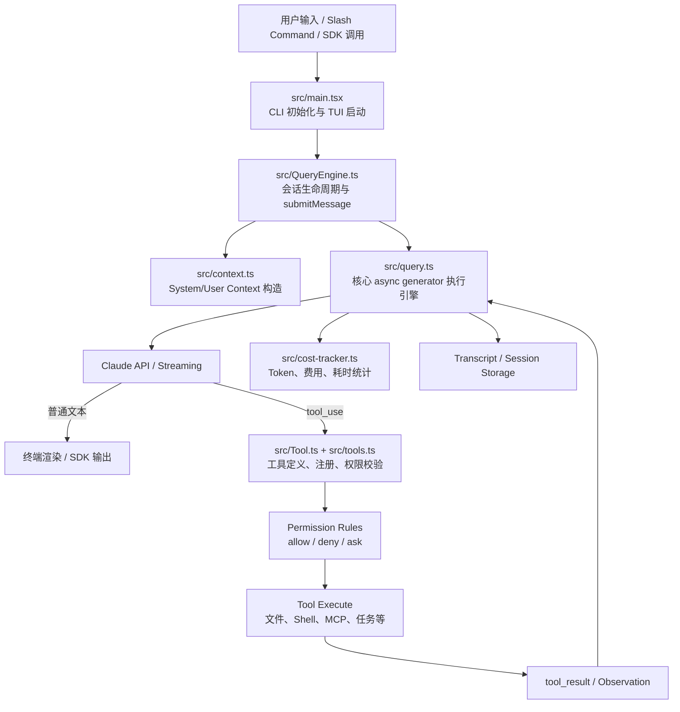

# 阶段 6 学习计划：ClaudeCode 源码级 AI Agent 工程拆解

> 目标：把 `ClaudeCode/` 当作一个真实复杂 AI Agent CLI 产品来学习，重点掌握 Agent Loop、Tool Calling、Context 管理、权限安全、成本观测、多 Agent 编排和工程化拆分方式，并转化成可面试表达的架构能力。

## 0. 学习边界

`ClaudeCode/README.md` 标注该子项目是从 npm 包 source map 还原的非官方源码，仅用于研究学习。学习时遵守以下边界：

1. 不复制受版权保护的实现作为自己的商业项目代码。
2. 不把还原源码包装成官方版本或对外发布。
3. 重点学习架构思想、模块拆分、执行链路、工程取舍和面试表达。
4. 实践落地优先在本仓库已有 Go 学习项目中做“简化版复刻”，例如 Agent Loop、工具权限、成本统计、上下文压缩。

## 1. 全局架构白板图

核心理解：`ClaudeCode` 不是“一个聊天 CLI”，而是一个围绕 LLM 构建的任务执行运行时。它把用户输入、上下文、模型调用、工具执行、权限审批、成本统计和终端交互串成一个可恢复、可观测、可扩展的 Agent 系统。

## 2. 推荐学习节奏

建议用 4 周完成第一轮源码学习，每周 3-5 次，每次 60-90 分钟。

| 周期 | 主题 | 目标产出 |
|---|---|---|
| 第 1 周 | 项目总览、入口、会话生命周期 | 能画出启动链路和用户输入到 `query()` 的路径 |
| 第 2 周 | Agent Loop、Tool Calling、权限模型 | 能讲清楚模型如何请求工具、应用如何执行工具、如何避免危险操作 |
| 第 3 周 | Context、Token、成本、可观测性 | 能讲清楚上下文构造、压缩、成本统计和调试方式 |
| 第 4 周 | 命令系统、多 Agent、高级能力、作品集表达 | 能把 `ClaudeCode` 的架构思想迁移到自己的 Go Agent 项目中 |

## 3. 分关卡学习计划

### 6.1 项目认知与运行入口

**知识点设计**

- `ClaudeCode` 的技术栈：TypeScript、Bun、React、Ink、Anthropic SDK、MCP SDK、OpenTelemetry。
- CLI 产品为什么会使用 React/Ink：把终端交互拆成组件化 UI 状态，而不是纯 println。
- `src/main.tsx` 的职责：启动顺序、配置加载、命令注册、TUI 渲染、性能 checkpoint。

**重点文件**

1. `ClaudeCode/README.md`
2. `ClaudeCode/AGENTS.md`
3. `ClaudeCode/package.json`
4. `ClaudeCode/src/main.tsx`

**实践任务**

- 画出启动链路：`bun run dev` → `src/dev-entry.ts` → `src/main.tsx` → CLI/TUI。
- 对比 Go CLI：如果用 Go 实现，哪些部分用 `cobra`，哪些部分用 Bubble Tea 或普通 stdout。

**面试表达目标**

能用 1 分钟解释：一个 AI Coding CLI 的入口层不只是解析参数，还要做配置、认证、上下文预热、命令注册、TUI 初始化和性能观测。

---

### 6.2 会话生命周期：从用户输入到 QueryEngine

**知识点设计**

- `QueryEngine` 是会话层，不是模型调用层。
- 它负责把一次用户输入转成可被执行引擎消费的消息，维护状态、权限、会话 ID、任务队列和 transcript。
- 为什么真实 Agent 产品需要独立的会话引擎：避免 UI、模型调用、工具执行互相耦合。

**重点文件**

1. `ClaudeCode/src/QueryEngine.ts`
2. `ClaudeCode/src/query.ts`
3. `ClaudeCode/src/context.ts`
4. `ClaudeCode/src/Task.ts`

**实践任务**

- 画出：`submitMessage()` → 输入处理 → context 构造 → `query()`。
- 在现有 Go `03-agent/` 中对比：当前 demo 哪些逻辑混在一起，哪些可以拆成 `SessionEngine` / `AgentRuntime`。

**面试表达目标**

能讲清楚：复杂 Agent 系统里，会话生命周期管理和模型调用循环应该分层，否则后续加入多工具、权限、重试、恢复、观测都会失控。

---

### 6.3 Agent Loop：`query.ts` 的核心执行引擎

**知识点设计**

- `query()` 使用 async generator，边执行边产出事件。
- Agent Loop 的本质：模型输出可能是文本，也可能是工具请求；工具结果要作为 Observation 回传给模型继续推理。
- 循环必须有退出条件、最大轮数、错误恢复和上下文溢出处理。

**重点文件**

1. `ClaudeCode/src/query.ts`
2. `ClaudeCode/src/services/tools/`
3. `ClaudeCode/src/services/api/`

**实践任务**

- 摘出一条最小链路：`query()` → API streaming → tool_use → runTools → tool_result → follow-up query。
- 对照 `03-agent/agent_loop.go`，整理“教学版 Agent Loop”和“生产级 Agent Loop”的差异。

**面试表达目标**

能讲清楚：Agent Loop 的难点不是 for 循环，而是流式事件、工具并发、权限中断、错误恢复、上下文压缩和最终状态一致性。

---

### 6.4 Tool Calling 与工具抽象

**知识点设计**

- 工具不是普通函数，而是“给模型看的能力描述 + 给程序执行的安全实现”。
- Tool schema 决定模型能否正确选择工具和填参数。
- Tool registry 解决工具发现、按条件加载、能力裁剪和测试替换。

**重点文件**

1. `ClaudeCode/src/Tool.ts`
2. `ClaudeCode/src/tools.ts`
3. `ClaudeCode/src/tools/`
4. `ClaudeCode/src/commands.ts`

**实践任务**

- 对比本仓库 `03-agent/registry.go`、`03-agent/calculator_tool.go`、`03-agent/file_reader_tool.go`。
- 设计一个“生产级 Go Tool 接口”草案，包含 name、description、schema、permission、execute、timeout、audit log。

**面试表达目标**

能讲清楚：Tool Calling 的工程重点在 schema 质量、参数校验、权限隔离、可观测性和失败回传，而不是简单地让模型返回一个函数名。

---

### 6.5 权限、安全与 Human-in-the-loop

**知识点设计**

- LLM 输出的工具参数永远不可信。
- 危险工具需要分层防护：工具级权限、操作级权限、路径/命令白名单、用户确认、审计日志。
- 权限模式常见有：默认询问、自动允许、安全绕过、显式拒绝。

**重点文件**

1. `ClaudeCode/src/Tool.ts`
2. `ClaudeCode/src/tools/BashTool/` 或相关 Shell 工具目录
3. `ClaudeCode/src/tools/FileEditTool/` 或相关文件编辑工具目录
4. `03-agent/validation.go`
5. `03-agent/file_reader_tool.go`

**实践任务**

- 整理 ClaudeCode 的 permission context 结构。
- 给 Go `03-agent/` 写一版“权限策略设计说明”，不用马上改代码，先画权限决策链路。

**面试表达目标**

能讲清楚：AI Agent 安全不是 prompt 能解决的，必须在宿主程序侧做硬边界，包括权限策略、参数校验、执行沙箱、审计和人工确认。

---

### 6.6 Context 管理、Token 控制与压缩

**知识点设计**

- LLM API 无状态，所谓“记忆”来自应用层持续构造上下文。
- Coding Agent 的上下文来源复杂：系统提示、用户消息、文件内容、Git 状态、工具结果、历史 transcript。
- Context window 是硬约束，必须做裁剪、压缩、缓存和优先级管理。

**重点文件**

1. `ClaudeCode/src/context.ts`
2. `ClaudeCode/src/utils/queryContext.ts`
3. `ClaudeCode/src/services/compact/`
4. `ClaudeCode/src/cost-tracker.ts`

**实践任务**

- 画出 context 来源图：system / user / repo / git / tool result / history。
- 给 Go RAG 或 Agent 项目补一个“上下文预算表”：哪些内容必须进 prompt，哪些可以检索，哪些可以压缩。

**面试表达目标**

能讲清楚：上下文管理是 Agent 产品的核心竞争力之一，因为它直接影响准确率、成本、延迟和稳定性。

---

### 6.7 成本、性能与可观测性

**知识点设计**

- AI 应用的观测指标不仅是 QPS 和延迟，还包括 input token、output token、cache token、tool duration、API duration、失败原因。
- 成本统计要和会话、模型、工具调用关联，才能定位“贵在哪里”。
- 真实产品需要 feature gate、慢操作日志、trace、session cost 恢复。

**重点文件**

1. `ClaudeCode/src/cost-tracker.ts`
2. `ClaudeCode/src/services/analytics/`
3. `ClaudeCode/src/costHook.ts`
4. `ClaudeCode/src/context.ts`

**实践任务**

- 整理一张 AI Agent Observability 指标表。
- 给 Go `03-agent/` 设计 trace 输出升级方案：step、model latency、tool latency、token/cost、error type。

**面试表达目标**

能讲清楚：AI Agent 上线后最需要观测的是“每轮为什么这么回答、为什么调用这个工具、花了多少 token、慢在哪里、失败在哪里”。

---

### 6.8 Slash Command、任务系统与 TUI 产品化

**知识点设计**

- Slash command 是 Agent 产品的“显式控制面”。
- TUI 负责把复杂状态可视化，例如工具执行、权限确认、历史、成本、任务状态。
- Task 系统把一次请求升级为可追踪、可取消、可恢复的工作单元。

**重点文件**

1. `ClaudeCode/src/commands.ts`
2. `ClaudeCode/src/commands/`
3. `ClaudeCode/src/Task.ts`
4. `ClaudeCode/src/components/`

**实践任务**

- 挑 3 个命令分析：帮助类、配置类、成本类。
- 给 Go Agent CLI 设计 `/trace`、`/tools`、`/cost`、`/reset` 四个命令。

**面试表达目标**

能讲清楚：一个成熟 Agent CLI 需要给用户显式控制权，否则 Agent 越强，用户越难理解和信任它。

---

### 6.9 MCP、Bridge 与工具生态化

**知识点设计**

- MCP 把工具从当前进程抽离成可复用服务。
- Bridge 把本地 CLI 的控制面扩展到远程端。
- 对比普通 Function Calling、MCP、本地工具、远程工具的边界。

**重点文件**

1. `ClaudeCode/docs/06-bridge.md`
2. `ClaudeCode/src/bridge/`
3. `ClaudeCode/src/mcp` 或 MCP 相关服务目录
4. `04-mcp/`

**实践任务**

- 只做高层理解，不深挖协议细节。
- 把阶段 4 MCP 结论迁移到 ClaudeCode：为什么 Coding Agent 需要接入外部工具生态。

**面试表达目标**

能讲清楚：MCP 的价值不是“换一种函数调用格式”，而是工具能力协议化、服务化、跨客户端复用和权限边界清晰。

---

### 6.10 多 Agent 编排与高级能力

**知识点设计**

- Coordinator 模式把主 Agent 变成计划者，把 Worker 变成执行者。
- 多 Agent 不是越多越好，核心难点是任务拆解、上下文隔离、冲突解决、结果汇总和责任边界。
- KAIROS、ULTRAPLAN、Bridge 这类高级能力体现了 Agent 产品从“对话工具”向“长期任务系统”演进。

**重点文件**

1. `ClaudeCode/docs/02-kairos.md`
2. `ClaudeCode/docs/03-ultraplan.md`
3. `ClaudeCode/docs/04-coordinator.md`
4. `ClaudeCode/src/coordinator/`
5. `ClaudeCode/src/assistant/`
6. `ClaudeCode/src/proactive/`

**实践任务**

- 画一个 Coordinator / Worker 架构图。
- 总结多 Agent 的 5 个风险：重复工作、上下文不一致、权限扩大、成本失控、结果合并困难。

**面试表达目标**

能讲清楚：多 Agent 编排的价值在并行和角色隔离，风险在一致性、成本、权限和可观测性，所以需要任务协议、共享状态、明确退出条件和审计机制。

## 4. 第一轮源码阅读顺序

按这个顺序读，避免一开始陷进 1000+ 行大文件：

1. `ClaudeCode/README.md`：先理解有哪些能力。
2. `ClaudeCode/package.json`：看运行脚本和依赖。
3. `ClaudeCode/AGENTS.md`：理解该还原项目的维护约定。
4. `ClaudeCode/src/dev-entry.ts`：看开发入口和宏配置。
5. `ClaudeCode/src/main.tsx`：只看前 100-200 行启动顺序，不要全读。
6. `ClaudeCode/src/QueryEngine.ts`：看构造函数、`submitMessage()` 和状态字段。
7. `ClaudeCode/src/query.ts`：定位 `query()`，重点看输入参数、yield 的事件、工具调用分支和退出条件。
8. `ClaudeCode/src/Tool.ts`：看 Tool 类型、ToolUseContext、ToolPermissionContext。
9. `ClaudeCode/src/tools.ts`：看工具如何注册和条件加载。
10. `ClaudeCode/src/context.ts`：看系统上下文和用户上下文如何组装。
11. `ClaudeCode/src/cost-tracker.ts`：看 token、模型、成本如何累计。
12. `ClaudeCode/docs/04-coordinator.md`：最后看多 Agent 编排。

## 5. 与本仓库 Go 项目的映射

| ClaudeCode 概念 | 当前 Go 学习项目映射 | 后续可增强点 |
|---|---|---|
| `QueryEngine` | `03-agent` 的 CLI + Agent Loop 混合逻辑 | 拆出 Session / Runtime / Renderer |
| `query()` Agent Loop | `03-agent/agent_loop.go` | 增加事件流、错误分类、重试、trace |
| `Tool.ts` | `03-agent/types.go`、各 tool 文件 | 增加权限策略、timeout、审计日志 |
| `tools.ts` | `03-agent/registry.go` | 增加条件注册、工具分组、schema 打印 |
| `context.ts` | 阶段 1 消息历史、阶段 2 RAG prompt、阶段 3 observation | 增加上下文预算和压缩策略 |
| `cost-tracker.ts` | 暂无完整实现 | 增加 token/cost/mock latency 统计 |
| MCP 相关 | `04-mcp/` | 把 Agent 工具服务化 |
| Coordinator | 暂无 | 做一个最小 Planner/Worker demo |

## 6. 每关固定交付物

每完成一个小关卡，沉淀以下内容：

1. 一张架构图或时序图。
2. 3-5 个核心术语解释。
3. 一条源码执行链路。
4. 和 Go 项目的类比。
5. 1 段 1-2 分钟面试表达。
6. 逐题 Mock Interview 记录。

## 7. 第一阶段验收标准

完成 6.1 到 6.4 后，需要能回答：

1. `ClaudeCode` 为什么不是普通 Chatbot，而是 Agent Runtime？
2. `main.tsx`、`QueryEngine.ts`、`query.ts` 三者分别负责什么？
3. Tool schema、Tool registry、Tool execution 的边界是什么？
4. Agent Loop 为什么必须有 observation 回传和退出条件？
5. 如果用 Go 复刻一个最小 ClaudeCode，你会拆哪些模块？

## 8. 面试版项目讲述草稿

> 我在学习 `ClaudeCode` 这类真实 AI Coding Agent 的源码时，不是只看模型调用，而是按产品级 Agent Runtime 拆解：入口层负责 CLI/TUI、配置和命令；会话层负责用户输入、状态和 transcript；执行层用 Agent Loop 串联模型 streaming、工具调用和 observation 回传；工具层通过 schema、registry 和 permission context 控制能力边界；观测层记录 token、成本、耗时和错误。这个拆解帮助我把之前用 Go 实现的 RAG、Agent、MCP 小项目升级成更接近生产系统的架构思路，尤其是在上下文预算、工具安全、人机确认和可观测性方面有明确工程取舍。

## 9. 下一步

下一次学习从 **6.1 项目认知与运行入口** 开始：先画 `bun run dev` 到 `main.tsx` 的启动链路，再进入 `QueryEngine` 和 `query()`。

